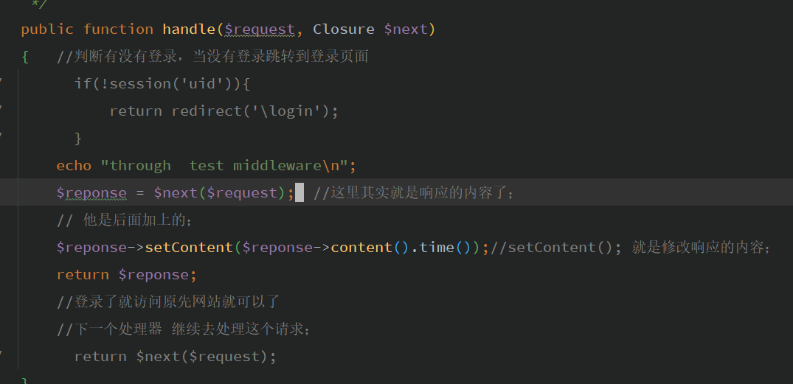

# request


new static  实例化自己；// 延迟绑定类

static::class 类名； 延迟绑定类；

self本类


new self; 本类的实例化；

self::class


### laravel中请求得处理；

Request  一般是通过注入的方式来操作

```php
$request->all();  // all 所有的请求；
$request->input('name');
$request->path();  // 请求的地址
// Without Query String...
$url = $request->url();

// With Query String...
$url = $request->fullUrl();

$method = $request->method();

//  获取单个值 就用 input
$name = $request->input('name', 'Sally');  //sally default value
$name = $request->input('products.0.name');  // 数组的形式获取
$name = $request->name;
$name = $request->input('user.name');	

if ($request->has('name')) {
    //
}
return redirect('form') //跳转； 重定向；  这里需要加路由； 跳转的是路由 ，重定向的是路由；
    
$value = $request->cookie('name');//  通过 $request  来获取 cookie
$request->isMethod('post');
```


Reponse

````php
# reponse 
//设置cookie
$cookie = cookie('name', 'value', $minutes);
// 都是辅助函数来做操作；reponse('content')
return response('Hello World')->cookie($cookie);


 return response('Hello World', 200)
                  ->header('Content-Type', 'text/plain');
// 默认200；
return response($content)
            ->header('Content-Type', $type)
            ->header('X-Header-One', 'Header Value')
            ->header('X-Header-Two', 'Header Value');

return response($content)
            ->withHeaders([
                'Content-Type' => $type,
                'X-Header-One' => 'Header Value',
                'X-Header-Two' => 'Header Value',
            ]);

return response($content)
                ->header('Content-Type', $type)
                ->cookie('name', 'value', $minutes);

return response($content)
                ->header('Content-Type', $type)
                ->cookie('name', 'value', $minutes);
//重定向
Route::get('dashboard', function () {
    return redirect('home/dashboard'); //这里是路由
});

return redirect()->route('login');// 重定向一个路由器

return response()->json([   //json 数据格式；
    'name' => 'Abigail',
    'state' => 'CA'
]);
// view
return response()
            ->view('hello', $data, 200)
            ->header('Content-Type', $type);

//cookie::get();获取cookie；或者直接通过 $request->cookie(); 
// session的设置 ；
session(['uid' => 1000]);
session('uid'); //fetch
//        if(!session('uid')){  // 直接用  辅助函数session (); 来查找session；
//            return redirect('\login');
//        }


````




**TestMiddleware 测试中间件；**

测试中间件起作用的必须是 return的 其实我们可以对reponse处理  reponse 返回的都是一个对象；

\$reponse->content(); // 获取内容；

\$reponse->setContent(); // 去修改内容； 


public/index.php

```php
//   回应是一个对象；
$response = $kernel->handle(
    $request = Illuminate\Http\Request::capture()
);
// 修改返回的内容
//$response->setContent('wocao');
//dd($response);// 这里是返回得信息； return 都是返回的一个对象；
// 返回之后的数据 ；；
//$response->setContent('一直是这个数据');
$response->send();
```


```php
// 这两个参数一个是uri传过来的，一个是注入的 完全不冲突；
Route::get('/lst/ceshi/{id}','TestController@ceshi');
   public function ceshi(Request $request,$id){
        var_dump($request);
        echo $id;
        die;
}
```


