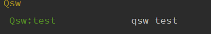

# console 运行命令的脚本


两种 php artisan的格式

````php
php artisan key:generate  [namespace]
php artisan server 
````


**创建一个命令脚本 test** 

php artisan make:command  test  


**修改test文件**

````php
protected $signature = 'qsw:test';//这里就是要=运行的命令的名称；
handle(); handle 就是处理逻辑；
````


**注册命令**

**命令编写完成后，需要注册 Artisan 后才能使用。注册文件为 app/Console/Kernel.php 。在这个文件中，你会在 commands 属性中看到一个命令列表。要注册你的命令，只需将其加到该列表中即可。当 Artisan 启动时，所有罗列在这个 属性的命令，都会被 服务容器 解析并向 Artisan 注册：**


protected $commands = [
    Commands\SendEmails::class
];


**php artisan list   可以查看到命令名称；**




**运行命令**

php artisan  qsw:test  


````php
Artisan::command('email:send {user}', function (DripEmailer $drip, $user) {
    $drip->send(User::find($user));
});
{user}{--ceshi=} 分别是参数和选项；前面的对象利用反射注入了，$user 就是参数；argv  参数argument参数的形式
````


## # php artisan 其实artisan 就是一个文件；


# [php artisan 常用的命令](https://www.cnblogs.com/caibaotimes/p/14310942.html)

**php artisan 命令是Laravel框架自带的命令，方便用户快速创建、查看对应的模块参数等。**


## 一、常用的命令：[#](https://www.cnblogs.com/caibaotimes/p/14310942.html#3286407772)

php artisan list 查看php artisan所有命令


php artisan --help 查看php artisan的用法


php artisan help admin:make 查看php artisan admin:make的用法

php artisan admin:make --help 查看php artisan admin:make的用法

创建控制器

```
php artisan make:controller OrderController
```

创建Rest风格资源控制器（带有index、create、store、edit、update、destroy、show方法）

```
php artisan make:controller OrderController --resource
```

创建模型

```
php artisan make:model Student
```

创建新建表的迁移和修改表的迁移

```
php artisan make:migration create_orders_table --create=orders //创建订单表orders
php artisan make:migration add_tags_to_orders_table --table=orders//给orders表增加tags字段
```

执行迁移

```
php artisan migrate
```

创建模型的时候同时生成新建表的迁移+控制器+路由

```
php artisan make:model Order -m -c -r
```

回滚上一次的迁移

```
php artisan migrate:rollback
```

回滚所有迁移

```
php artisan migrate:reset
```

创建填充

```
php artisan make:seeder OrderTableSeeder
```

执行单个填充

```
php artisan db:seed --class=OrderTableSeeder
```

执行所有填充

```
php artisan db:seed
```

创建中间件（app/Http/Middleware 下）

```
php artisan make:middleware Activity
```

创建队列（数据库）的表迁移（需要执行迁移才生效）

```
php artisan queue:table
```

创建队列类（app/jobs下）：

```
php artisan make:job SendEmail
```

创建请求类（app/Http/Requests下）

```
php artisan make:request CreateArticleRequest
```

## 二、Laravel Artisan 命令大全[#](https://www.cnblogs.com/caibaotimes/p/14310942.html#813574500)

## Available commands:[#](https://www.cnblogs.com/caibaotimes/p/14310942.html#3641971912)

| 命令           | 中文                            | English                                             |
| -------------- | ------------------------------- | --------------------------------------------------- |
| clear-compiled | 删除已编译的类文件              | Remove the compiled class file                      |
| down           | 将应用程序置于维护模式          | Put the application into maintenance mode           |
| dump-server    | 启动转储服务器以收集转储信息。  | Start the dump server to collect dump information.  |
| env            | 显示当前的框架环境              | Display the current framework environment           |
| help           | 显示命令的帮助                  | Displays help for a command                         |
| inspire        | ---                             | Display an inspiring quote                          |
| list           | 列出命令                        | Lists commands                                      |
| migrate        | 运行数据库迁移                  | Run the database migrations                         |
| optimize       | 缓存框架引导程序文件            | Cache the framework bootstrap files                 |
| preset         | 为应用程序交换前端脚手架        | Swap the front-end scaffolding for the application  |
| serve          | 在 PHP 开发服务器上提供应用程序 | Serve the application on the PHP development server |
| tinker         | 与您的应用程序互动              | Interact with your application                      |
| up             | 使应用程序退出维护模式          | Bring the application out of maintenance mode       |

## app[#](https://www.cnblogs.com/caibaotimes/p/14310942.html#3778466473)

| 命令     | 中文                 | English                       |
| -------- | -------------------- | ----------------------------- |
| app:name | 设置应用程序命名空间 | Set the application namespace |

## auth[#](https://www.cnblogs.com/caibaotimes/p/14310942.html#2671186324)

| 命令              | 中文                   | English                             |
| ----------------- | ---------------------- | ----------------------------------- |
| auth:clear-resets | 刷新过期的密码重置令牌 | Flush expired password reset tokens |

## cache[#](https://www.cnblogs.com/caibaotimes/p/14310942.html#3426014042)

| 命令         | 中文                   | English                                         |
| ------------ | ---------------------- | ----------------------------------------------- |
| cache:clear  | 刷新应用程序缓存       | Flush the application cache                     |
| cache:forget | 从缓存中删除项目       | Remove an item from the cache                   |
| cache:table  | 为缓存数据库表创建迁移 | Create a migration for the cache database table |

## config[#](https://www.cnblogs.com/caibaotimes/p/14310942.html#1953467906)

| 命令         | 中文                       | English                                              |
| ------------ | -------------------------- | ---------------------------------------------------- |
| config:cache | 创建缓存文件以加快配置速度 | Create a cache file for faster configuration loading |
| config:clear | 删除配置缓存文件           | Remove the configuration cache file                  |

## db[#](https://www.cnblogs.com/caibaotimes/p/14310942.html#2655882869)

| 命令    | 中文       | English                        |
| ------- | ---------- | ------------------------------ |
| db:seed | 填充数据库 | Seed the database with records |

## event[#](https://www.cnblogs.com/caibaotimes/p/14310942.html#1638674051)

| 命令           | 中文                           | English                                                      |
| -------------- | ------------------------------ | ------------------------------------------------------------ |
| event:generate | 根据注册生成缺少的事件和侦听器 | Generate the missing events and listeners based on registration |

## key[#](https://www.cnblogs.com/caibaotimes/p/14310942.html#2340513491)

| 命令         | 中文             | English                 |
| ------------ | ---------------- | ----------------------- |
| key:generate | 生成应用程序 key | Set the application key |

## lang[#](https://www.cnblogs.com/caibaotimes/p/14310942.html#24815263)

| 命令         | 中文                     | English                                        |
| ------------ | ------------------------ | ---------------------------------------------- |
| lang:publish | 将语言文件发布到资源目录 | publish language files to resources directory. |

## make[#](https://www.cnblogs.com/caibaotimes/p/14310942.html#1484885091)

| 命令              | 中文                                        | English                                                |
| ----------------- | ------------------------------------------- | ------------------------------------------------------ |
| make:auth         | ---                                         | Scaffold basic login and registration views and routes |
| make:channel      | 创建一个新的 `channel` 类                   | Create a new channel class                             |
| make:command      | 创建一个新的 `Artisan` 命令                 | Create a new Artisan command                           |
| make:controller   | 创建一个新的控制器类                        | Create a new controller class                          |
| make:event        | ---                                         | 创建一个新的 `event` 类                                |
| make:exception    | 创建一个新的自定义异常类                    | Create a new custom exception class                    |
| make:factory      | 创建一个新的模型工厂                        | Create a new model factory                             |
| make:job          | 创建一个新的工作类                          | Create a new job class                                 |
| make:listener     | 创建一个新的事件监听器类                    | Create a new event listener class                      |
| make:mail         | 创建一个新的电子邮件类                      | Create a new email class                               |
| make:middleware   | 创建一个新的中间件类                        | Create a new middleware class                          |
| make:migration    | 创建一个新的迁移文件                        | Create a new migration file                            |
| make:model        | 创建一个新的 Eloquent 模型类                | Create a new Eloquent model class                      |
| make:notification | 创建一个新的通知类                          | Create a new notification class                        |
| make:observer     | 创建一个新的观察者类                        | Create a new observer class                            |
| make:policy       | 创建一个新的策略类                          | Create a new policy class                              |
| make:provider     | 创建一个新的服务提供者类                    | Create a new service provider class                    |
| make:request      | 创建一个新的表单请求类                      | Create a new form request class                        |
| make:resource     | 创建一个新资源                              | Create a new resource                                  |
| make:rule         | 创建新的验证规则                            | Create a new validation rule                           |
| make:scaffold     | 代码生成器 — Laravel 5.x Scaffold Generator | Create a laralib scaffold                              |
| make:seeder       | 创建一个新的 `seeder` 类                    | Create a new seeder class                              |
| make:test         | 创建一个新的测试类                          | Create a new test class                                |

## migrate[#](https://www.cnblogs.com/caibaotimes/p/14310942.html#1919861564)

| 命令             | 中文                         | English                                   |
| ---------------- | ---------------------------- | ----------------------------------------- |
| migrate:fresh    | 删除所有表并重新运行所有迁移 | Drop all tables and re-run all migrations |
| migrate:install  | 创建迁移存储库               | Create the migration repository           |
| migrate:refresh  | 重置并重新运行所有迁移       | Reset and re-run all migrations           |
| migrate:reset    | 回滚所有数据库迁移           | Rollback all database migrations          |
| migrate:rollback | 回滚上次数据库迁移           | Rollback the last database migration      |
| migrate:status   | 显示每次迁移的状态           | Show the status of each migration         |

## notifications[#](https://www.cnblogs.com/caibaotimes/p/14310942.html#3690597619)

| 命令                | 中文             | English                                        |
| ------------------- | ---------------- | ---------------------------------------------- |
| notifications:table | 为通知表创建迁移 | Create a migration for the notifications table |

## optimize[#](https://www.cnblogs.com/caibaotimes/p/14310942.html#1010235948)

| 命令           | 中文                   | English                           |
| -------------- | ---------------------- | --------------------------------- |
| optimize:clear | 删除缓存的引导程序文件 | Remove the cached bootstrap files |

## package[#](https://www.cnblogs.com/caibaotimes/p/14310942.html#487472265)

| 命令             | 中文             | English                             |
| ---------------- | ---------------- | ----------------------------------- |
| package:discover | 重建缓存的包清单 | Rebuild the cached package manifest |

## queue[#](https://www.cnblogs.com/caibaotimes/p/14310942.html#1736857763)

| 命令               | 中文                                     | English                                                     |
| ------------------ | ---------------------------------------- | ----------------------------------------------------------- |
| queue:failed       | 列出所有 `failed` 队列工作               | List all of the failed queue jobs                           |
| queue:failed-table | 为 `failed` 队列工作数据库表创建迁移     | Create a migration for the failed queue jobs database table |
| queue:flush        | 刷新所有 `failed` 队列工作               | Flush all of the failed queue jobs                          |
| queue:forget       | 删除 `failed` 队列工作                   | Delete a failed queue job                                   |
| queue:listen       | 监听一个给定的队列                       | Listen to a given queue                                     |
| queue:restart      | 在当前工作之后重新启动队列工作器守护程序 | Restart queue worker daemons after their current job        |
| queue:retry        | 重试 `failed` 队列作业                   | Retry a failed queue job                                    |
| queue:table        | 为队列工作数据库表创建迁移               | Create a migration for the queue jobs database table        |
| queue:work         | 开始将队列上的工作作为守护程序处理       | Start processing jobs on the queue as a daemon              |

## route[#](https://www.cnblogs.com/caibaotimes/p/14310942.html#1420478207)

| 命令        | 中文                               | English                                                 |
| ----------- | ---------------------------------- | ------------------------------------------------------- |
| route:cache | 创建路由缓存文件以加快路由注册速度 | Create a route cache file for faster route registration |
| route:clear | 删除路由缓存文件                   | Remove the route cache file                             |
| route:list  | 列出所有注册的路由                 | List all registered routes                              |

## schedule[#](https://www.cnblogs.com/caibaotimes/p/14310942.html#16704353)

| 命令         | 中文           | English                    |
| ------------ | -------------- | -------------------------- |
| schedule:run | 运行预定的命令 | Run the scheduled commands |

## session[#](https://www.cnblogs.com/caibaotimes/p/14310942.html#4104141303)

| 命令          | 中文                   | English                                           |
| ------------- | ---------------------- | ------------------------------------------------- |
| session:table | 为会话数据库表创建迁移 | Create a migration for the session database table |

## storage[#](https://www.cnblogs.com/caibaotimes/p/14310942.html#2793604603)

| 命令         | 中文                                                    | English                                                      |
| ------------ | ------------------------------------------------------- | ------------------------------------------------------------ |
| storage:link | 创建从 “公共 / 存储” 到 “存储 / 应用 / 公共” 的符号链接 | Create a symbolic link from "public/storage" to "storage/app/public" |

## vendor[#](https://www.cnblogs.com/caibaotimes/p/14310942.html#2287808130)

| 命令           | 中文                             | English                                             |
| -------------- | -------------------------------- | --------------------------------------------------- |
| vendor:publish | 从供应商包中发布任何可发布的资产 | Publish any publishable assets from vendor packages |

## view[#](https://www.cnblogs.com/caibaotimes/p/14310942.html#4175622819)

| 命令       | 中文                          | English                                          |
| ---------- | ----------------------------- | ------------------------------------------------ |
| view:cache | 编译所有应用程序的 Blade 模板 | Compile all of the application's Blade templates |
| view:clear | 清除所有编译的视图文件        | Clear all compiled view files                    |