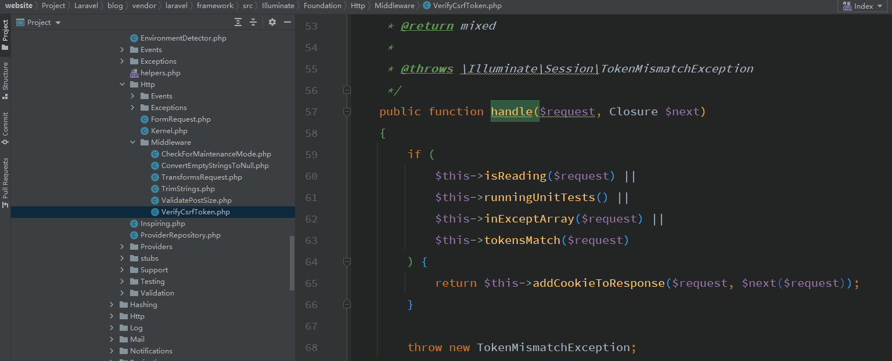
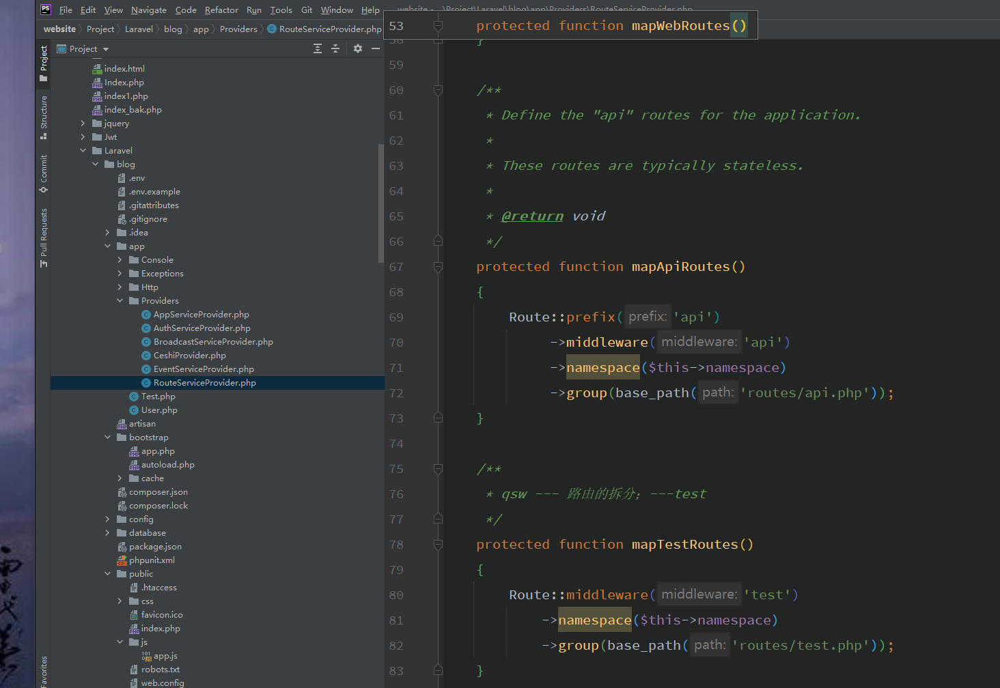

# 中间件

请求还没有达到路由和控制器之前的处理；

**中间件其实就是一种模板方法；**

php artisan make::middleware MiddlewareTest  

就会生成放在app/Http/Middleware 目录下面的MiddlewareTest.php 

### 中间件是一个责任链模式

**比如我们需要做的csrf验证 都是用的中间件，当不满足的时候不会到控制器的；**

**中间件；**

**服务提供者；**

### 中间件的案例

中间件的范围 定义一个方案

Route::get()->middleware();

或者一定一个类  类里面的方法都使用中间件

public function \_\_construct(){

​		\$this->middleware(MiddlWareTest::class);

}

直接定义一个路由都是用 或者 定义所有的请求都使用中间件或者定义别名 都在app/Http/kernel.php 里面去设置；

