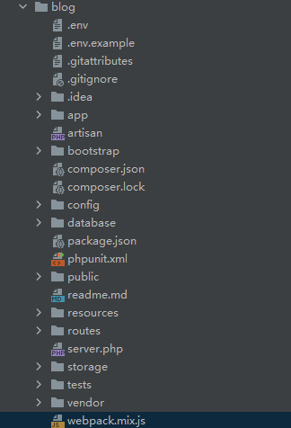
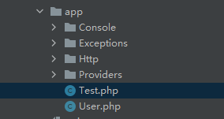
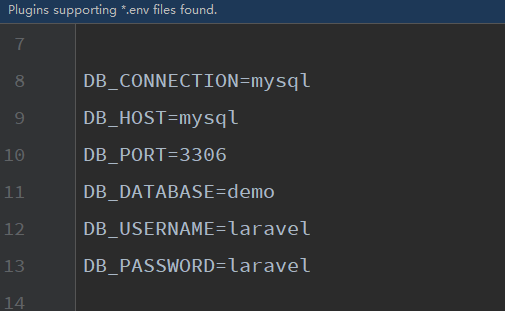
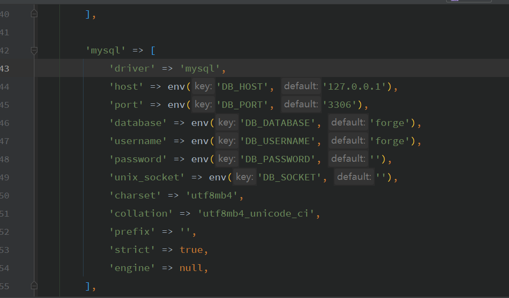

# laravel 的文件目录  和 配置；





.env  配置文件

.gitignore

composer.json

compose.lock

**app   脚本文件  服务容器 ；   Http 里面的控制器和中间件；**

artisan 脚本文件入口

bootstrap  启动文件  自动加载有  app 服务容器的注册   

config 配置文件

**database**  跟数据库相关的操作；

public 入口文件

**resources**  **就是view 前端文件；**

**routes  路由文件**

storage  存储，上传文件；

tests 测试模块；

vendor  就是 第三方类库；


### app


**总之，Kernel 做了两件事，第一个是定义 $bootstraps[]，做好了 boot 系统的准备，第二个是定义 各种 middleware，这些都对 $request 进行加工、处理、甄选、判断，最终为可以形成正确的、有效的 $response 做准备，都完成后，进行了 index.php 中的 $kernel->handle($request)，返回 $response。**


console 脚本

**Test.php models**

Exception 异常处理

Providers 服务提供者

**注册需要到 Kernel.php文件； 脚本命令的注册；**

 




**Http**  

**controller 控制器**


**Middleware  中间件**


kernel.php 定义了三种中间件；


**laravel目录下的app/Http目录中会有Kernel.php文件，里面会定有三种不同的middleware。**

下面我么就说一下middleware 、middlewaregroups 、routeMiddleware 这三种中间件的作用

**$middleware：全局中间件**

**所谓的全局中间件，就是中间件里的内容会全部执行**

protected $middleware = [

\Illuminate\Foundation\Http\Middleware\CheckForMaintenanceMode::class,

\Illuminate\Foundation\Http\Middleware\ValidatePostSize::class,

\App\Http\Middleware\TrimStrings::class,

\Illuminate\Foundation\Http\Middleware\ConvertEmptyStringsToNull::class,

\App\Http\Middleware\TrustProxies::class,

];


**$middlewareGroups：分组中间件**

**只有在某个模块内才会调用，比如一般我们会定义三个web,admin，api**


**$routeMiddleware:路由中间件**

**内部中间件，只能在使用路由时候引用。**

简单的举个例子

protected $routeMiddleware = [

'auth' => \Illuminate\Auth\Middleware\Authenticate::class,

'auth.basic' => \Illuminate\Auth\Middleware\AuthenticateWithBasicAuth::class,

'bindings' => \Illuminate\Routing\Middleware\SubstituteBindings::class,

'can' => \Illuminate\Auth\Middleware\Authorize::class,

'guest' => \App\Http\Middleware\RedirectIfAuthenticated::class,

'throttle' => \Illuminate\Routing\Middleware\ThrottleRequests::class,

'admin.guest' => \App\Http\Middleware\RedirectIfAdminAuthenticated::class,//新添加后台跳转

];

**在使用的时候就会自动跳转**


### config 


**database.php** 

**其实很多配置都是从.env 中获取的；**





**// 都是从 env 中获取的，获取不到就是i默认的；.env 不要上传到git； 因为我们这个参数需要改动的；**

**// 一般会有一个参数来表示所处的环境，到底是测试环境还是线上环境，本地环境，那么就会有不同的配置逻辑；**





### 容器


```php 
# 容器概念；
app(CeshiCeshi::class)->run(); //通过容器 也可以拿到这个对象；
echo "\n";
app()->make(CeshiCeshi::class)->run(); // 通过app 容器也可以拿到这个类的对象；

app() === app()->make()  完全都是一个东西 返回一个对象；
```
