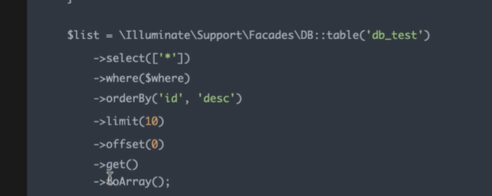
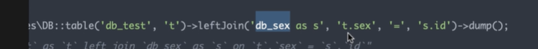

# 查询构造器

>用链式调用的方式来查询数据库；
>
>建造者模式；构造器模式；

原生的sql语句

````php
DB:select("select * from laravel where id =?",[1]); //sql语句 预处理
$data = DB::select("select * from laravel where id =:id", ['id' => 2]);//  多个参数的与处理了；
$res = DB::insert("insert into laravel(a,b) values(11,22)");  // insert 
$rows = DB::select("update laravel set a=333 where id =2");
//select  并不代表只能用select  其实 update delete insert（）;都是可以的；
````


**为什么很多非静态的方法反而可以使用静态方法调用方式?**

````php
/**
 * 魔术方法 __callstatic 的使用
 * 查询构造器的实现
 * DB::table()
 */

class DBA
{
    public function table($arg) {
        echo " table is ".$arg."\n";
        return $this;
    }

    public function where(){
        echo " i m where func\n";
        return $this;
    }

    public function orderby(){
        echo " i m order by\n";
        return $this;
    }

}


class DB
{
    public static function __callStatic($name, $arguments = null) {
        // TODO: Implement __callStatic() method.
        $a = new DBA;
        return call_user_func_array(array($a,$name),$arguments);
    }
}


$ceshi = 'laravel';
DB::table($ceshi)->where()->orderby();


````


### Laravel  查询构造器的使用

```php
// 查询
//DB::table()->where()
$data = DB::table("laravel")->get();// get = select () 查询；
$info = DB::table('laravel')->first();
$data = DB::table('laravel')->pluck('a');  //pluck  获取一行数据
$data = DB::table('laravel')->pluck('a', 'id');
dd(DB::table('laravel')->where('id', 2)->value('a'));//返回数据 其实就是定义select * 变成了a
//插入  批量插入 需要二维数组；
$res = DB::table('laravel')->insert(['a' => 22, 'b' => 22]);
$id = DB::table('laravel')->insertGetId(['a' => 22, 'b' => 222]);
//更新
$rows = DB::table('laravel')->where('id', 2)->update(['a' => 444]);
//删除
 $rows = DB::table('laravel')->where('id', 4)->delete();
//json
$users = DB::table('users')
            ->join('contacts', 'users.id', '=', 'contacts.user_id')
            ->join('orders', 'users.id', '=', 'orders.user_id')
            ->select('users.*', 'contacts.phone', 'orders.price')
            ->get();

//groupBy  having()
$users = DB::table('users')
    ->groupBy('account_id')
    ->having('account_id', '>', 100)
    ->get();
//between 
$users = DB::table('users')
    ->whereBetween('votes', [1, 100])->get();
// whereIn
$users = DB::table('users')
    ->whereIn('id', [1, 2, 3])
    ->get();
// select 可以定义那些字段；
DB::table($table)
    ->select(['*'])
    ->where($where)
    ->orderBy('id','desc')
    ->limit(10)
    ->offset(0)
    ->get()
    ->toArray();//数组
//  只查询一条数据 直接用find();
// 根据主键查询；
DB::table('laravel')->find($id);
->dump();// 调试用的 直接打印sql语句；  会继续向下运行；
->dd();  //也会打印sql  并且会停止运行
```





左连接，条件；





