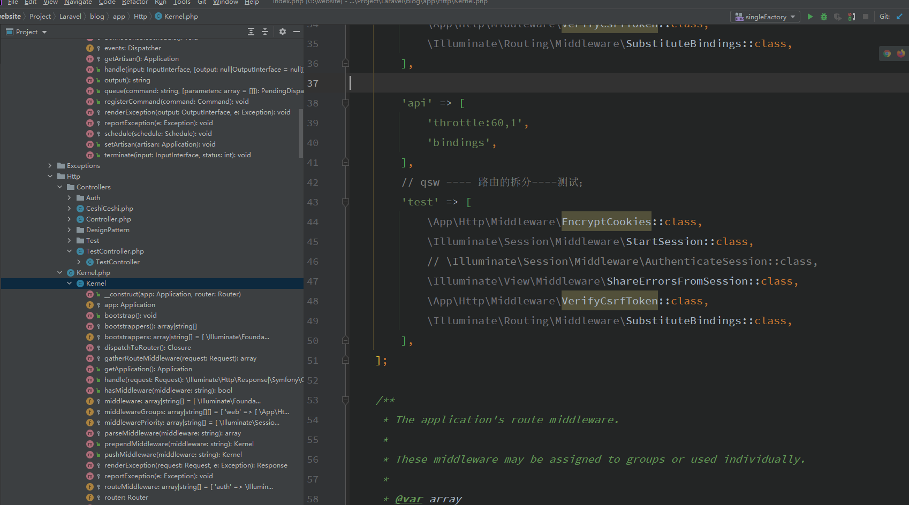
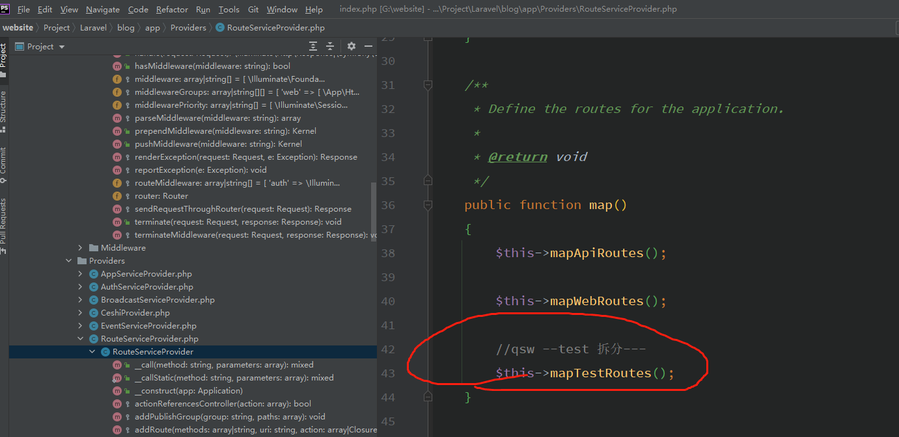
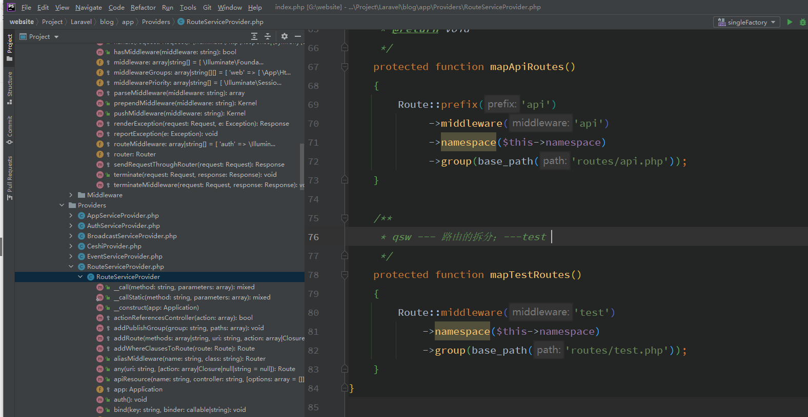

# 路由 Route


###**强路由  有那些好处和坏处？？**

优点：

* 可以设计restful 风格的URL 

* **多个URL可以指向同一个控制器**

  ```php
  Route::get('/lst', 'TestController@lst');
  Route::get('/ceshi/lst','TestController@lst');
  ```

* **URI 和控制器解耦，自定义名称，不受控制器目录和机器方法的限制；**

* 很多场合都不需要控制器 ，只需要返回一个静态页面，直接用路由就饿可以了return review();

* 路由web.php ,路由配置上写上注释就是一个文档；

  

​	**强路由的 缺点：**

* **需要拆分路由文件不然很容易起冲突；**


---


### route文件的拆分

laravel框架将web.php拆分为多个路由文件
第一种方法：
使用inclue_once将创建的其他路由文件引入到web.php文件中
在/routes目录下创建test.php路由文件
在web.php使用include_once引入路由文件

**include_once '../routes/test.php';**

1
第二种方法：
查找laravel框架加载web.php的方式，仿照web.php的加载凡是添加新的路由文件
在/routes目录下创建test.php路由文件
找到**app\Providers\RouteServiceProvider.php**文件的boot()方法，仿照**web.php**方式，添加加载新的路由文件


     $this->routes(function () {
         Route::prefix('api')
             ->middleware('api')
             ->namespace($this->namespace)
             ->group(base_path('routes/api.php'));
     Route::middleware('web')
         ->namespace($this->namespace)
         ->group(base_path('routes/web.php'));
    
     Route::middleware('test')
         ->namespace($this->namespace)
         ->group(base_path('routes/test.php'));
           });

middleware()方法是用来加载中间件的，可以为路由文件添加独立的中间件，也可以直接使用web的中间件。添加方式就仿照web的中间件
在App\Http\Kernel.php找到web的中间件，复制web的中间件，并改名为test


        protected $middlewareGroups = [
            'web' => [
                \App\Http\Middleware\EncryptCookies::class,
                \Illuminate\Cookie\Middleware\AddQueuedCookiesToResponse::class,
                \Illuminate\Session\Middleware\StartSession::class,
                // \Illuminate\Session\Middleware\AuthenticateSession::class,
                \Illuminate\View\Middleware\ShareErrorsFromSession::class,
                \App\Http\Middleware\VerifyCsrfToken::class,
                \Illuminate\Routing\Middleware\SubstituteBindings::class,
            ],
        'api' => [
            'throttle:api',
            \Illuminate\Routing\Middleware\SubstituteBindings::class,
        ],
    
        'test' => [
            \App\Http\Middleware\EncryptCookies::class,
            \Illuminate\Cookie\Middleware\AddQueuedCookiesToResponse::class,
            \Illuminate\Session\Middleware\StartSession::class,
            // \Illuminate\Session\Middleware\AuthenticateSession::class,
            \Illuminate\View\Middleware\ShareErrorsFromSession::class,
            \App\Http\Middleware\VerifyCsrfToken::class,
            \Illuminate\Routing\Middleware\SubstituteBindings::class,
        ],
    ];








