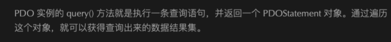
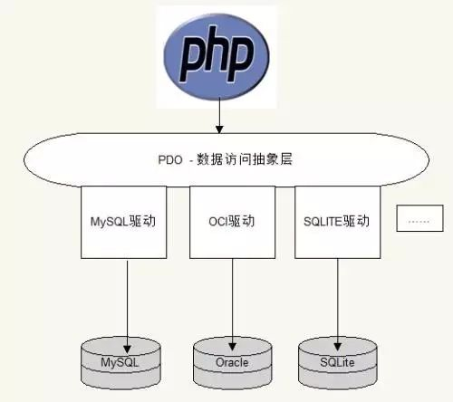

# PDO

>**很重要！！！**
>
>

# query 返回的是一个PDOStatement对象



`````php
$res = $pdo->query("select * from laravel");
var_dump($res);
/datadisk/website/Project/index4.php:542:
class PDOStatement#9 (1) {
  public $queryString =>
  string(21) "select * from laravel"
}
// 所以 可以使用pdoStatement 对象来获取sql语句；
echo $res->queryString; // 输出sql语句！！！
`````


\## rowCount()方法返回行数

\## fetch()方法返回结果集的一行【一维数组】并指针下移

\### fetch()方法的参数


\#### PDO::FETCH_ASSOC:返回关联数组  //  一般使用这个就好 了 （就是 返回的数据，以字段为key；）

````php
array(3) {
  'id' =>
  string(1) "2"
  'a' =>
  string(3) "444"
  'b' =>
  string(2) "22"
}
//fetch
````


\#### PDO::FETCH_NUM :返回索引数组  （就是 fetchAll 返回数据以数字为key；）

`````php
array(3) {
  [0] =>
  string(1) "2"
  [1] =>
  string(3) "444"
  [2] =>
  string(2) "22"
}
`````


\#### PDO::FETCH_BOTH ：默认，返回以上2种

\#### PDO::FETCH_OBJ 返回对象


## fetchAll()方法返回结果集的所有行【二维数组】，指针指向结束的位置


\### fetchAll()方法的参数

\#### PDO::FETCH_COLUMN 返回指定列组成的一维数组 参数2是一个整数索引，0代表第一列 就是pluck 这种数据类型的返回；


### 错误处理机制


（1）静默模式

 默认情况下与mysql处理方式一致，不现实错误信息（静默模式）但是我们可以通过固定的方法获得错误信息

  $pdo ->setAttribute(PDO::ATTR_ERRMODE,PDO::ERRMODE_SLIENT);

（2）警告模式

  //更改属性设置错误处理模式

  $pdo ->setAttribute(PDO::ATTR_ERRMODE,PDO::ERRMODE_WARNING);


（3）异常模式，当发生错误时，抛出一个异常 ---- 

  $pdo ->setAttribute(PDO::ATTR_ERRMODE,PDO::ERRMODE_EXCEPTION);

### 预编译


// 预编译机制 ，数据和程序分开，安全性和高效；

  //预编译：PDO::prepare($sql);  返回PDOStatement对象

  //绑定数据PDOStamentt->bindParam(); 给预编译的结果绑定数据

  //执行编译结果 PDOStament->execute()；

`````php
#注意  
//exec();指向代码，返回的是受影响的行数；
//query(); 执行select代码；code select * from laravel; + fetch(); 和fetchAll 取数据；
//execute(); 预处理执行代码！！！

`````


`````php
#attribute  设置属性 错误模式 和 fetch 模式
$pdo->setAttribute(PDO::ATTR_ERRMODE, PDO::ERRMODE_EXCEPTION);//错误转换成异常
//data的数据格式 私有属性变量data的数据类型，并不是query之后的数据类型；这个很重要 ！！！  这里我一般选择 是assoc 观念连数组；
$pdo->setAttribute(PDO::ATTR_DEFAULT_FETCH_MODE, PDO::FETCH_ASSOC);//2 返回的数据是一个数组
## 执行
$res = $pdo->query();  // 有结果集 PDOStatement 对象  //  然后fetch  fetchAll才能去获取数据；
$pdo->exec();  //返回的是受影响的行数！！！  update  insert delete   

# 数据的遍历  
foreach ($res as $val) {
    var_dump($val);
}

# 返回上一次插入操作的自增id
$pdo->lastInsertId();
# 取一个单个数据 一条条的取树
PDOstatement::fetch(); // 取一条数据；拿到结果集；

PDOstatemeent::fetchAll();


# 绑定
$a = 1;
$b = 2;
$prepare = $pdo->prepare("insert into table_name(a,b) values(:a,:b)");
$prepare->bingParam(':a',$a);
$prepare->bingParam(':a',$b);
// 预处理的执行；execute();
$prepare->execute();  //执行  注意这里的对象是$prepare 并不是 $pdo对象！！！

## 事务 

$pdo->beginTransaction();
$pdo->commit();
$pdo->rollback();

##注意 PDO的格式
// 数据库类型:hostname=***：
$dsn = 'mysql:host=192.168.1.103;dbname=demo;port=3306;charset=utf8';
$pdo = new PDO($dsn, 'laravel', 'laravel'); //pdo对象；
$object = new PDO($dsn,$user,$password);
`````


`````php
try {
    $dsn = 'mysql:host=192.168.1.103;dbname=demo;port=3306;charset=utf8';
    $pdo = new PDO($dsn, 'laravel', 'laravel');
    var_dump($pdo);
    $pdo->setAttribute(PDO::ATTR_ERRMODE, PDO::ERRMODE_EXCEPTION);//错误转换成异常
    //data的数据格式 私有属性变量data的数据类型，并不是query之后的数据类型； 这里是fetchall获得的数据类型！！！
    $pdo->setAttribute(PDO::ATTR_DEFAULT_FETCH_MODE, PDO::FETCH_ASSOC);//2 返回的数据是一个数组
    $res = $pdo->query('select * from laravel'); //PDOstatement 对象；
    //
    foreach ($res as $re) {  // 对象遍历//遍历全部
        var_dump($re);
    }
    //一条条的去取数据！！！
    //while ($row = $res->fetch()) {
    //    var_dump($row);
    //}
    //var_dump($res->fetch());
    //var_dump($res->fetchall());
   // die;  // 二维数组 一行是一个数组；
    $rows = $pdo->exec("update laravel set a=33 where id=3 ");  //exec() // 返回的是受影响的行数；update
    $prepare =  $pdo->prepare("insert into laravel(a,b) values(:a,:b)");// prepare 预处理
    $prepare->bindParam(':a',$a); // 数据的绑定
    $prepare->bindParam(':b',$b);
    $a = 44;
    $b = 444;
    $rows = $prepare->execute();  // 执行；//true  或者是false； 成功或者失败；//  指向成功或者失败；
    $stmt=$pdo->prepare($SQL);
    $stmt->execute();
    $count = $prepare->rowCount();//删除行数
    $rows = $pdo->exec("delete from laravel where id = 5");  // delete
    //var_dump($rows);die; //1  受影响的行数
} catch (PDOException $e) {
    echo $e->getMessage();
}
`````


## 事务pdo

`````php
        /**
         * 事务  pdo的事务
         */
try {
         $pdo->beginTransaction();
            // 一系列操作  要么成功 要么失败；失败； 
           $rows = $pdo->exec("update laravel set a=444 where id=3 ");
			# id primary key  已经存在；肯定是失败的；
           $prepare  = $pdo->prepare("insert into laravel(id,a,b) values(19,:a,:b)");
           $prepare->bindParam(':a',$a); // 数据的绑定
           $jude = $prepare->bindParam(':b',$b);


           // 完全可以实现的；

           $res = $prepare->execute();

           $pdo->commit();

    } catch (PDOException $e) {

        echo $e->getMessage();
        $pdo->rollBack();

    }
`````

---

````php
//pdo more profession 全部自己测试过了；放心食用！！！
try {

    $dsn = "mysql:host=192.168.1.106;dbname=demo;port=3306;charset=utf8";
    $pdo = new PDO($dsn, "root", "");
    $pdo->setAttribute(PDO::ATTR_ERRMODE, PDO::ERRMODE_EXCEPTION);//错误转换成异常
    //data的数据格式 私有属性变量data的数据类型，并不是query之后的数据类型；
    //要求返回的数据类型；
    // $pdo->setAttribute(PDO::ATTR_DEFAULT_FETCH_MODE, PDO::FETCH_ASSOC);//2 返回的数据是一个数组


    // $pdo->setAttribute(PDO::ATTR_DEFAULT_FETCH_MODE, PDO::FETCH_BOTH);//2 返回的数据是一个数组
    $pdo->setAttribute(PDO::ATTR_DEFAULT_FETCH_MODE, PDO::FETCH_NUM);//2 返回的数据是一个数组
    $res = $pdo->query("select * from laravel");
    $res2 = $res->fetch();
    echo "rowcount:".$res->rowCount();
    echo "\n";
    var_dump($res2);
    $res1 = $res->fetchAll();//返回的是一个二维数组；
    var_dump($res1);
    var_dump($res);//这是一个pdo对象要想获取数据还要用fetAll()  或者是fetch()
    echo $res->queryString; // pdoStatement 里面保存的是sql语句！！
    //todo这是啥？？？ //不知道为啥 这里不可以遍历对象；
    foreach ($res as $re) {
        echo "\n";
        echo "ss";
        var_dump($re);
        echo "\n";
    }

    // 预处理prepare();
    $prepare =   $pdo->prepare("insert into laravel(a,b) values(:a,:b)");
    $a = 1;
    $b = 2;
    $prepare->bindParam(":a",$a);
    $prepare->bindParam(":b",$b);
    // $prepare = $pdo->prepare("select * from laravel where id = :id");
    // echo $prepare->queryString;
    // $val = 2;
    // 第二个参数必须是一个变量；因为这里是接收，引用的；
    // $prepare->bindParam(":id",2);
    $prepare->execute();//执行代码； // return false  and true；
    // var_dump($prepare->fetchAll()); //接收数据；预处理的；
    //受影响的行数；
    var_dump($prepare->rowCount());//受影响的行数；
    // $pdo->beginTransaction();//事物开始；
    //
    // sql code 

    // $pdo->commit();//提交事务；

    // 获取最后一条sqlid；
    // 在这个例子中，通过执行 $pdo->lastInsertId() 方法来获取最后一行数据的ID。在此之后，我们可以将 $lastInsertId 变量中的ID打印到屏幕上，以查看在上一个插入操作中插入的最后一行的ID。
    $lastInsertId = $pdo->lastInsertId();
    var_dump($lastInsertId);
} catch (PDOException $e) {
    echo $e->getMessage();
}
````


为什么要讲PDO：

（1）市面上使用最多的，大部分企业使用PDO

（2）Mysqli 只支持MySQL数据库，PDO支持大部分数据库

（3）以后做的项目都是使用PDO作为数据库抽象层来实现的


**mysqli------是mysql数据库的加强：**

**（预处理机制）**  

**（错误处理机制）**

**（采用了面向对象的编程模式）**


**一、PHP如何操作数据库**

与具体数据库的扩展：php想操作那个数据库，需要开启这个数据库的扩展，提供操作这个数据库的函数




**二、什么是PDO**

PDO是一个mysql官方封装的，基于面向对象编程思想的，使用C语言开发的数据库抽象层

**三、PDO数据库抽象的概念：**

**PDO抽象类**

它是封装的一个类，就是一个控制数据库的新的操作方法

将具体的操作数据库的代码封装到数据库抽象层，如果出项数据库转移，只需在php代码里高速数据库抽象层，你去使用哪一个数据库就可以了

通过代码引出PDO

<?php

 //写一个函数，根据传递的参数来操作不同的数据库

 function mysql_db($type){

  if($type=='mysql'){

​    mysql_connect();

​    mysql_select_db();

  }elseif ($type=='mssql'){

​    mssql_connect();

​    mssql_query();

  }elseif ($type=='Oracle'){

​    // 具体操作某个数据库的函数

  }

 }

 mysql_db('mysql');

 function mysql_q($type,$sql){

  if($type=='mysql'){

​    mysql_query($sql);

  }

 }

?>


**一、   如何使用PDO**

**和当前使用mysql非常像**

**要想使用mysql需要开启mysql扩展，**

**需想使用PDO，需要开启PDO扩展**

**获得PDO对象，调用方法**

(1)要开启pdo驱动

Extension = php_pdo.dll

Extension = php_pdo_sqlite.dll

Extension = php_pdo_mysql.dll

开启这个扩展（驱动），就可以使用这个扩展给我们提供类了


（2）使用这个类，实例化这个类，调用属性和方法

  <?php

  //使用PDO操作数据库

  //第一个参数：连接数据库的类型：主机名；数据库名

  $dsc = 'mysql:host=localhost;dbname=mysql_text';

  $user = 'root';

  $pass = '123';

  $pdo = new PDO($dsc,$user,$pass);//实例化一个类的时候，会自动的先调用__construct()构造函数

  //var_dump($pdo);

  //执行sql语句获得

  $sql = 'select*fromgoods';

  $result = $pdo->query($sql);//query方法返回的是PDOStatement对象

  //如果想获得具体的数据，需要调用对象的方法：fetchAll();参数是类常量，表示返回什么样的数据

  $rows = $result->fetchAll(PDO::FETCH_BOTH);

  //var_dump($rows);

  //更新数据库的操作

  $sql = 'update goods set goods_name="lalala" wheregoods_id=3';

  //执行增删改的语句,exec()方法，执行查询的语句 query()

  //exec()返回受影响的函数   query()返回PDOStatement对象

  $nums = $pdo->exec($sql);

  var_dump($nums);

  ?>


**二、   PDO预编译机制**

先将sql语句的数据部分和费数据部分分离开————》将不带数据的部分预编译一下prepare（）————》在编译结果上绑定数据bandparam()————》执行编译结果execute()

预编译的好处：1、减少了编译的字符数，编译的速度提高

​       2、如果再次执行同样的sql语句，直接绑定数据，减少编译sql语句时间

写代码实现PDO的预编译（与处理机制）

<?php

// 预编译机制 ，数据和程序分开，安全性和高效；

  //预编译：PDO::prepare($sql);  返回PDOStatement对象

  //绑定数据PDOStamentt->bindParam(); 给预编译的结果绑定数据

  //执行编译结果 PDOStament->execute();

  //使用PDO操作数据库

  //第一个参数：连接数据库的类型：主机名；数据库名

  $dsn = 'mysql:host=localhost;dbname=mysql_text';

  $user = 'root';

  $pass = '123';

  $pdo = new PDO($dsn,$user,$pass);

  //var_dump($pdo);

  //预编译：prepare();参数是不带数据的sql语句

  //先将sql语句中的数据部分用占位符代替 :占位符名称

  $sql = 'insert intogoods values(null,:name,:price,:number)';

  $smt = $pdo->prepare($sql); //返回一个PDOStament 对象

  //绑定数据 PDOStament对象的bindParam()来绑定参数：占位符，实际数据

  $goods_name= 'surface';

  $goods_price= '3500';

  $goods_num= '41';

  $smt->bindParam(':name',$goods_name);

  $smt->bindParam(':price',$goods_price);

  $smt->bindParam(':number',$goods_num);

  $smt->execute()；

?>


**三、   PDO的错误处理机制：**

（1）静默模式

 默认情况下与mysql处理方式一致，不现实错误信息（静默模式）但是我们可以通过固定的方法获得错误信息

（2）警告模式

  //更改属性设置错误处理模式

  $pdo ->setAttribute(PDO::ATTR_ERRMODE,PDO::ERRMODE_WARNING);

（3）异常模式，当发生错误时，抛出一个异常

  $pdo ->setAttribute(PDO::ATTR_ERRMODE,PDO::ERRMODE_EXCEPTION);

  $sql = 'select*fromgood';

  try {

  //尝试可能会处错误的代码

  $pdo ->query($sql);

  }catch (PDOException $e){

  //现在捕获异常后，自己看着办，是让他显示出来呢，还是输出到日志文件里呢？

  //通常是将错误信息输出到日志文件里

  var_dump($e->getMessage());

  file_put_contents('D://mysql.log',$e->getMessage());

}

---


## 打印SQL 语句


PDOStatement是PHP中一种常用的数据库操作类，可以用来执行[SQL](https://www.cda.cn/map/sql/)语句并返回结果集或影响行数。在开发过程中，我们经常需要查看PDOStatement执行的[SQL](https://www.cda.cn/map/sql/)语句以方便调试和优化。本文将介绍如何使用PDOStatement打印出执行的[SQL](https://www.cda.cn/map/sql/)语句。

### 方法一

PDOStatement提供了一个debugDumpParams方法，可以方便地输出执行的[SQL](https://www.cda.cn/map/sql/)语句及其绑定参数的值。该方法会打印出与PDOStatement对象关联的[SQL](https://www.cda.cn/map/sql/)语句、绑定的参数值、参数类型等信息。

下面是一个使用debugDumpParams方法的示例代码：

```
$stmt = $pdo->prepare('SELECT * FROM users WHERE id = :id');
$stmt->bindParam(':id', $id, PDO::PARAM_INT);
$stmt->execute();
$stmt->debugDumpParams();
```

运行上述代码后，控制台会输出如下内容：

```
SQL: [80] SELECT * FROM users WHERE id = :id
Params: 1
Key: Name: [2] :id
paramno=-1
name=[2] ":id"
is_param=1
param_type=1
```

其中，[SQL](https://www.cda.cn/map/sql/)：[80]表示[SQL](https://www.cda.cn/map/sql/)语句的长度为80个字符；Params：1表示绑定了1个参数；Key：Name：[2]：:id表示绑定的参数名为:id。

虽然debugDumpParams方法可以输出[SQL](https://www.cda.cn/map/sql/)语句及其绑定参数的信息，但是输出的格式不够直观，而且只能在控制台中查看，不够方便。因此，我们可以使用方法二来打印出执行的[SQL](https://www.cda.cn/map/sql/)语句。

### 方法二

PDOStatement提供了一个属性queryString，可以获取与PDOStatement对象关联的[SQL](https://www.cda.cn/map/sql/)语句。我们可以通过该属性来直接获取并打印出执行的[SQL](https://www.cda.cn/map/sql/)语句，如下所示：

```php
//处理预处理的sql代码，想一想直接 query 那么基本没必要去看执行的SQL
$stmt = $pdo->prepare('SELECT * FROM users WHERE id = :id');
$stmt->bindParam(':id', $id, PDO::PARAM_INT);
$stmt->execute();
echo $stmt->queryString;
```

运行上述代码后，会直接输出执行的[SQL](https://www.cda.cn/map/sql/)语句：

```
SELECT * FROM users WHERE id = :id
```

使用这种方法打印出的[SQL](https://www.cda.cn/map/sql/)语句更加简洁、直观，也更方便在日志文件或控制台中查看。

### 总结

本文介绍了使用PDOStatement打印出执行的[SQL](https://www.cda.cn/map/sql/)语句的两种方法，即使用debugDumpParams方法和获取属性queryString。两种方法都可以实现打印出[SQL](https://www.cda.cn/map/sql/)语句的目的，具体选择哪种方法取决于个人习惯和实际情况。在开发过程中，打印出执行的[SQL](https://www.cda.cn/map/sql/)语句是非常有用的，可以帮助我们调试程序、优化性能。