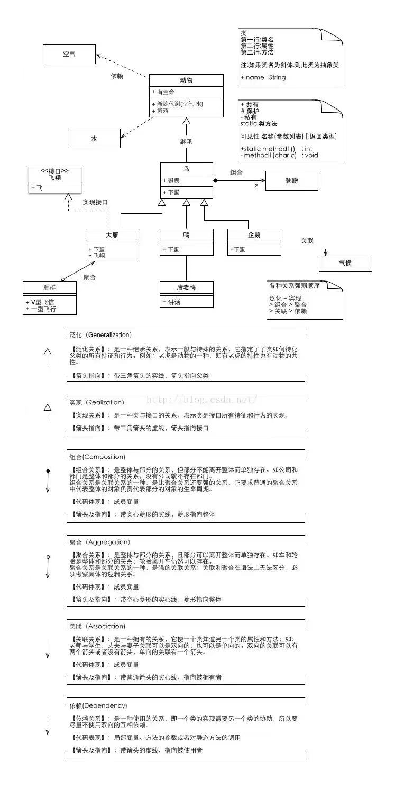
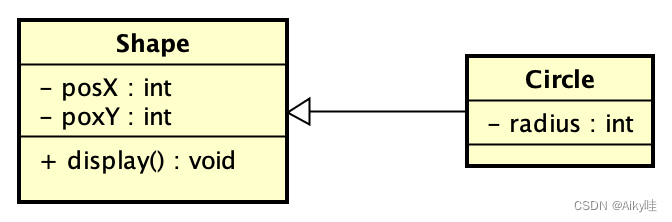
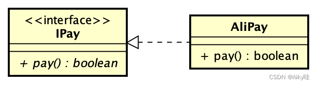
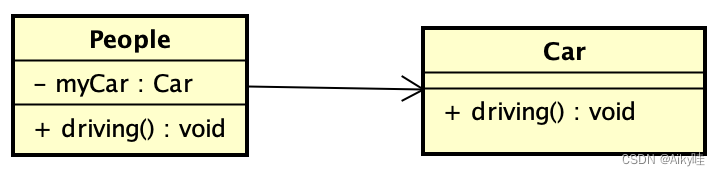
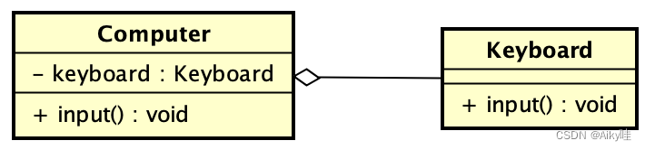
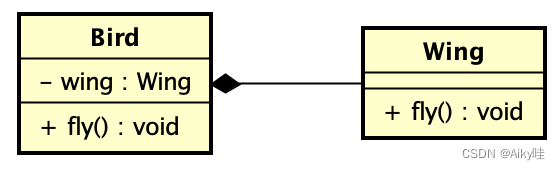
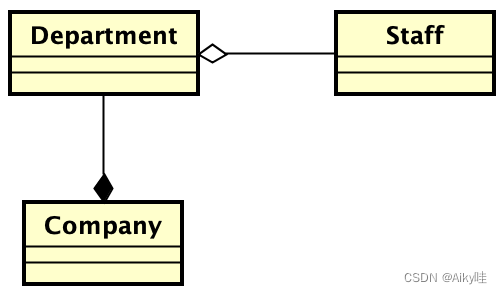
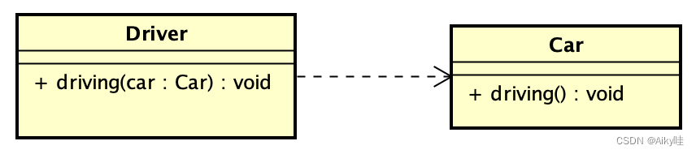
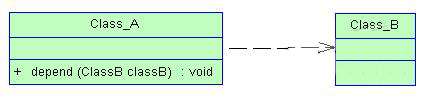
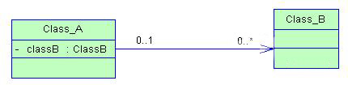

#UML  unified modeling language

>统一建模语言；
>
>说白了 就是类与类之间的关系 总共的五种关系；
>
><font color=red>**继承 实现 聚合 组合 关联 依赖；**</font>


---

类与类之间的关系：


##  继承

实线空心箭头；

## 实现 (类与接口的关系！！)

虚线三角空心箭头来表示


-----


## 关联   association  仅仅是关联的；仅仅是有关系的；

>拥有关系，一个类知道另一个类的属性和方法；

类与类之间的关系 

用实线箭头来表示；


## 聚合

is_has（）

聚合 代码基本一致 但是业务逻辑不同；同样是表示部分和整体的关系；

整体不存在了，部分也就不存在了；

例如：公司不存在了，那么员工也就不存在了；

`````php
#代码实现一模一样；但是 部分和整体更加密切；整体消失的时候 部分也要消失；
`````


## 组合

is_contains

整体不存在了，部分还存在了；

````php
# 注入的是个抽象；是稳定的；所以这里是组合；  这是组合；
class Computer
{
    private $type;
    //组合； 
    public function __construct(Type $type){
        $this->type = $type;
	}
    public function main(){
        $this->type->main();
    }
}

//这是一种聚合  总的关系；
interface Type 
{
    public function main();
}

class Mac implements Type 
{
    public function main(){
        echo "i m a mac";
    }
}

class notebook implements Type
{
    public function main(){
        echo "i m a note book";
	}
}

````


---


## 依赖

>一个类的实现依赖另外一个类；
>
>使用关系，一个类实现，需要另外一个类；

-------->来实现

````````php
# 依赖注入的是实例； 注入的是实例；
//  这个是组合呀；

// 直接静态方法； 
class Car {  
    public static void run(){  
        System.out.println("汽车在奔跑");  
    }  
}  
   
class Driver {  
    //使用形参方式发生依赖关系  
    public void drive1(Car car){  
        car.run();  
    }  
    //使用局部变量发生依赖关系  
    public void drive2(){  
        Car car = new Car();  
        car.run();  
    }  
    //使用静态变量发生依赖关系  
    public void drive3(){  
        // 静态方法；
        Car.run();//静态方法；  
    }  
}
````````


# 图片简介；

> 箭头指向问题 研究i下总结一下；//todo





----

## 什么是[类图](https://so.csdn.net/so/search?q=类图&spm=1001.2101.3001.7020)？

- 【概念】 类图是一切面向对象方法的核心建模工具。类图描述了系统中对象的类型以及它们之间存在的各种静态关系。
- 【目的】用来表示类、接口以及它们之间的静态结构和关系。

在类图中，常见的有以下几种关系。

### [泛化](https://so.csdn.net/so/search?q=泛化&spm=1001.2101.3001.7020)（Generalization）

- 【泛化关系】是一种继承关系，表示子类继承父类的所有特征和行为。
- 【箭头指向】带三角箭头的实线，箭头指向父类。



### 实现（Realization）

- 【实现关系】是一种类与接口的关系，表示类是接口所有特征和行为的实现。
- 【箭头指向】带三角箭头的虚线，箭头指向接口。



---


### 关联（Association）

- 【关联关系】是一种拥有关系，它使得一个类知道另一个类的属性和方法。
- 【代码体现】成员变量
- 【箭头指向】带普通箭头的实线，指向被拥有者。双向的关联可以有两个箭头，或者没有箭头。单向的关联有一个箭头。



 自己买的车，想什么时候开就开。但是车是车，人是人，没有整体与部分的关系。

-----

<font color=red>整体和部分的关系： 聚合和组合；类与类之间的关系；</font>

>**区别：**
>
>* **聚合： 部分离开整体还是存在的；**
>* **组合： 部分不能不开整体而单独存在；**

### 聚合（Aggregation）

- 【聚合关系】是一种整体与部分的关系。且部分可以离开整体而单独存在。聚合关系是关联关系的一种，是强的关联关系；关联和聚合在语法上无法区分，必须考察具体的逻辑关系。
- 【代码体现】成员变量
- 【箭头指向】带空心菱形的实线，空心菱形指向整体。



 电脑有键盘才能输入信息，电脑是整体，键盘是部分，键盘也可以离开电脑，单纯的拿去敲。所以是聚合。

### 组合（Composition）

- 【组合关系】是一种整体与部分的关系。但部分不能离开整体而单独存在，组合关系是关联关系的一种，是比聚合关系还要强的关系。
- 【代码体现】成员变量
- 【箭头指向】带实心菱形和普通箭头的实线，实心菱形指向整体。



鸟是整体，翅膀是部分。鸟死了，翅膀也就不能飞了。所以是组合。我们再看一下，下面的一组经典的聚合组合关系的例子。



一个公司拥有多个部门，公司和部门之间是组合关系，公司破产了，部门就不复存在了。部门和员工是聚合关系，部门被裁掉，员工就换下家了。

---


### 依赖（Dependency）

- 【依赖关系】是一种使用关系，即一个类的实现需要另一个类的协助。
- 【箭头指向】带普通箭头的虚线，普通箭头指向被使用者。



 老司机只管开车，车是谁的不重要，给什么车开什么车。

---

## 关联和依赖；


依赖注入

依赖

组合；来做扩展；类用注入的方式来注入；php 直接注入就行了；


---

# [依赖、关联、聚合和组合之间的区别](https://www.cnblogs.com/lsgxeva/p/7773190.html)

# 依赖、关联、聚合和组合之间的区别

>关联关系就是用属性来保存依赖另外一个类的引用； 就是一种引用关系；属于类的一个引用而已；
>
>依赖关系：就是用形参，局部变量或者静态方法来保存的对象引用；并不属于这个对象的；仅仅是一个参数；
>
>依赖与关联的不同点： 类里面包不包含关联类或者依赖类的属性；
>
>* 不包含那么就是依赖；
>
>* 包含那么就是关联；
>
> ----
>
>  

在学习面向对象设计对象关系时，依赖、关联、聚合和组合这四种关系之间区别比较容易混淆。特别是后三种，仅仅是在语义上有所区别，所谓语义就是指上下文环境、特定情景等。他们在编程语言中的体现却是基本相同的，但是基本相同并不等于完全相同，这一点在我的前一篇博文[**《**](http://www.importnew.com/15480.html)**[设计模式](http://www.amazon.cn/gp/product/B001130JN8/ref=as_li_qf_sp_asin_il_tl?ie=UTF8&tag=importnew-23&linkCode=as2&camp=536&creative=3200&creativeASIN=B001130JN8)中类的关系》**中已经有所提及，下面就来详细的论述一下在java中如何准确的体现依赖、关联、聚合和组合。

首先看一看书上对这四种关系的定义：

- 依赖(Dependency)关系是类与类之间的联接。**依赖关系表示一个类依赖于另一个类的定义**。例如，一个人(Person)可以买车(car)和房子(House)，Person类依赖于Car类和House类的定义，因为Person类引用了Car和House。与关联不同的是，Person类里并没有Car和House类型的属性，Car和House的实例是以参量的方式传入到buy()方法中去的。**一般而言，依赖关系在Java语言中体现为局域变量、方法的形参，或者对静态方法的调用。**

`````php
#依赖--php好像不能直接 把一个对象赋值道一个属性上； 所以不存在关联的关系；
//  php可以 把一个对象赋值到一个属性上，在初始化————construct(); 构造函数的时候去赋值；
#只存在 依赖的关系？
//组合;
class A
{
	public $mid;
    public function __construct(B $b) {
        $mid = $b;
    }
    public function main() {
        $mid->do();
    }
}

class B
{
    public function do() {
        echo "B do doing";
    }
}

`````


- 关联(Association）关系是类与类之间的联接，**它使一个类知道另一个类的属性和方法。****关联可以是双向的，也可以是单向的。**在Java语言中，关联关系一般使用成员变量来实现。

  

----


- 聚合(Aggregation) 关系是**关联关系的一种**，是**强的关联关系。聚合是整体和个体之间的关系。**例如，汽车类与引擎类、轮胎类，以及其它的零件类之间的关系便整体和个体的关系。与关联关系一样，聚合关系也是通过实例变量实现的。

  **<font color=red>但是关联关系所涉及的两个类是处在同一层次上的，而在聚合关系中，两个类是处在不平等层次上的，一个代表整体，另一个代表部分。</font>**

  

-  组合(Composition) 关系是**关联关系的一种**，是**比聚合关系强的关系。它要求普通的聚合关系中代表整体的对象负责代表部分对象的生命周期，组合关系是不能共享的。**代表整体的对象需要负责保持部分对象和存活，在一些情况下将负责代表部分的对象湮灭掉。代表整体的对象可以将代表部分的对象传递给另一个对象，由后者负责此对象的生命周期。换言之，代表部分的对象在每一个时刻只能与一个对象发生组合关系，由后者排他地负责生命周期。部分和整体的生命周期一样。

````php
````


——摘自《Java面向对象编程》，作者：孙卫琴

````php
// 注意 只有存在整体和部分的概念的时候才会使用组合；不然就是用继承好了； 只有一个整体可以划分为多个部分的时候才能使用组合；
// 继承就是代表  一个整体 就分为一个部分 那么你就需要继承就好了；

// 聚合和 组合的一个比较经典的例子  首先聚合 和 组合处于不平等给的一个层次；一个代表整体一个代表部分；

//company department staff 
//公司倒闭了，部门肯定没得了，是一个组合的关系
//但是部门完蛋了，员工还存在，是一个聚合关系；
````


 以上关系的**耦合度**依次增强（关于耦合度的概念将在以后具体讨论，这里可以暂时理解为当一个类发生变更时，对其他类造成的影响程度，影响越小则耦合度越弱，影响越大耦合度越强）。**由定义我们已经知道，依赖关系实际上是一种比较弱的关联，聚合是一种比较强的关联，而组合则是一种更强的关联，所以笼统的来区分的话，实际上这四种关系、都是关联关系。**

依赖关系比较好区分，它是耦合度最弱的一种，**在java中表现为局域变量、方法的形参，或者对静态方法的调用**，如下面的例子：Driver类依赖于Car类，Driver的三个方法分别演示了依赖关系的三种不同形式。

```java
// 直接静态方法； 
class Car {  
    public static void run(){  
        System.out.println("汽车在奔跑");  
    }  
}  
   
class Driver {  
    //使用形参方式发生依赖关系  
    public void drive1(Car car){  
        car.run();  
    }  
    //使用局部变量发生依赖关系  
    public void drive2(){  
        Car car = new Car();  
        car.run();  
    }  
    //使用静态变量发生依赖关系  
    public void drive3(){  
        // 静态方法；
        Car.run();//静态方法；  
    }  
}
```

----

关联：

**关联关系在java中一般使用成员变量来实现，有时也用方法形参的形式实现。**

**依然使用Driver和Car的例子，使用方法参数形式可以表示依赖关系，也可以表示关联关系，毕竟我们无法在程序中太准确的表达语义。**


**在本例中，使用成员变量表达这个意思：车是我自己的车，我“拥有”这个车。** 

**使用方法参数表达：车不是我的，我只是个司机，别人给我什么车我就开什么车，我使用这个车。**


```java
class Driver {  
    //使用成员变量形式实现关联  
    Car mycar;  
    public void drive(){  
        mycar.run();  
    }  
    ...  
    //使用方法参数形式实现关联  
    public void drive(Car car){  
        car.run();  
    }  
}
```


---

 聚合和组合；

聚合关系是是一种比较强的关联关系，java中一般使用成员变量形式实现。对象之间存在着整体与部分的关系。例如上例中

```java
class Driver {  
    //使用成员变量形式实现聚合关系  
    Car mycar;  
    public void drive(){  
        mycar.run();  
    }  
}
```

假如给上面代码赋予如下语义：车是一辆私家车，是司机财产的一部分。则相同的代码即表示聚合关系了。聚合关系一般使用setter方法给成员变量赋值。


假如赋予如下语义：车是司机的必须有的财产，要想成为一个司机必须要先有辆车，车要是没了，司机也不想活了。而且司机要是不干司机了，这个车就砸了，别人谁也别想用。那就表示组合关系了。

**一般来说，为了表示组合关系，常常会使用构造方法来达到初始化的目的，例如上例中，加上一个以Car为参数的构造方法**

```java
public Driver(Car car){  
    mycar = car;  
}
//php也是 在初始化的时候完成赋值 ；
class A
{
    public $mid;
    public function __construct(B $b) {
        $mid = $b;
    }
}

$a = new A(new B);
```

所以，关联、聚合、组合只能配合语义，结合上下文才能够判断出来，而只给出一段代码让我们判断是关联，聚合，还是组合关系，则是无法判断的。


----


最近研究[设计模式](https://so.csdn.net/so/search?q=设计模式&spm=1001.2101.3001.7020)，看类图有点发虚！有些关系搞的不是很清楚。所以整理一下：

  类与类之间由弱到强关系是:   ***\*没关系 >\** \**依赖 > 关联 > 聚合 > 组合。\****

　 类和类之间八竿子打不着那就是没关系，这个没啥歧义。

  

　**依赖\**(dependency)\****

 

　　可以简单的理解，就是一个类A使用到了另一个类B，而这种使用关系是具有偶然性的、、临时性的、非常弱的，但是B类的变化会影响到A；比如某人要过河，需要借用一条船，此时人与船之间的关系就是依赖；表现在代码层面，为类B作为参数被类A在某个method方法中使用。用带虚线的箭头。

　　

 

　**关联\**(association)\****

　　他体现的是两个类、或者类与接口之间语义级别的一种强依赖关系，比如我和我的朋友；这种关系比依赖更强、不存在依赖关系的偶然性、关系也不是临时性的，一般是长期性的，而且双方的关系一般是平等的、关联可以是单向、双向的；表现在代码层面，为被关联类B以类属性的形式出现在关联类A中，也可能是关联类A引用了一个类型为被关联类B的全局变量；

 

 **依赖和关联区别：**我用锤子修了一下桌子，我和锤子之间就是一种依赖，我和我的同事就是一种关联。依赖是一种弱关联，只要一个类用到另一个类，但是和另一个类的关系不是太明显的时候（可以说是“uses”了那个类），就可以把这种关系看成是依赖，依赖也可说是一种偶然的关系，而不是必然的关系。关联是类之间的一种关系，例如老师教学生，老公和老婆这种关系是非常明显的。依赖是比较陌生，关联是我们已经认识熟悉了。

----

# 关联 组合 聚合的关系


聚合
聚合是关联的一种特例，体现的是整体与部分的关系，即has-a的关系。

has-a 不是must has，例如飞机场和飞机，飞机场可以停有飞机，也可以没有停飞机，飞机可以停在飞机场，也可以飞在天上。

他们有各自的生命周期。


组合
组合也是关联的一种特例，他体现的是contains-a的关系，比聚合更强。

组合同样体现整体和部分的关系，但是整体和部分是不可分割的，他们有共同的生命周期。


例如，人有耳朵鼻子等，一旦人死了，耳朵鼻子也就死了。

####聚合和组合

      1.聚合和组合都是一种关联关系，只是具有不同的整体-部分的意义。
      2.整体部分中，部分的生命周期不同。聚合关系中，整体不会拥有部分的生命周期，整体删除时，
      部分不会被删除， 多个整体共享同一个部件。组合关系中，整体拥有部分的生命周期，整体删除时，
      部分一定会被删除。

而且，多个整体不可以同时共享同一个部分。（区分某个关联关系是组合还是聚合，看两个类的生命周期是否同步，同步就是组合关系，不同步就是聚合关系）

     3.聚合是has-a 关系，组合是contains-a 关系。
1
举个简单的例子：

大家需要去公司上班，所以很多员工组成了公司，每个公司都有自己的员工，每个员工也有自己的公司。员工和公司就是聚合的关系。另外，每个员工都有手脚，人和手脚的关系就是组合，不可分割，拥有相同的生命周期。

聚合关系图：

```java
public class Company {
    public List<Company> companyList;
public Company(List<Company> companyList) {
    this.companyList = companyList;
}
}
```

组合关系图:
                                       

```java
public class Employee {
    public Hand hand;
public Employee() {
    this.hand = new Hand();
}
    
}

```
