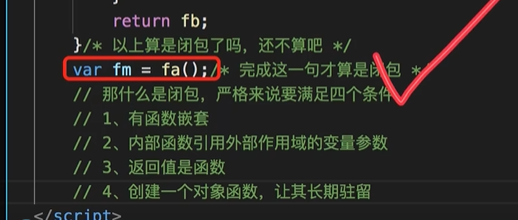

# closure 闭包

> 可以调用其他函数的内部变量；	
>
> 用use来实现调用其他函数的内部变量；
>
> <font color=red>**php 闭包：闭包的语法很简单，需要注意的关键字就只有use，use意思是连接闭包和外界变量，可以用use保存传入的外部变量(用use来保存函数外部的环境；)，函数的参数，要输入；**</font>
>
> <font color=red>php单线程，闭包真的没有什么吊意义！！！</font>
>
> 因为函数内的变量无法常驻内存，所以我们使用闭包来保存函数内的上下文环境！！！


````php

/**
 * closure
 *
 *
闭包就是能够读取其他函数内部变量的函数。
 */

function affir(Closure $callback){
    $a = 1;
    $b = 2;
    $callback($a,$b);
}

/**
 * 闭包就是能够读取其他函数内部变量的函数。
 */
function main() {
    $a = 3;
    $b = 4;
    affir(function ($x,$y) use ($a,$b) {
        echo $a,$b;
        echo $x,$y;
    });
}

main(); // 3412
````


```````js
// 前端的闭包
// 全局变量害怕被污染？？// 注意前端的js 全局变量是常驻内存的，但是php全局变量仅仅是请求内的常驻内存；所以每次请求都会重置全局变量；

// let 是局部变量  var 是全局变量？   还是放在堆或者栈中的区别？？？？

//前端代码 --- 全局变量；--- 常驻内存；注意和php的区别；php会做请求的初始化和请求的销毁；变量会被销毁和重建；
// 用全局变量，但是所有的函数都可以调用所以会污染掉全局变量；
// php害怕的是一个进程内被很多人调用 然后全局变量被污染掉？？ 感觉理由很牵强，但是只有这一个理由！！！因为是同一个进程内，顺序调用所以并不胡被污染！！！ 
//1.
var a = 10;
//// 
function fa() {
    a--;
    console.log(a);
}
fa();

```````


````js
//2.局部变量 -- 很明显并不会实现的；
//不能实现；
function fa() {
    let a = 10;
    a--;
    console.log(a)
}
````


````js
// 闭包的实现；
function fa() {
    let a = 10;
    function fb() {
        a--;
        console.log(a);
    }
    return fb;
}

var fm = fa();

//实现闭包的条件？？？？？


//php 的闭包！一个请求内，全局变量，
// 全部是 9 ； 肯定不能实现闭包；
// php闭包 就是可以用use 来保存外部变

/**
 * closure
 */


function run(){
    $a = 10;
    // 这里全部都是 10 ，已经保存了是10；
    $mid = function () use ($a) {
        $a--;
        echo $a;
        echo "\n";
    };

    return $mid;
};

$res = run();

$res();  // 9 

$res(); // 9 


````





##  php匿名函数 或者说 闭包

匿名函数（Anonymous functions），也叫闭包函数（closures），允许 临时创建一个没有指定名称的函数。最经常用作回调函数（callback）参数的值。当然，也有其它应用的情况。

匿名函数目前是通过 Closure 类来实现的。（摘自官方文档）


1、简单示例

定义一个函数，并没有指定名称，再指定一个参数

`````php


$fun = function ($variable) {
  echo $variable . '---';
};
$a = '123'; //变量$a定义在匿名函数定义前，还是后，结果是一样的
$fun($a);
// 运行结果为： 123---
`````


2、未使用 use

如果不使用use ，则不能在匿名函数中调用变量$b。

````php
$b = '456';
$fun = function ($variable) {
    echo $variable .'---'. $b;
};
$a = '123';
$fun($a);
// 
// 输出结果为 ErrorException 未定义变量 b
````


3、使用use

借助关键字use之后，就可以调用变量$b了

````php
$a = '123';
$b = '456';// 此时，变量$b必须定义在匿名函数定义前
$fun = function ($variable) use($b) {
    echo $variable .'---'. $b;
};
$fun($a);
// 输出结果是 123---456
````


前提是变量$b必须在匿名函数定义之前，否则依然会提示未定义变量 b；

4、不使用&

``````php
$a = '123';
$b = '456';// 此时，变量$b必须定义在匿名函数定义前
$fun = function ($variable) use($b) {
    echo $variable .'---'. $b;
};
$fun($a);
// 输出结果是 123---456
$b = 5678;
$fun($a);
// 输出结果依然是 123---456
``````


示例4中，虽然修改了变量b的值，但是结果依然是123—456，因为匿名函数在定义时已经保存了变量b的值，这也是证明了为何$b必须定义在匿名函数定义之前的原因了，因为在定义时，会保存这个值，如果要想随着外界修改而自动更新，则就使用引用传递了，即&

5、使用&

````php
$a = '123';
$b = '456';
$fun = function ($variable) use(&$b) {
    echo $variable .'---'. $b;
};
$fun($a);
// 输出结果是 123---456
$b = 5678;
$fun($a);
// 输出结果变为 123---5678
````

备注：以上调试php版本是7.3.4


`````php
匿名函数（Anonymous functions），也叫闭包函数（closures），允许 临时创建一个没有指定名称的函数。最经常用作回调函数（callback）参数的值。当然，也有其它应用的情况。

匿名函数目前是通过 Closure 类来实现的。（摘自官方文档）

1、简单示例

定义一个函数，并没有指定名称，再指定一个参数

$fun = function ($variable) {
  echo $variable . '---';
};
$a = '123'; //变量$a定义在匿名函数定义前，还是后，结果是一样的
$fun($a);
// 运行结果为： 123---

2、未使用 use

如果不使用use ，则不能在匿名函数中调用变量$b。

$b = '456';
$fun = function ($variable) {
    echo $variable .'---'. $b;
};
$a = '123';
$fun($a);
// 输出结果为 ErrorException 未定义变量 b

3、使用use

借助关键字use之后，就可以调用变量$b了

$a = '123';
$b = '456';// 此时，变量$b必须定义在匿名函数定义前
$fun = function ($variable) use($b) {
    echo $variable .'---'. $b;
};
$fun($a);
// 输出结果是 123---456

前提是变量$b必须在匿名函数定义之前，否则依然会提示未定义变量 b

4、不使用&

$a = '123';
$b = '456';// 此时，变量$b必须定义在匿名函数定义前
$fun = function ($variable) use($b) {
    echo $variable .'---'. $b;
};
$fun($a);
// 输出结果是 123---456
$b = 5678;
$fun($a);
// 输出结果依然是 123---456

示例4中，虽然修改了变量b的值，但是结果依然是123—456，因为匿名函数在定义时已经保存了变量b的值，这也是证明了为何$b必须定义在匿名函数定义之前的原因了，因为在定义时，会保存这个值，如果要想随着外界修改而自动更新，则就使用引用传递了，即&

5、使用&

$a = '123';
$b = '456';
$fun = function ($variable) use(&$b) {
    echo $variable .'---'. $b;
};
$fun($a);
// 输出结果是 123---456
$b = 5678;
$fun($a);
// 输出结果变为 123---5678

备注：以上调试php版本是7.3.4

`````


## php 函数内部不能访问到全局变量


执行如下代码，

`````php
$i = 10;

function my(){
	 echo $i;
 }

my();

//xdebug显示是：Undefined variable
`````


## php的闭包！

`````php
/**
 * 全局变量
 * php 只能使用 global 来访问  或者使用超全局变量 $_GLOBALS来保存；
 * php
 * php 直接这样写就行了，不需要用闭包； 因为是进程模型，所以全局变量，并不会被污染；
 * 单线程模型；
 */
$ceshi1 = 10;

function fceshi() {
    //局部变量；//引用 全局变量符号表 symbal table
    $GLOBALS['ceshi1']--;
    echo $GLOBALS['ceshi1'];
    echo "\n";
}
fceshi();
fceshi();
fceshi();
die;

/**
 * closure
 *  use  仅仅是保存外部变量而已！！！！！ 保护$a 这个变量不能被其他的线程调用？？？ 
 *  php本来就是多进程的！
 */


$run = function (){
    // 局部变量；
    $a = 10;
    // 这里全部都是 10 ，已经保存了是10；
    // use 仅仅是保存 和使用外部变量；
    $mid = function () use ($a) {
        $a--;
        echo $a;
        echo "\n";
    };

    return $mid;
};

//$res = $run();
//
//$res(); //9
//
//$res(); //9
//$res();


/**
 * 超全局变量 就是 c语言中的全局变量
 * php的全局变量除了在函数内，在任意地方都可以访问到；
 * 局部变量是只能在函数内访问；
 */
$glo = 123;
function glorun() {
    $gloa = 123;
    echo $GLOBALS['glo'];
}
//echo $GLOBALS['gloa'];
glorun();


// 算是一个闭包的应用吧；
// 保存当前环境的变量 到另外一个环境；

/**
 * php 闭包的一个用法吧
 * php因为是单线程的原因，所以不存在全局变量被别的线程污染的可能；
 */
//
// 保存当前环境的一个作用；
//
$adss = 123;

//
$ad = function () use ($adss) {
    echo $adss;
};
//
function fad(Closure $ad) {
    $ad();
}
fad($ad);
//
`````


这个问题，即函数内部不可以访问外部的变量，如果想访问，如上，则在函数内部加 global $i。

用户在php中定义的变量都可以在一个HashTable中找到，当php中定义一个变量，内核会自动的把它的信息存储到一个用HashTable实现的符号表里，当用户在php中调用一个函数或者类的方法时，内核会创建一个新的符号表并激活之，这也是为什么我们无法在函数中使用函数外定义的变量的原因（因为他们分属两个符号表，一个当前作用域，一个全局作用域的），如果不是在一个函数里，则全局作用域的符号表处于激活状态。
