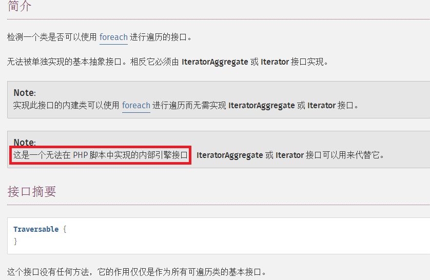

# foreach 遍历对象


 这篇文章给大家分享的是PHP中foreach遍历类对象的实现，foreach 遍历数组很常见，同样foreach也可以遍历对象，文中示例代码介绍的非常详细，感兴趣的朋友接下来一起跟随小编看看吧。

  做如下测试：

```php
class my
{
	public $a = 'a';
	protected $b = 'b';
	private $c = 'c';
	private $data = array('fantasy','windows','linux');
	// 内部foreach遍历class
	function traversable()
	{
		foreach($this as $key=>$val)
		{
			echo $key.'=>';
			print_r($val);
			echo '<br>';
		}
	}
}
$m = new my();
// 外部foreach遍历class
foreach($m as $key=>$val)
{
	echo $key.'=>';
	print_r($val);
	echo "\n";
}
echo '--------------------------<br>';
// 内部foreach遍历class
$m->traversable();
```

  输出结果如下：

> a=>a
>
> \--------------------------
>
> a=>a
>
> b=>b
>
> c=>c

  由此可知，对于外部的foreach遍历是没有权限访问 protected private 这两个修饰的属性的，而在class内部是有权限访问，foreach可以遍历所有的属性。


<font color=red>**foreach可以遍历内部属性；注意属性的访问权限；**</font>


  **今天在写PDO的时候发现可以这样写：** 

```
foreach($db->query('SELECT * FROM tab') as $row)
{
    print_r($row);
}
```


  这样快速的获取了全部查询结果，可奇怪的是$this->query() 返回的是 object类型<font color=red> **PDOStatement**</font> ，var_dump()打印出来的结果是这样的：       PDOstatement  == PDO声明；

```
object(PDOStatement)#2 (1) {
  ["queryString"]=>
  string(18) "SELECT * FROM user"
}
```


  PDOStatement里面就一个public属性 queryString  并且foreach也没有出现这个值，这样的情况就不是简单的对属性进行遍历了，而是<font color=red>class继承了iterator迭代器，在foreach的时候会执行class里面的迭代方式，遍历迭代器指定的数据</font>

  关于迭代器看下面的例子：


```php
//Iterator 迭代器；
class test implements Iterator
{
	public $a = 'a';
	private $data = array('apple','banlance','current');
	private $point = 0;
	public function __construct()
	{
		$this->point = 0;
	}
	public function current()
	{
		return $this->data[$this->point];
	}
	public function key()
	{
		return $this->point;
	}
	public function next()
	{
		++$this->point;
	}
	public function rewind()
	{
		$this->point=0;
	}
	public function valid()
	{
		return isset($this->data[$this->point]);
    }
    
    //pdo  fetchAll
    public function fetchALl() {
        foreach ($this->data as $datum) {
            print_r($datum);
            echo "\n";
        }
    }
    
    // pdo fetch
    public function fetch() {
        $val = $this->current();
        $this->next();
        return $val;
    }
}

$t = new test();
foreach($t as $val)
{
	print_r($val);
	echo '<br>';
}
// pdo fetchAll
$t->fetchAll();
// pdo  fetch  取一行数据；
while ($row = $t->fetch()) {
    echo $row . "\n";
}
```

  输出结果如下：

> apple
>
> banlance

<font color=red>  test class 实现iterator的接口，foreach调用的时候会使用这个接口方法，调用过程大致如下面伪代码：</font>

```php
// 迭代过程伪代码  == foreach  这个伪代码不错的；
while(valid)
{
<span style="white-space:pre">	</span>current/key
<span style="white-space:pre">	</span>next
}
rewind
```

  so，之前的foreach对class的处理过程是一种默认方法，如果是继承iterator的class被foreach遍历的时候是上面这种方式

  由此情况去套用 PDO的写法还是行不通，因为如果我们var_dump上面的哪个test类结果是这样的：

```php
test Object
(
    [a] => a
    [data:test:private] => Array
        (
            [0] => apple
            [1] => banlance
            [2] => current
        )
 
    [point:test:private] => 0
)
```

  但是当我们var_dump $db->query返回的对象时并没有见到point这个iterator接口中定义的属性以及遍历的数据 $data;

  **由此我们可以猜测PDOStatement继承了一种迭代的接口但是并不是iterator**

  查看手册可以发现：

> PDOStatement implements Traversable``

  查看**Traversable**的介绍如下图：



  由此明白了，PDOStatement的迭代实现都是在内部，继承iterator是php脚本的实现方式。

  大致总结下：

 <font color=red> foreach是可以遍历数组的，也可以遍历对象。对象只能罗列出public的属性，如果想要foreach罗列出保护的属性可以让class继承iterator并实现其中的方法，这样foreach遍历一个class的时候是按照class内部实现的iterator进行处理的。</font>

\-------------------------------------------------------------
  PDO的问题：

  PDO::query() 返回的是对象 PDOStatement （继承的Traversable这个空接口，必须由Iterator or iteratorAggregate 接口实现）。
  PDOStatement 实现了Iterator接口的方法，其实现方法中操作的就是非public修饰的属性，这个属性里面存储的是查询结果集。
  至此，foreach($db->query('sql..') as $row) 的执行过程明白了

  以上就是关于PHP中foreach遍历类对象的介绍，上述示例具有一定的借鉴价值，有需要的朋友可以参考学习，希望对大家学习PHP有帮助，想要了解更多可以继续浏览群英网络其他相关的文章。


```php
**
 * Interface for external iterators or objects that can be iterated
 * themselves internally.
 * @link http://php.net/manual/en/class.iterator.php
 */
interface Iterator extends Traversable {

    /**
     * Return the current element
     * @link http://php.net/manual/en/iterator.current.php
     * @return mixed Can return any type.
     * @since 5.0.0
     */
    public function current();

    /**
     * Move forward to next element
     * @link http://php.net/manual/en/iterator.next.php
     * @return void Any returned value is ignored.
     * @since 5.0.0
     */
    public function next();

    /**
     * Return the key of the current element
     * @link http://php.net/manual/en/iterator.key.php
     * @return mixed scalar on success, or null on failure.
     * @since 5.0.0
     */
    public function key();

    /**
     * Checks if current position is valid
     * @link http://php.net/manual/en/iterator.valid.php
     * @return boolean The return value will be casted to boolean and then evaluated.
     * Returns true on success or false on failure.
     * @since 5.0.0
     */
    public function valid();

    /**
     * Rewind the Iterator to the first element
     * @link http://php.net/manual/en/iterator.rewind.php
     * @return void Any returned value is ignored.
     * @since 5.0.0
     */
    public function rewind();
}
```