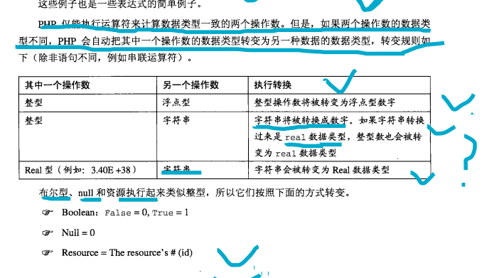

# 弱类型语言----存在的隐式类型转换；

**容忍存在隐式的类型转换；**


都要转换成整型来左计算；

数组和对象复式数据结构不算；

整型 字符串 布尔 资源 null  计算的时候都要转换成整型的形式；


**浮点型和整型做对比需要转换成浮点型；**   




```php
// 字符串的比较；
if ('0aaa' == 0.00) {  //equal
    echo "equal";
}
// null == 0
if (null == 0) {
    echo "equal";
}
//  false == 0
if (false == 0) {
    echo '0';
}

```


#### isset is_null empty();

---

## Summary:

>isset is_null  empty();
>
>isset and is_null 用来判断是否为null；
>
>empty();用来判断各种数据类型是否是空；或者是false；

empty() : 0, 0.00  ,'' '0' , array(); null ,false; 对象资源没有empty的说法；null；

**由此可见 empty() 可以用来判定所有的数据类型是否为空或假，**


**而 is_null 与 isset 基本一样，只能用来判断是否为NULL和未定义(null)**

<font color=red>空数组 只能用empty来判断；</font>

