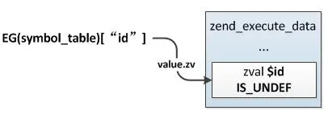
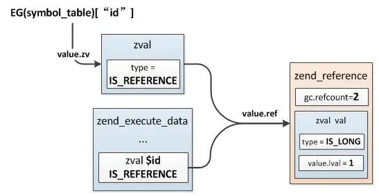

# 全局变量和局部变量


### 不同点：

* 生命周期：
  * 全局变量：请求结束，程序结束之后销毁；
  * 局部变量：函数调用结束；
* 作用域：
  * 全局变量：函数内部；也是可以通过\$GLOABLS 来实现跨页面；
  * 局部变量： 定义处一直到文件的结束；（是到文件的结束）
  * 超全局变量： 是可以跨页面的；


**静态变量和 局部变量 在请求结束的时候会销毁**

**只有unset()；然后销毁，回收；**


**static 改变了变量的声明周期，请求结束才会销毁，但是作用域没有发生变化；还是在函数内才可以访问；**

````php
# 全部变量；
$ceshi = 1;
function ceshi() {
    static $ceshi = 4;
    $ceshi++;
    echo $ceshi;
}
//echo $ceshi;
ceshi();
echo "\n";
ceshi();
echo "\n";
ceshi();

````


### symbol_tabl e  active_symbol_table 


总共牵扯到了 四个符号表 

symbol_table 

function_table

class_table


```c
	zend_array symbol_table;		/* main symbol table */   全局 变量 或者静态变量的符号表； 存放全局变量；

	HashTable included_files;	/* files already included */


	HashTable *function_table;	/* function symbol table */ 
	HashTable *class_table;		/* class table */
	
	HashTable *zend_constants;	/* constants table */


	HashTable *active_symbol_table; /*活动符号表*/   每次调用函数的时候都会创建一个函数的符号表；在函数内定义的变量都会保存在这个函数符号表内；执行完成之后会被销毁；注意函数的调用栈都是有大小限制的； 

```


**静态变量的支持；**

```c
/* static variables support */
HashTable *static_variables;  //静态的哈希表；不论调用多少次都会指向那一个变量，根active_symbol_table 没有关系的；
// 遇到static 会创建一个静态变量表（其实就是symbol_table） 这里保存着这个静态变量的地址请求结束的时候会被销毁，只有active_symbol_table 里面的变量才会被销毁;
```


**这是c语言的说法：**


**当static用来修饰局部变量的时候，它就改变了局部变量的存储位置，从原来的栈中存放改为静态存储区。但是局部静态变量在离开作用域之后，并没有被销毁，而是仍然驻留在内存当中，直到程序结束，只不过我们不能再对他进行访问。**


**注意：active_symbol_table 只有一个符号表；当函数调用的时候创建，当调用结束的时候销毁，下一个函数调用继续创建；无限次的循环；**


## 全局变量

PHP中在函数、类之外直接定义的变量可以在函数、类成员方法中通过global关键词引入使用，这些变量称为：全局变量。

这些直接在PHP中定义的变量(包括include、require文件中的)相对于函数、类方法而言它们是全局变量，但是对自身执行域zend_execute_data而言它们是普通的局部变量，自身执行时它们与普通变量的读写方式完全相同。

```php
function test() {
    global $id;
    $id++;
}

$id = 1;
test();
echo $id;
```

### 全局变量初始化

**全局变量在整个请求执行期间始终存在，它们保存在EG(symbol_table)中，也就是全局变量符号表，与静态变量的存储一样，这也是一个哈希表，**主脚本(或include、require)在zend_execute_ex执行开始之前会把当前作用域下的所有局部变量添加到EG(symbol_table)中，这一步操作后面介绍zend执行过程时还会讲到，这里先简单提下：

```c
ZEND_API void zend_execute(zend_op_array *op_array, zval *return_value)
{
    ...
    i_init_execute_data(execute_data, op_array, return_value);
    zend_execute_ex(execute_data);
    ...
}
```

i_init_execute_data()这个函数中会把局部变量插入到EG(symbol_table)：

```
ZEND_API void zend_attach_symbol_table(zend_execute_data *execute_data)
{
    zend_op_array *op_array = &execute_data->func->op_array;
    HashTable *ht = execute_data->symbol_table;

    if (!EXPECTED(op_array->last_var)) { 
        return;
    }

    zend_string **str = op_array->vars;
    zend_string **end = str + op_array->last_var;
    //局部变量数组起始位置
    zval *var = EX_VAR_NUM(0);

    do{
        zval *zv = zend_hash_find(ht, *str);
        //插入全局变量符号表
        zv = zend_hash_add_new(ht, *str, var);
        //哈希表中value指向局部变量的zval
        ZVAL_INDIRECT(zv, var);
        ...
    }while(str != end);
}
```

从上面的过程可以很直观的看到，在执行前遍历局部变量，然后插入EG(symbol_table)，EG(symbol_table)中的value直接指向局部变量的zval，示例经过这一步的处理之后(此时局部变量只是分配了zval，但还未初始化，所以是IS_UNDEF)：



### 全局变量的访问


与静态变量的访问一样，全局变量也是将原来的值转换为引用，然后在global导入的作用域内创建一个局部变量指向该引用：

```
global $id; // 相当于：$id = & EG(symbol_table)["id"];
```

具体的操作过程不再细讲，与静态变量的处理过程一致，这时示例中局部变量与全局变量的引用情况如下图。



### 超全局变量

全部变量除了通过global引入外还有一类特殊的类型，它们不需要使用global引入而可以直接使用，这些全局变量称为：超全局变量。

超全局变量实际是PHP内核定义的一些全局变量：$GLOBALS、$_SERVER、$_REQUEST、$_POST、$_GET、$_FILES、$_ENV、$_COOKIE、$_SESSION、argv、argc。

### 销毁

**局部变量如果没有手动销毁，那么在函数执行结束时会将它们销毁**，**而全局变量则是在整个请求结束时才会销毁**，即使是我们直接在PHP脚本中定义在函数外的那些变量。

```
void shutdown_destructors(void)
{
    if (CG(unclean_shutdown)) {
        EG(symbol_table).pDestructor = zend_unclean_zval_ptr_dtor;
    }
    zend_try {
        uint32_t symbols;
        do {
            symbols = zend_hash_num_elements(&EG(symbol_table));
            //销毁
            zend_hash_reverse_apply(&EG(symbol_table), (apply_func_t) zval_call_destructor);
        } while (symbols != zend_hash_num_elements(&EG(symbol_table)));
    }
    ...
}
```
