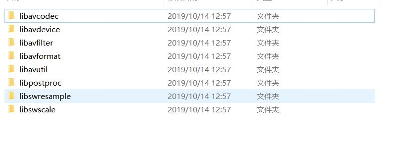

#  dev  


**dev（Development environment）：开发环境。用于开发者调试使用。**

**test：测试环境。**

sit（System Integration Test）：系统集成测试。
uat（User Acceptance environment）：用户验收测试环境。生产环境下的软件测试者测试使用。预发布环境。
**pre：灰度环境。灰度测试环境就是生产环境，生产数据，所影响的也是生产环境，只是范围比测试环境更广，更真实。其实就是小范围的生产环境。类似于游戏内测。**
fat（Feature Acceptance Test environment）：功能验收测试环境。软件测试者测试使用。

**prod（Production environment）：生产环境。正式线上环境。**

---

//内网；

//production 生产环境！！！

**pro环境：生产环境，面向外部用户的环境，连接上互联网即可访问的生产环境。**


**内网：**

**pre环境：灰度环境，外部用户可以访问，但是服务器配置相对低，其它和生产环境一样（笔者公司对应此处为“验证环境”）  数据库是真实环境的数据库；。**

**test环境：测试环境，外部用户无法访问，专门给测试人员使用的，版本相对稳定。**

**dev环境：开发环境，外部用户无法访问，开发人员使用，版本变动很大。**     <font color=red>一般就是测试环境 其实i这里一般就是我们的本地环境 版本迭代很快</font> 

。

---


linux系统中lib，lib-dev，lib-dbg，lib-common库的区别
在安装一些软件时，经常要安装libxx,libxx-dev,libxx-dbg之类的库：

libxx只包含了基本的运行时库，安装各类软件时选择这个包；


**libxx-dev包含了运行时和头文件和其他库文件，如果编译其他软件需要链接这个库，咱们开发的就选这个了；**


libxx-dbg包含了运行时和头文件和其他库文件，以及调试信息，有些库没有相关的包；
libxx-common 通用包；
**咱们开发编译程序的时候通常会选libxx-dev包。**


# 0. 概述

FFmpeg 全名是Fast Forward MPEG(Moving Picture Experts Group),是一个集成了各种编解码器的库，也就是一堆程序文件，可以实现图像信息的编码、解码，也就是从视频采集、视频编码到视频传输，都可以调用FFmpeg这个库中的代码来完成。并且这个库还有一个牛逼的地方是，他的代码无视平台，Windows和LinuxAndroid、IOS都可以使用。

# 1. FFMPEG三种版本

## STATIC 版本

**静态库版本 里面有3个exe： ffmpeg.exe, ffplay.exe, ffprobe.exe,每个exe体积很大，因为相关的dll已经被编译到exe 里面去了。****作为工具而言此版本就可以满足我们的需求。**


## SHARED 版本

**动态库版本，里面有3个exe：ffmpeg.exe，ffplay.exe , ffprobe.exe ,还有一些dll， 比如说avcodec-54.dll之类的。shared 里面的exe体积很小，因为他们在运行的时候，到相应的dll中调用功能**。**程序运行过程必须依赖于提供的dll文件。**


## DEV 版本

开发者版本，是用于开发的，里面包含了库文件 xxx.lib 以及头文件 xxx.h，这个版本不包含exe文件。dev版本中include文件夹内文件用途：




---

 

## 安装openresty

login in  这个才是登陆的意思；


`````shell
docker pull openresty/openresty
# 运行openresty；
docker run -d --name openresty -p 8090:80 -v G:\website\docker-lnmp\openresty\conf\conf:/usr/local/openresty/nginx/conf -v G:\website\docker-lnmp\openresty\conf\conf.d:/etc/nginx/conf.d openresty/openresty
# cmd  其实已经在 镜像里面定义好了  docker build -t 的时候 dockerfile 已经定义好了； 所有我们这里就不需要自己定义了；

  "Cmd": [
                "/usr/bin/openresty",
                "-g",
                "daemon off;"
            ];
            
            
docker update  --restart=always openresty;

#nginx -g daemon off 守护进程；后台运行；  nginx的cmd启动命令；
#http://demo.com:8080/


##
###nginx -V  查看模块；
root@e91bb75781f4:/# nginx -V
nginx version: openresty/1.19.9.1
built with OpenSSL 1.1.1l  24 Aug 2021
TLS SNI support enabled
configure arguments: --prefix=/usr/local/openresty/nginx --with-cc-opt='-O2 -DNGX_LUA_ABORT_AT_PANIC -I/usr/local/openresty/zlib/include -I/usr/local/openresty/pcre/include -I/usr/local/openresty/openssl111/include' --add-module=../ngx_devel_kit-0.3.1 --add-module=../echo-nginx-module-0.62 --add-module=../xss-nginx-module-0.06 --add-module=../ngx_coolkit-0.2 --add-module=../set-misc-nginx-module-0.32 --add-module=../form-input-nginx-module-0.12 --add-module=../encrypted-session-nginx-module-0.08 --add-module=../srcache-nginx-module-0.32 --add-module=../ngx_lua-0.10.20 --add-module=../ngx_lua_upstream-0.07 --add-module=../headers-more-nginx-module-0.33 --add-module=../array-var-nginx-module-0.05 --add-module=../memc-nginx-module-0.19 --add-module=../redis2-nginx-module-0.15 --add-module=../redis-nginx-module-0.3.7 --add-module=../ngx_stream_lua-0.0.10 --with-ld-opt='-Wl,-rpath,/usr/local/openresty/luajit/lib -L/usr/local/openresty/zlib/lib -L/usr/local/openresty/pcre/lib -L/usr/local/openresty/openssl111/lib -Wl,-rpath,/usr/local/openresty/zlib/lib:/usr/local/openresty/pcre/lib:/usr/local/openresty/openssl111/lib' --with-pcre-jit --with-stream --with-stream_ssl_module --with-stream_ssl_preread_module --with-http_v2_module --without-mail_pop3_module --without-mail_imap_module --without-mail_smtp_module --with-http_stub_status_module --with-http_realip_module --with-http_addition_module --with-http_auth_request_module --with-http_secure_link_module --with-http_random_index_module --with-http_gzip_static_module --with-http_sub_module --with-http_dav_module --with-http_flv_module --with-http_mp4_module --with-http_gunzip_module --with-threads --with-stream --with-http_ssl_module
`````


菜鸟教程是基于 ubuntu14.04 安装 OpenResty。

OpenResty 依赖库有： perl 5.6.1+, libreadline, libpcre, libssl。 //readline  GNU *readline*是一个开源的跨平台程序库，提供了交互式的文本编辑功能。

所以我们需要先安装好这些依赖库，也非常简单：  <font color=red>**pcre3  ssl socket  perl  就是pcre的底层；**</font>

```
apt-get install libreadline-dev libpcre3-dev libssl-dev perl	
```

如果你的系统是 Centos 或 RedHat 可以使用以下命令：

```
yum install readline-devel pcre-devel openssl-devel
```

接下我们可以在官方（https://openresty.org/cn/）下载最新的 OpenResty 源码包并解压编译安装:

```
wget https://openresty.org/download/ngx_openresty-1.9.7.1.tar.gz   # 下载
tar xzvf ngx_openresty-1.9.7.1.tar.gz       # 解压
cd ngx_openresty-1.9.7.1/ 
./configure
make 
make install
```

默认情况下程序会被安装到 /usr/local/openresty 目录，你可以使用 ./configure --help 查看更多的配置选项。

------

## Hello World 实例

安装成功后，我们就可以使用 openresty 直接输出 html 页面。

首先我们可以创建一个工作目录：

```
mkdir /home/www
cd /home/www/
mkdir logs/ conf/
```

其中 logs 目录用于存放日志，conf 用于存放配置文件。

接着，我们在 conf 目录下创建一个 nginx.conf 文件 代码如下：

```
worker_processes  1;
error_log logs/error.log;
events {
    worker_connections 1024;
}
http {
    server {
        listen 9000;
        location / {
            default_type text/html;
            content_by_lua '
                ngx.say("<p>Hello, World!</p>")
            ';
        }
    }
}
```