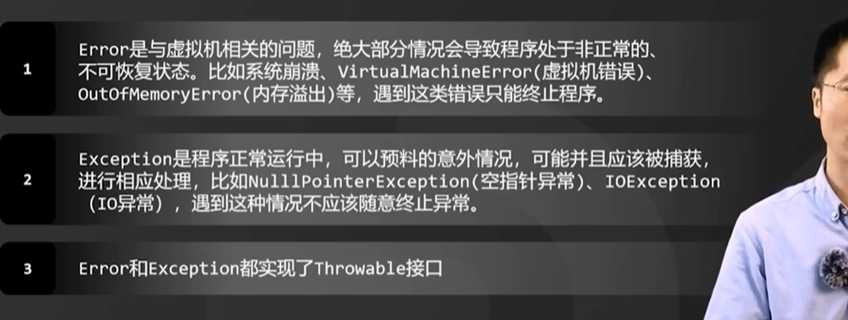

# 异常和错误

>**错误，是和 virtualmachine有关，程序处于非正常状态，遇到错误只能终止程序；**
>
>**异常，程序正常运行，可以预料意外的情况，可能并且应该被捕获进行相应处理，比如IOexception，遇到这种情况不应该随意终止异常；**  **（程序正常运行，但是出现了意外情况，所以应该被捕获并且进行相应处理；）**
>
>**异常，程序正常运行，但是发生了意外情况；**  所以我们应该去捕获；capture;去捕获；

---





---

## 例子；

`````php
// 异常肯定是程序正常运行，但是出现了意外情况，所以我们要捕获这种意外情况，并且，log；
values()
//eg：
$pdo->exec('insert into t() values()');  // 因为返回的是受影响的行数，如果是0，那么就代表插入失败了，所以肯定是要去抛异常 的，并且去打log；打日志；
`````

