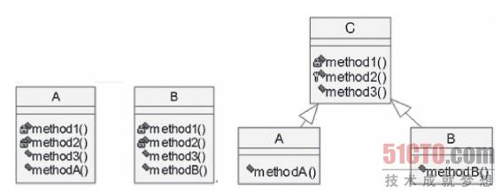
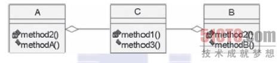

# 组合和继承

组合和继承是类与类关系

>解决类和类之间的依赖关系的两种方式
>
>继承和组合
>
>组合是通过传递参数的方式来实现 耦合度低；
>
>继承就是继承来实现； 耦合度高，父类发生变化影响子类；


**组合是has 的关系；**

**继承是is 的关系；**

**组合通常优于继承。**    


**缺点和解决方案：** 

  **继承 耦合度太高了； 修改父类肯定对子类产生影响；**        (添加接口) **可以使用多继承；**

 **如果可变维度变多，那么很难去实现（继承扩展复杂。），需要去创建很多的对象，那么就需要用组合去实现；**


**1.考虑使用多态。能够用继承。**  继承并且重写的多态； 继承抽象类；调用同父类的不同实例的相同的方法，会有不同的结果；

**2.考虑复用父类方法，并且父类非常少修改。能够用继承。**    **满足里氏替换原则；**


**其它情况请谨慎使用继承。**   **最好使用trait 多继承来解决问题；**


# **php中的组合和继承**

**组合：**

````php
#组合 
class Fly 
{
    publilc function fly(){
        echo " i can fly";
    }
}

class bird
{
    protected $fly;
    
    public function __construct(Fly $fly){
        $this->fly = $fly;
       // $this->fly = new Fly;
    }
  
    public function fly() {
        $this->fly->fly();
    }
}


#多继承 来实现组合； 多继承如果可变维度很多 那么会更加复杂；
trait Fly
{
    publif function fly(){
        echo "i can fly";
    }
}

class Bird
{
    use Fly;
    
}
$obj = new Bird;
$obj->fly();


````


**1.3.1　类的组合与继承(2)**

组合与继承都是提高代码可重用性的手段。在设计对象模型时，可以按照语义识别类之间的组合关系和继承关系。比如，通过一些总结，得出了继承是一种“是、像”的关系，而组合是一种“需要”的关系。利用这条规律，就可以很简单地判断出父亲与儿子应该是继承关系，父亲与家庭应该是组合关系。还可以从另外一个角度看，组合偏重整体与局部的关系，而继承偏重父与子的关系，如图1-3所示。


(点击查看大图)图1-3　继承和组合的对照从方法复用角度考虑，如果两个类具有很多相同的代码和方法，可以从这两个类中抽象出一个父类，提供公共方法，然后两个类作为子类，提供个性方法。这时用继承语意更好。继承的UML图如图1-4所示。



(点击查看大图)图1-4　继承的UML图而组合就没有这么多限制。组合之间的类可以关系(体现为复用代码)很小，甚至没有关系，如图1-5所示。



图1-5　组合的UML图

然而在编程中，继承与组合的取舍往往并不是这么直接明了，很难说出二者是“像”的关系还是“需要”的关系，甚至把它拿到现实世界中建模，还是无法决定应该是继承还是组合。那应该怎么办呢？有什么标准吗？有的。这个标准就是“低耦合”。

**耦合是一个软件结构内不同模块之间互连程度的度量，也就是不同模块之间的依赖关系。**

低耦合指模块与模块之间，尽可能地使模块间独立存在；模块与模块之间的接口尽量少而简单。现代的面向对象的思想不强调为真实世界建模,变得更加理性化一些，把目标放在解耦上。

解耦是要解除模块与模块之间的依赖。

按照这个思想，继承与组合二者语义上难于区分，在二者均可使用的情况下，更倾向于使用组合。为什么呢？继承存在什么问题呢？

**1)继承破坏封装性。**

比如，定义鸟类为父类，具有羽毛属性和飞翔方法，其子类天鹅、鸭子、鸵鸟等继承鸟这个类。显然，鸭子和鸵鸟不需要飞翔这个方法，但作为子类，它们却可以无区别地使用飞翔这个方法，显然破坏了类的封装性。而组合，从语义上来说，要优于继承。

**2)继承是紧耦合的。**

**继承使得子类和父类捆绑在一起。                      **

**组合仅通过\*\*\*接口和外部进行通信，耦合度低于继承。**

3)继承扩展复杂。

随着继承层数的增加和子类的增加，将涉及大量方法重写。使用组合，可以根据类型约束，实现动态组合，减少代码。

**4)不恰当地使用继承可能违反现实世界中的逻辑。**

比如，人作为父类，雇员、经理、学生作为子类，可能存在这样的问题，经理一定是雇员，学生也可能是雇员，而使用继承的话一个人就无法拥有多个角色。这种问题归结起来就是“角色”和“权限”问题。在权限系统中很可能存在这样的问题，经理权利和职位大于主管，但出于分工和安全的考虑，经理没有权限直接操作主管所负责的资源，技术部经理也没权限直接命令市场部主管。这就要求角色和权限系统的设计要更灵活。不恰当的继承可能导致逻辑混乱，而使用组合就可以较好地解决这个问题。