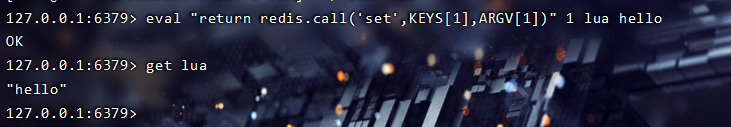
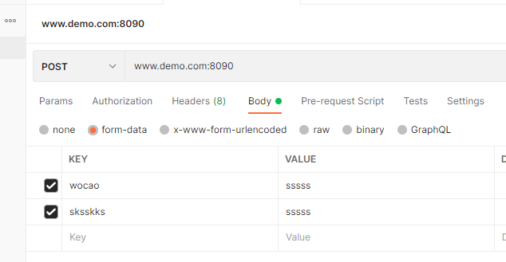
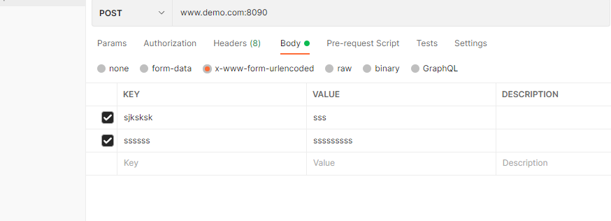

# lua脚本

>优先级 rewrite 高于 access  高于 content


Redis 中执行 Lua 脚本相关的命令
编写完脚本后最重要的就是在程序中执行脚本。Redis 提供了 EVAL 命令可以使开发者像调用其他 Redis 内置命令一样调用脚本。


##EVAL 命令 - 执行脚本
**[EVAL] [脚本内容] [key 参数的数量] [key …] [arg …]**

可以通过 key 和 arg 这两个参数向脚本中传递数据，他们的值可以在脚本中分别使用 KEYS 和 ARGV 这两个类型的全局变量访问。

比如我们通过脚本实现一个 set 命令，通过在 redis 客户端中调用，那么执行的语句是：

````shell
# 1代表的是key的数量；
eval "return redis.call('set',KEYS[1],ARGV[1])" 1 lua hello
````


上述脚本相当于使用 Lua 脚本调用了 Redis 的 set 命令，存储了一个 key=lua，value=hello 到 Redis 中。



````shell
## eval 
>> eval "return redis.call('set',KEYS[1],ARGV[1])" 1 stock 11

"OK"
>> get stock

"11"
````


##EVALSHA 命令

考虑到我们通过 eval 执行 lua 脚本，脚本比较长的情况下，每次调用脚本都需要把整个脚本传给 redis，比较占用带宽。为了解决这个问题，redis 提供了 EVALSHA 命令允许开发者通过脚本内容的 SHA1 摘要来执行脚本。该命令的用法和 EVAL 一样，只不过是将脚本内容替换成脚本内容的 SHA1 摘要。

Redis 在执行 EVAL 命令时会计算脚本的 SHA1 摘要并记录在脚本缓存中
执行 EVALSHA 命令时 Redis 会根据提供的摘要从脚本缓存中查找对应的脚本内容，如果找到了就执行脚本，否则返回 “NOSCRIPT No matching script,Please use EVAL”
将脚本加入缓存并生成sha1命令

`````php
# 加载-------- 
script load "return redis.call('get','lua')"
#["13bd040587b891aedc00a72458cbf8588a27df90"]
 #传递sha1的值来执行该命令
    #执行；  0  就是没有参数
evalsha "13bd040587b891aedc00a72458cbf8588a27df90" 0  
    
`````


## script load


##超卖脚本；

````php
  $str = <<<Lua
        local key   = KEYS[1];
        local redis_stock = redis.call('get', key);
        if (tonumber(redis_stock) > 0)
        then
            redis.call('decr', key);
            return true;
        else
            return false;
        end
        Lua;
## php 超卖 lua 脚本；

$script2 = <<<EOF
    local key = KEYS[1]
    local stock =  redis.call('get',key)
    if (tonumber(stock) > 0)
    then
        redis.call('decr',key)
        return true
    else
        return false
    end
EOF;
````

## 方案二使用lua脚本+redis

`````php

$goods_total = 20;
    // Redis::set("goods_stock", $goods_total);
    // die;
    // 测试商品秒杀
    $redis_stock = Redis::get("goods_stock");
    if (empty($redis_stock) && $redis_stock == 0) {
    	return "商品已被抢空";
    }
    $user_id = mt_rand(1,999);
    $redis_list = Redis::lRange("user_list",0, -1);
    // 限定只抢购一次
    if (empty($redis_list)) {
        Redis::lPush("user_list", $user_id);
    } else {
        if (in_array($user_id, $redis_list)) {
            return "您已经抢购过啦,用户id:" . $user_id;
        }
        Redis::lPush("user_list", $user_id);
    }

    if ($redis_stock > 0) {
        // 方案2
        // lua脚本
        $str = <<<Lua
        local key   = KEYS[1];
        local redis_stock = redis.call('get', key);
        if (tonumber(redis_stock) > 0)
        then
            redis.call('decr', key);
            return true;
        else
            return false;
        end
        Lua;
        $res = Redis::eval($str, 1, "goods_stock");  //decr -1 
        
        if ($res) {
            $user_id = Redis::rPop("user_list");
            DB::beginTransaction();
            try {
                $data = [
                    "user_id"   => $user_id,
                    "orders_num" => time() . mt_rand(10, 999),
                ];
                $res = DB::table("test_table")->lockForUpdate()->insert($data);
                echo "抢购成功,用户id:" . $user_id;
                DB::commit();
                return;
            } catch (\Exception $e) {
                DB::rollBack();
                // Redis::Discard();
                echo "抢购失败,用户id:" . $user_id . "," . $e->getMessage();
                return;
            }
        } else {
            echo "商品已被抢空,用户id:" . $user_id;
            // Redis::Discard();
            return;
        }
    }
    echo "商品已被抢空,用户id:" . $user_id;
    return;

`````


### nohup的后台运行 cli模式的运用；


如果正在运行一个进程，而且在退出账户时该进程还不会结束，即在系统后台或背景下运行，那么就可以使用nohup命令。该命令可以在退出账户之后继续运行相应的进程。
nohup在英文中就是不挂起的意思（no hang up）。该命令的一般形式为：

\# nohup <脚本名.php> &

使用nohup命令提交作业，在默认情况下该作业的所有输出都被重定向到一个名为 nohup.out 的文件中，除非另外指定了输出文件：

```text
# nohup /usr/local/php/bin/php ./scriptName.php 1>/tmp/log.txt &                将标准输出重定向到log.txt
# nohup /usr/local/php/bin/php ./scriptName.php 1>/tmp/log.txt 2>/tmp/err.txt & 将标准输出重定向到/tmp/log.txt 错误输出重定向到/tmp/err.txt
# nohup /usr/local/php/bin/php ./scriptName.php 1>/tmp/log.txt 2>&1 &           将标准输出重定向到/tmp/log.txt 然后再将标准错误输出重定向到标准输出，即：两者一起重定向到/tmp/log.txt
# nohup /usr/local/php/bin/php ./scriptName.php 1>/dev/null 2>&1 &              将标准输出和错误输出一起到重定向到/dev/null
```

这样，PHP CLI脚本执行后的结果将输出到log.txt中，我们可以使用tail命令动态查看内容：
\# tail -f -n20 /tmp/log.txt


## lua脚本


https://blog.csdn.net/shark_pang/article/details/124709417


### ###access_by_lua_file

语法： access_by_lua_file <path-to-lua-script-file>

上下文：http, server, location, location if

作用时期： access tail

作用：用于访问控制，比如我们只允许内网ip访问，可以使用如下形式

```bash
location /lua_access_1 {
    default_type "text/html";
    access_by_lua_file /usr/local/nginx/conf/lua/lua_access_1.lua;
    echo "access_ ";
}
```

lua_access_1.lua 添加以下内容：

```vbnet
if ngx.req.get_uri_args()["token"] ~= "123" then  
   return ngx.exit(403)  
end 
```

---


### content_by_lua

语法： content_by_lua <lua-script-str>

上下文： location, location if

作用时期： 上下文内容

注：这个指令的使用气馁以下v0.9.17版本。请改用 content_by_lua_block指令。

充当“内容处理程序”并执行<lua-script-str>每个请求中指定的Lua代码字符串。Lua代码可以进行 API调用，并且作为独立全局环境（即沙箱）中的新生成的协同程序来执行。不要在同一位置使用此指令和其他内容处理程序指令。例如，此伪指令和 proxy_pass伪指令不应在同一位置使用。

nginx.conf配置：

```puppet
lua_package_path "/usr/local/nginx/lua/?.lua;;";  #lua 模块
#include lua.conf; #单独lua配置     
server {
    listen       80;
    server_name  localhost;
    location =/lua {
       content_by_lua '
           ngx.say("Hello Lua!")
       ';
    }
}
```

说明：#lua模块路径，多个之间”;”分隔，其中”;;”表示默认搜索路径，默认到/usr/local/nginx下找

输出结果：

```ruby
root@iZ236j3sofdZ:/usr/local/nginx/conf # curl 'http://localhost/lua'
```

---


### rewrite_by_lua_file


语法： rewrite_by_lua_file <path-to-lua-script-file>

上下文：http, server, location, location if

作用时期： 上下文内容

作用：执行内部URL重写或者外部重定向，典型的如伪静态化的URL重写。其默认执行在rewrite处理阶段的最后。

概述：

相当于 rewrite_by_lua，除了指定的文件<path-to-lua-script-file>包含Lua代码，或者从v0.5.0rc32发行版开始，要执行的 Lua / LuaJIT字节码。

Nginx变量可以在<path-to-lua-script-file>字符串中使用以提供灵活性。但这有一些风险，通常不推荐。

当foo/bar.lua给定一个相对路径时，在启动Nginx服务器时，它们将被转换为相对于server prefix由-p PATH命令行选项确定的路径的绝对路径。

当Lua代码缓存打开时（默认情况下），用户代码在第一次请求时被加载一次并被缓存，并且每次修改Lua源文件时必须重新加载Nginx配置。Lua代码缓存可以在开发期间通过切换 lua_code_cache 暂时禁用off，nginx.conf以避免重新加载Nginx。

该rewrite_by_lua_file代码将总是在结束时运行rewrite，除非请求处理相 rewrite_by_lua_no_postpone被接通。

动态分派的文件路径支持Nginx变量，就像content_by_lua_file中 一样。


**Example # 1**

```bash
location /rewrite_by_lua_file {

    default_type "text/html";

    rewrite_by_lua_file /usr/local/nginx/conf/lua/test_rewrite_1.lua;
    echo "no rewrite";
}
```

test_rewrite_1.lua 添加一下内容：

```ruby
if ngx.req.get_uri_args()["jump"] == "1" then  
   return ngx.redirect("http://www.jd.com?jump=1", 302)  
end  
```

当我们请求http://192.168.1.2/lua_rewrite_1时发现没有跳转，

而请求http://192.168.1.2/lua_rewrite_1?jump=1时发现跳转到京东首页了。 此处需要301/302跳转根据自己需求定义。


----

### set_by_lua

语法：set_by_lua $ res <lua-script-str> [$ arg1 $ arg2 ...]

上下文：server, server if, location, location if

阶段：重写（rewrite）

警告自从v0.9.17发行版以来，不鼓励使用此指令;请改用新的set_by_lua_block指令。

使用可选的输入参数$ arg1 $ arg2 ...执行<lua-script-str>中指定的代码，并将字符串输出返回给$ res。 <lua-script-str>中的代码可以进行API调用，并可以从ngx.arg表中检索输入参数（索引从1开始，依次增加）。

该指令旨在执行短，快速运行的代码块，因为在代码执行期间Nginx事件循环被阻止。因此应避免耗时的代码序列。

该指令通过将自定义命令注入到标准ngx_http_rewrite_module的命令列表中来实现。因为ngx_http_rewrite_module在其命令中不支持非阻塞I / O，因此需要产生当前Lua“light thread”的Lua API在此指令中无法工作。

至少以下API功能目前在set_by_lua的上下文中被禁用：

输出API函数（例如，ngx.say 和 ngx.send_headers）
控制API函数（例如，ngx.exit ）
子请求API函数（例如，ngx.location.capture和ngx.location.capture_multi）
Cosocket API函数（例如，ngx.socket.tcp和ngx.req.socket）。
睡眠API函数ngx.sleep。
另外，请注意，这个指令一次只能写出一个Nginx变量的值。但是，可以使用ngx.var.VARIABLE接口进行解决。

```nginx
#ninx 里面设置变量 set $diff '';  一些简单的一些复杂的 只能通过 set_by_lua 来处理

location /set_by_lua_test {
    set $diff ''; # we have to predefine the $diff variable here
    set_by_lua $sum '
        local a = 32
        local b = 56
        ngx.var.diff = a - b;  -- write to $diff directl
        return a + b;          -- return the $sum value normally
    ';
    echo "sum = $sum, diff = $diff";
}
```

测试结果：

```r
sum = 88, diff = -24
```

---

##  


---


##**Example # 2**

https://segmentfault.com/a/1190000022194344?sort=votes

## Nginx调用lua

| 指令                                | 说明                               |
| ----------------------------------- | ---------------------------------- |
| set_by_lua, set_by_lua_file         | 设置Nginx变量                      |
| access_by_llua, access_by_lua_file  | 访问控制                           |
| content_by_lua, content_by_lua_file | 接收请求，输出响应                 |
| rewrite_by_lua                      | 重写url；redirect 直接跳转就行了； |


## Lua调用Nginx

| 变量                                           | 说明                                        |
| ---------------------------------------------- | ------------------------------------------- |
| ngx.var                                        | nginx变量                                   |
| ngx.req.get_headers                            | 获取请求头                                  |
| ngx.req.get_post_args                          | 获取post请求的参数；key value的这种类型的； |
| ngx.req.get_uri_args                           | 获取请求参数  请求参数                      |
| ngx.redirect                                   | 重定向                                      |
| ngx.print                                      | 输出内容                                    |
| ngx.say                                        | 同ngx.print，会多一个换行符                 |
| ngx.header                                     | 输出响应头                                  |
| ngx.exit(403)                                  | ngx.exit(403)                               |
| ngx.log(ngx.ERR, "failed to limit req: ", err) | err 就是错误信息； 是一个变量的错误信息；   |
| ngx.req.read_body();                           | 读取 body 信息；                            |


``````nginx
# 先要读取一下数据吗？ 
ngx.req.read_body()
                             ngx.say("post args begin", "<br/>")
                                local post_args = ngx.req.get_post_args()
                                for k, v in pairs(post_args) do
                                    if type(v) == "table" then
                                        ngx.say(k, " : ", table.concat(v, ", "), "<br/>")
                                    else
                                        ngx.say(k, ": ", v, "<br/>")
                                    end
                                end

# result
hello word
post args begin<br/>
----------------------------596122263728065214557454
Content-Disposition: form-data; name: "wocao"

sssss
----------------------------596122263728065214557454
Content-Disposition: form-data; name="sksskks"

sssss
----------------------------596122263728065214557454--
<br/>


``````








## from-data 和 x-www-from-urlencode之间的区别


**form-data**

就是http请求中的multipart/form-data,它会将表单的数据处理为一条消息，以标签为单元，用分隔符分开。既可以上传键值对，也可以上传文件。当上传的字段是文件时，会有Content-Type来表名文件类型；content-disposition（内容处置），用来说明字段的一些信息；

由于有boundary（边界）隔离，所以multipart/form-data既可以上传文件，也可以上传键值对，它采用了键值对的方式，所以可以上传多个文件。**用binary 这里做一个隔离，所以不会产生歧义；？？？**

 

**x-www-form-urlencoded**

就是application/x-www-from-urlencoded,会将表单内的数据转换为键值对，比如,name=java&age = 23

 

**multipart/form-data与x-www-form-urlencoded区别**

 

multipart/form-data：既可以上传文件等二进制数据，也可以上传表单键值对，只是最后会转化为一条信息； 

x-www-form-urlencoded：只能上传键值对，并且键值对都是间隔分开的。
