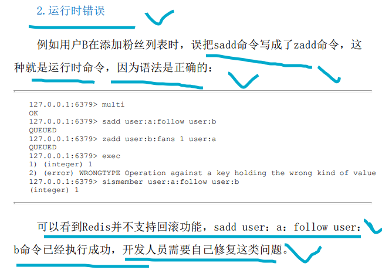

# redis的事务


>**乐观锁来实现回滚；  其实就是一个乐观锁；**
>
>from  https://blog.csdn.net/m0_46761060/article/details/124325446
>
>查看redis的版本；
>
>redis-server -v
>Redis server v=4.0.8 sha=00000000:0 malloc=jemalloc-4.0.3 bits=64 build=51ec49f06079b708

---


​								

``````c

// redis 事务的三个过程
 //0 watch a  //监听   如果a期间有人修改你们就事务取消  事务失败；
// multi  开启事务
// set ceshi ceshi   命令入队列；
// discard  停止事务的执行；
// exec  执行命令 事务的结束；

``````


##  <font color=red>redis 事务很简单，不支持回滚特性，无法实现命令之间额逻辑关系运算；</font>

>**说白了，就是exec 之前会检查队列里面的redis命令的语法问题，如果有问题那么就取消事务；不会发生数据不一致的问题；**
>
>**如果,队列里面的所有命令的语法正确，那么我们就exec执行命令，如果运行过程中出现错误，那么不能够回滚；就会出现数据不一致的问题；**    **我们需要自己处理这些问题；**
>
><font color=red>**仅仅是在入队列之前来做一个语法检测,如果执行出错，并不会去做回滚！！！**</font>

#### **命令错误，会造成整个事务无法执行；**   **一般是语法的问题出现错误；就会导致整个事务无法执行；**


#### **运行时候错误；语法是正确的，会继续往下运行；**




#### **watch 乐观锁 在执行事务之前要保证key 不被其他的客户端修改**

> **由100 改成100 算不算是被修改？？  只有修改过 就会执行不成功，这个是包含版本的乐观锁！！！**


----


就是运行失败并不会回滚；而是往下继续执行；这是自己的问题，事务也会成功；


## 用watch  来实现 一个回滚， 其实就是一个乐观锁，提交之前做一下比较 有没有被修改；

用Watch机制实现秒杀
思路：

利用redis的watch功能，监控这个redisKey的状态值
获取redisKey的值
创建redis事务
给这个key的值+1
然后去执行这个事务，如果key的值被修改过则回滚，key不加1

实现代码：

```java
    public static void main(String[] arg) {
        String redisKey = "lock";
        ExecutorService executorService = Executors.newFixedThreadPool(20);//20个线程
        try {//初始化
            Jedis jedis = new Jedis("127.0.0.1", 6379);
            // 初始值
            jedis.set(redisKey, "0");
            jedis.close();
        } catch (Exception e) {
            e.printStackTrace();
        }
    for (int i = 0; i < 1000; i++) {//尝试1000次
        executorService.execute(() -> {
            Jedis jedis1 = new Jedis("127.0.0.1", 6379);
            try {
                jedis1.watch(redisKey);
                String redisValue = jedis1.get(redisKey);
                int valInteger = Integer.valueOf(redisValue);
                String userInfo = UUID.randomUUID().toString();
                // 没有秒完
                if (valInteger < 20) {//redisKey
                    Transaction tx = jedis1.multi();//开启事务
                    tx.incr(redisKey);//自增
                    List list = tx.exec();//提交事务，如果返回nil则说明执行失败，因为我watch了的，只要执行失败，则
                    // 进来发现东西还有，秒杀成功
                    if (list != null && list.size() > 0) {
                        System.out.println("用户：" + userInfo + "，秒杀成功！当前成功人数：" + (valInteger + 1));
                    }else {//执行结果不是OK，说明被修改了，被别人抢了
                        System.out.println("用户：" + userInfo + "，秒杀失败");
                    }
                }else {//东西秒完了
                    System.out.println("已经有20人秒杀成功，秒杀结束");
                }
            } catch (Exception e) {
                e.printStackTrace();
            } finally {//关闭redis
                jedis1.close();
            }
        });
    }
    executorService.shutdown();//关闭线程池
}
```


————————————————
版权声明：本文为CSDN博主「走出半生仍是少年」的原创文章，遵循CC 4.0 BY-SA版权协议，转载请附上原文出处链接及本声明。
原文链接：https://blog.csdn.net/m0_46761060/article/details/124325446


## 测试


`````shell
#client 1
## 类似于乐观锁，给要操作的stock加乐观锁，在提交的时候验证是否被修改，修改过了就提交失败，或者说是修改失败！！！
##就是一个乐观锁；
127.0.0.1:6379> set a 10
OK
127.0.0.1:6379> watch a
OK
127.0.0.1:6379> multi
OK
127.0.0.1:6379> set a 100
QUEUED
127.0.0.1:6379> set a 2000
QUEUED
127.0.0.1:6379> exec
(nil)
127.0.0.1:6379> get a
"200"
127.0.0.1:6379> type a
string
127.0.0.1:6379> type a
string
127.0.0.1:6379> object encoding a
"int"
127.0.0.1:6379>

`````


