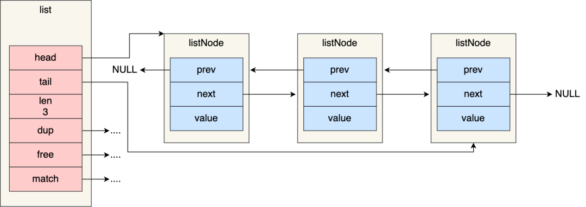
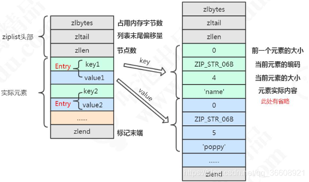
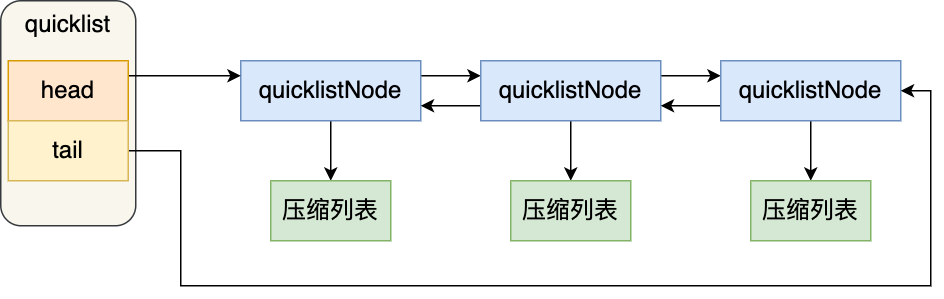

# redis 数据类型

---


### 1. redis的数据存储

**redis --version  查看版本；redis的版本；**

string list set zset hash stream bitmap 


key=>value   value 对应的是 数据类型；

通过key找value 使用的是hash哈希表；


**object encoding key ； 查看编码类型也就是数据格式；**


----


**string sds  动态字符串来实现的；**

可以看得出，这是按照实际占用字节数进行分配内存的，这样可以节省内存空间。

sds：

* int 类型，就是全部都是整型，也是为了节约内存的目的；  存在于整数还是要解决内存；
* embstr 就是字符串的类型，是字符串必须低于44字节的时候；
* raw 大于44个字节的时候会出现的；

------


**list   ziplist  quicklist   双向链表**

>制约ziplist 的还是数据搬迁的问题；
>

ziplist 左边插入的时候时间复杂度会很高，有可能会存在数据搬迁的问题；一般数据不要超过512个字节；

双向链表，更新时间复杂度是O(1),但是一个结点，需要占用很多内存，需要pre 和next指针；不需要数据的搬迁，

注意链表不需要查询某个数据；只需要push 和pop就可以了；所以 双向链push  和 pop 都是O(1) 的时间复杂度

但是ziplist lpush 和lpop 都是O(n),因为会存在数据的搬迁；

**一直执行rpop 其实就是反向遍历压缩列表！！！lpush就是正向遍历；**


**// list 当队列都会存在整个问题；**

**逆序遍历仅仅是因为 rpop;就会存在整个问题；所以需要逆序遍历操作；**


**双向链表；**

````c
typedef struct list {
    //链表头节点
    listNode *head;
    //链表尾节点
    listNode *tail;
    //节点值复制函数
    void *(*dup)(void *ptr);
    //节点值释放函数
    void (*free)(void *ptr);
    //节点值比较函数
    int (*match)(void *ptr, void *key);
    //链表节点数量
    unsigned long len;
} list;
````



- listNode 链表节点的结构里带有 prev 和 next 指针，**获取某个节点的前置节点或后置节点的时间复杂度只需O(1)，而且这两个指针都可以指向 NULL，所以链表是无环链表**；
- list 结构因为提供了表头指针 head 和表尾节点 tail，所以**获取链表的表头节点和表尾节点的时间复杂度只需O(1)**；
- list 结构因为提供了链表节点数量 len，所以**获取链表中的节点数量的时间复杂度只需O(1)**；
- listNode 链表节使用 void* 指针保存节点值，并且可以通过 list 结构的 dup、free、match 函数指针为节点设置该节点类型特定的函数，因此**链表节点可以保存各种不同类型的值**；

链表的缺陷也是有的：

- 链表每个节点之间的内存都是不连续的，意味着**无法很好利用 CPU 缓存**。能很好利用 CPU 缓存的数据结构就是数组，因为数组的内存是连续的，这样就可以充分利用 CPU 缓存来加速访问。
- 还有一点，保存一个链表节点的值都需要一个链表节点结构头的分配，**内存开销较大**。


----


因此，**Redis 3.0 的 List 对象在数据量比较少的情况下，会采用「压缩列表」作为底层数据结构的实现，它的优势是节省内存空间，并且是内存紧凑型的数据结构。**

**不过，压缩列表存在性能问题（具体什么问题，下面会说），所以 Redis 在 3.2 版本设计了新的数据结构 quicklist，并将 List 对象的底层数据结构改由 quicklist 实现。**

**然后在  Redis 5.0 设计了新的数据结构 listpack，沿用了压缩列表紧凑型的内存布局，最终在最新的 Redis 版本，将 Hash 对象和 Zset 对象的底层数据结构实现之一的压缩列表，替换成由  listpack 实现。**


**hash  ziplist hash**？？？

1. ziplist 当哈希元素个数小于512个(field <512)，同时value值小于64字节，Redis会使用Ziplist实现哈希，**连续储存，比较节省内存O(n)**；
2. hashtale ，当数据比较多的时候（field >=512），读写效率会提高到O(1);


-----


**set  hash intset** 

* intset(整数集合)：**当集合中元素都是整数，并且元素个数小于512个；**减少内存的适合用；这里就是一个数组；sismember key element 时间复杂度是O(n)；数组保存是一个有序的数组，查询的时候时间复杂度是logn；

* hashtable(哈希表)：无法满足intset条件的时候；

  ```shell
  #非整数；
  127.0.0.1:6379> object encoding cestringset
  "hashtable"
  ```




**zset ziplist skiplist** 


**ziplist  和 quicklist 必须要看一下**

----


### ziplist

压缩列表的最大特点，就是它被设计成一种内存紧凑型的数据结构，占用**一块连续的内存空间**，不仅可以**利用 CPU 缓存**，而且**会针对不同长度的数据，进行相应编码，**这种方法可以有效地节省内存开销。

但是，压缩列表的**缺陷**也是有的：

- 不能保存过多的元素，否则**查询效率就会降低**；

  ``````shell
  #  lrange hgetall zrange 全部遍历 时间复杂度是O(n);  注意查询和遍历的区别；
  # 
  list    ziplist  and  双向链表  skiplist  //节约内存 和 减少数据的搬迁；
  list 不需要查询 只需要pop push 就可以了
  ziplist 的两个问题，查询太慢 和 数据搬迁的问题； 如果ziplist 很大，那么搬迁效率太低，所以在list 不能太大，在list里面；
  
  双向链表 虽然占用内存多，但是没有数据搬迁的问题；可以逆序遍历；
  
  quciklist 兼容了他们共同的特点，就是每一个节点都是ziplist； 指针数变少了，需要搬迁的数据也变少了；
  lrange key start end; //显示所有的list；
  
  hash                //   ziplist 不能太多 不然查询太慢 O(n); 但是他占用的内存小；
                      //    
  
  zset  数据搬迁和查询的问题；
   和 hash 一样，ziplist，节约内存，但是需要数据的搬迁；查询太慢了； 存储的时候肯定是有序的；
   
   zrange key start end withscores;
  
  ``````

  

- 新增或修改某个元素时，压缩列表占用的内存空间需要重新分配，甚至可能引发连锁更新的问题。**数据搬迁的问题；**


因此，Redis 对象（List 对象、Hash 对象、Zset 对象）包含的**元素数量较少**，或者**元素值不大的情况才会使用压缩列表作为底层数据结构。**


- ***zlbytes\***，记录整个压缩列表占用对内存字节数；
- ***zltail\***，记录压缩列表「尾部」节点距离起始地址由多少字节，也就是列表尾的偏移量；
- ***zllen\***，记录压缩列表包含的节点数量；
- ***zlend\***，标记压缩列表的结束点，固定值 0xFF（十进制255）

，如果我们要查找定位第一个元素和最后一个元素，可以通过表头三个字段的长度直接定位，复杂度是 O(1)。而**查找其他元素时，就没有这么高效了，只能逐个查找，此时的复杂度就是 O(N) 了，因此压缩列表不适合保存过多的元素**。


压缩列表节点包含三部分内容：

- ***prevlen\***，记录了「前一个节点」的长度；

- ***encoding\***，记录了当前节点**实际数据的类型以及长度；**

- ***data\***，记录了当前节点的**实际数据**；

  

空间扩展操作也就是重新分配内存，因此**连锁更新一旦发生，就会导致压缩列表占用的内存空间要多次重新分配，这就会直接影响到压缩列表的访问性能**。

所以说，**虽然压缩列表紧凑型的内存布局能节省内存开销，但是如果保存的元素数量增加了，或是元素变大了，会导致内存重新分配，最糟糕的是会有「连锁更新」的问题**。

因此，**压缩列表只会用于保存的节点数量不多的场景**，只要节点数量足够小，即使发生连锁更新，也是能接受的。


**数据结构：quicklist（Redis 3.2 引入） 和 listpack（Redis 5.0 引入）**


----


哈希表 hash


这个过程看起来简单，但是其实第二步很有问题，**如果「哈希表 1 」的数据量非常大，那么在迁移至「哈希表 2 」的时候，因为会涉及大量的数据拷贝，此时可能会对 Redis 造成阻塞，无法服务其他请求**。

#### 渐进式 rehash

**为了避免 rehash 在数据迁移过程中，因拷贝数据的耗时，影响 Redis 性能的情况，所以 Redis 采用了渐进式 rehash，也就是将数据的迁移的工作不再是一次性迁移完成，而是分多次迁移。**


触发 rehash 操作的条件，主要有两个：

- **当负载因子大于等于 1 ，并且 Redis 没有在执行 bgsave 命令或者 bgrewiteaof 命令，也就是没有执行 RDB 快照或没有进行 AOF 重写的时候，就会进行 rehash 操作。**
- **当负载因子大于等于 5 时，此时说明哈希冲突非常严重了，不管有没有有在执行 RDB 快照或 AOF 重写，都会强制进行 rehash 操作。**


---


### quicklist

**quicklist 结构体**


````c
typedef struct quicklist {
    //quicklist的链表头
    quicklistNode *head;      //quicklist的链表头
    //quicklist的链表头
    quicklistNode *tail; 
    //所有压缩列表中的总元素个数
    unsigned long count;
    //quicklistNodes的个数
    unsigned long len;       
    ...
} quicklist;
````

quicklistNode

`````c
typedef struct quicklistNode {
    //前一个quicklistNode
    struct quicklistNode *prev;     //前一个quicklistNode
    //下一个quicklistNode
    struct quicklistNode *next;     //后一个quicklistNode
    //quicklistNode指向的压缩列表
    unsigned char *zl;              
    //压缩列表的的字节大小
    unsigned int sz;                
    //压缩列表的元素个数
    unsigned int count : 16;        //ziplist中的元素个数 
    ....
} quicklistNode;
`````




可以看到，quicklistNode 结构体里包含了前一个节点和下一个节点指针，这样每个 quicklistNode 形成了一个双向链表。但是链表节点的**元素不再是单纯保存元素值，而是保存了一个压缩列表**，所以 quicklistNode 结构体里有个指向压缩列表的指针 *zl。


在向 quicklist 添加一个元素的时候，不会像普通的链表那样，**直接新建一个链表节点。而是会检查插入位置的压缩列表是否能容纳该元素，如果能容纳就直接保存到 quicklistNode 结构里的压缩列表，如果不能容纳，才会新建一个新的 quicklistNode 结构。**

**quicklist 会控制 quicklistNode 结构里的压缩列表的大小或者元素个数，来规避潜在的连锁更新的风险，但是这并没有完全解决连锁更新的问题。**


quicklist 虽然通过控制 **quicklistNode** 结构里的压缩列表的**大小或者元素个数**，来减少连锁更新带来的性能影响，但是**并没有完全解决**连锁更新的问题。

连锁更新产生的**根源**问题是压缩列表这种数据结构来保存数据，所以需要彻底解决连锁更新的问题，必须重新设计一种新的数据结构；


----


## skiplist  建议高一级的索引 来解决这个问题； 来加快索引的速度；


logn的时间复杂度；

logn 的时间复杂度；


跳表 本质上是对链表的一种优化，通过逐层跳步采样的方式构建索引，以加快查找速度，如果是普通的链表只能一个个的往后找；


**跳表就不一样，可以通过高层的索引，一次跳跃多个节点，当未找到的时候进入更下层的索引来进行查找；时间复杂度是logn**


## 跳表 更加灵活  更容易实现；


**跳表和B+数既然大部分场景下可以互换，为什么redis没有使用B+树而选择跳表？**

**作者回复: 跳表更灵活 更容易实现**


##  


