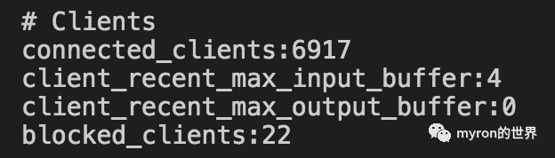
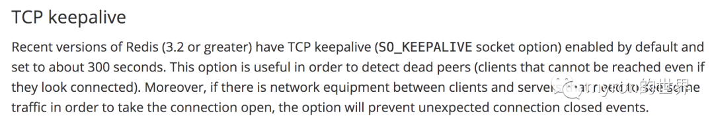

# redis


查看redis的连接数

ss -anp    t  u  l                 l


````redis.conf
# maxclients 10000
#最大的客户端连接数
````


命令 info 来查看客户端的连接数；

`````shell
redis-cli
info 
# Server                                                         
redis_version:4.0.8                                              
redis_git_sha1:00000000                                          
redis_git_dirty:0                                                
redis_build_id:51ec49f06079b708                                  
redis_mode:standalone                                            
os:Linux 4.9.60-linuxkit-aufs x86_64                             
arch_bits:64                                                     
multiplexing_api:epoll                                           
atomicvar_api:atomic-builtin                                     
gcc_version:4.9.2                                                
process_id:1                                                     
run_id:6d5f0288b794aa297839475e913213fdde1547c6                  
tcp_port:6379                                                    
uptime_in_seconds:59483                                          
uptime_in_days:0                                                 
hz:10                                                            
lru_clock:11437153                                               
executable:/data/redis-server                                    
config_file:/etc/redis.conf                                      
                                                                 
# Clients     连接的客户端；                                                   
connected_clients:1                                              
client_longest_output_list:0                                     
client_biggest_input_buf:0                                       
blocked_clients:0                                                
                                                                 
# Memory                                                         
used_memory:828504                                               
used_memory_human:809.09K                                        
used_memory_rss:4136960                                          
used_memory_rss_human:3.95M                                      
used_memory_peak:828504                                          
used_memory_peak_human:809.09K                                   
used_memory_peak_perc:100.13%                                    
used_memory_overhead:815270                                      
used_memory_startup:765640                                       
used_memory_dataset:13234                                        
used_memory_dataset_perc:21.05%                                  
total_system_memory:2095984640                                   
total_system_memory_human:1.95G                                  
used_memory_lua:37888                                            
used_memory_lua_human:37.00K                                     
maxmemory:0                                                      
maxmemory_human:0B                                               
maxmemory_policy:noeviction                                      
mem_fragmentation_ratio:4.99                                     
mem_allocator:jemalloc-4.0.3                                     
active_defrag_running:0                                          
lazyfree_pending_objects:0                                       
                                                                 
# Persistence                                                    
loading:0                                                        
rdb_changes_since_last_save:0                                    
rdb_bgsave_in_progress:0                                         
rdb_last_save_time:1672322054                                    
rdb_last_bgsave_status:ok                                        
rdb_last_bgsave_time_sec:-1                                      
rdb_current_bgsave_time_sec:-1                                   
rdb_last_cow_size:0                                              
aof_enabled:1                                                    
aof_rewrite_in_progress:0                                        
aof_rewrite_scheduled:0                                          
aof_last_rewrite_time_sec:-1                                     
aof_current_rewrite_time_sec:-1                                  
aof_last_bgrewrite_status:ok                                     
aof_last_write_status:ok                                         
aof_last_cow_size:0                                              
aof_current_size:0                                               
aof_base_size:0                                                  
aof_pending_rewrite:0                                            
aof_buffer_length:0                                              
aof_rewrite_buffer_length:0                                      
aof_pending_bio_fsync:0                                          
aof_delayed_fsync:0                                              
                                                                 
# Stats                                                   
total_connections_received:2                                     
total_commands_processed:2                                       
instantaneous_ops_per_sec:0                                      
total_net_input_bytes:98                                         
total_net_output_bytes:20421                                     
instantaneous_input_kbps:0.00                                    
instantaneous_output_kbps:0.00                                   
rejected_connections:0                                           
sync_full:0                                                      
sync_partial_ok:0                                                
sync_partial_err:0                                               
expired_keys:0                                                   
evicted_keys:0                                                   
keyspace_hits:0                                                  
keyspace_misses:0                                                
pubsub_channels:0                                                
pubsub_patterns:0                                                
latest_fork_usec:0                                               
migrate_cached_sockets:0                                         
slave_expires_tracked_keys:0                                     
active_defrag_hits:0                                             
active_defrag_misses:0                                           
active_defrag_key_hits:0                                         
active_defrag_key_misses:0                                       
                                                                 
# Replication  重复的copy ；复制；；                                              
role:master                                                      
connected_slaves:0                                               
master_replid:3174ad82a7dcceb044475cb77681ce0cec4aa073           
master_replid2:0000000000000000000000000000000000000000          
master_repl_offset:0                                             
second_repl_offset:-1                                            
repl_backlog_active:0                                            
repl_backlog_size:1048576                                        
repl_backlog_first_byte_offset:0                                 
repl_backlog_histlen:0                                           
                                                                 
# CPU                                                            
used_cpu_sys:19.23                                               
used_cpu_user:7.21                                               
used_cpu_sys_children:0.00                                       
used_cpu_user_children:0.00                                      
                                                                 
# Cluster                                                        
cluster_enabled:0                                                
`````


最近在压测过程中，server加进程时，发现启动不了，redis拿不到连接。这里记录一下排查过程。


**一、查看连接配置**


redis客户端连接后，使用命令info查看当前连接数

//




使用config get maxclients查看配置的最大连接数


当时看到连接数已经快超过10000了


之前排查过连接数爆掉的问题，是因为连接长时间不活跃，被中间设备断开连接，redis server又没有设置keepalive，导致server这边连接一直无法断开，客户端会不断重连，导致连接越积越多。**当前redis版本是5.0.4，这个版本默认设置了keepalive，排除这个可能**

##TCP keepalilve  保活；




# keepalive

* **查看操作系统tcp keepalive设置为7200s（2小时），未生效，推测此配置被redis配置覆盖。（在测试环境使用相同配置，进行tcpdump抓包测试，确认无误。）**
* **查看redis配置tcp_keepalive为0，代表关闭tcp连接状态检查，与现象一致。**
* **redis-server设置了keepalive=0，此配置覆盖了操作系统的keepalive=7200s，导致redis-server不主动检测连接状态，所以不会主动回收连接。 覆盖了;**
* **我这里遇到的问题 就是keepalive= 0 而我的redis4.0.8 版本 5版本默认会有keepalive  排除这个可能；**

`````shell
#  操作系统的keepalive  保活
#全局设置可更改/etc/sysctl.conf,加上:

net.ipv4.tcp_keepalive_intvl = 20
net.ipv4.tcp_keepalive_probes = 3
net.ipv4.tcp_keepalive_time = 60
#
`````


**二、统计客户端连接数**


登录redis server，根据master的端口统计server的连接数分布情况

- 

```
lsof -i:port | awk -F '->' '{print $2}' | awk -F ':' '{print $1}' | awk '{sum[$1]+=1} END {for(k in sum) print k ":" sum[k]}' | sort -n -r -k 2 -t ':'
```


发现排名最靠前两台机器每台都建立了3047个连接，凶手抓到了


**三、清理连接**

**
**

尝试使用redis的client kill ip:port干掉连接


- 

```
lsof -i:port | awk -F '->' '{print $2}' | awk -F ' ' '{print $1}'| awk -F ":" '{if ($1 == ip) print $1 ":" $2}' | xargs -n1 redis-cli -h host -p port -a password client kill
```


这里要注意xargs的用法，经过xargs的处理之后换行和空白将被空格取代，所以需要加-n1参数。执行完成，发现又被客户端重新连上了，看来客户端有重连机制


最后简单粗暴，iptables封禁ip，等周一找对应系统再排查，先解决问题

- 

```
iptables -I INPUT -s ***.***.***.*** -j DROP
```

解封ip是下面的命令

- 

```
iptables -D INPUT -s ***.***.***.*** -j DROP
```