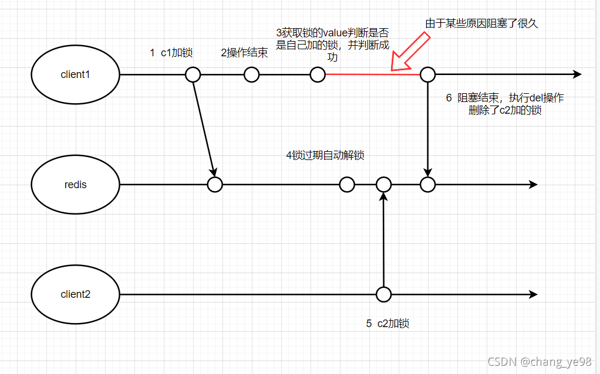
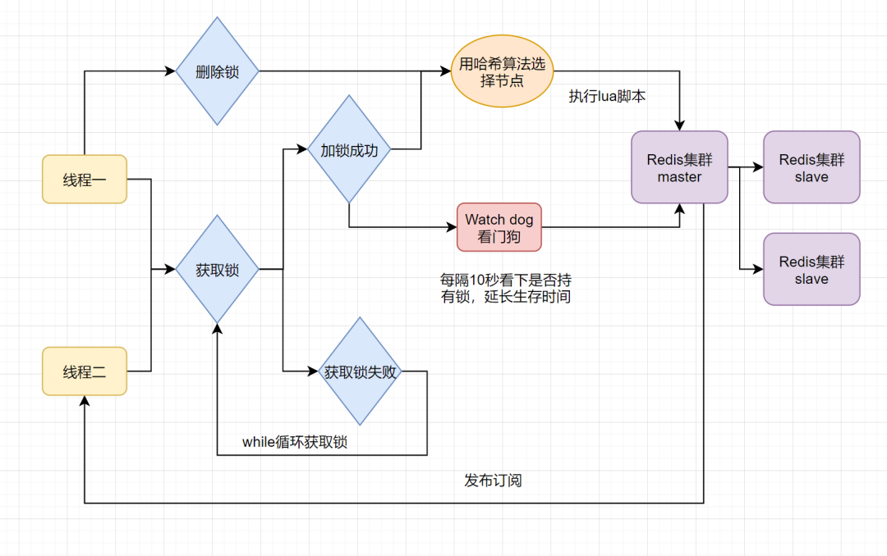

#**分布式锁的实现**  - - 多进程访问公共资源（mysql - redis库存的问题

# ）；+ 高并发 就会出现超卖的问题； --- 

>mysql 和 redis 的实现
>
>分布式锁场景：分布式和集群；对多进程的锁定；多进程访问共享资源；
>
>
>
>锁：单进程的锁；
>
>**锁其实就是把并发转换成串行化的一个过程；**
>
>其实这里超卖的问题，**完全可以用 lua脚本的来实现的查询库存，和库存减1的原子性也是可以的；**
>

## 分布式锁需要满足几点特性：


* **互斥性：在任何时刻，对于同一条数据，<font color=red>只有一台客户端可以获取分布式锁</font>；**  **setnx 来实现**

* **<font color=red>防止锁超时 防止产生长生锁</font>：如果客户端没有主动释放锁，服务器会在一段时间后自动释放锁，防止客户端宕机，或者网络不可达是产生的死锁；**

* **独占性： 加锁和解锁必须由用一个客户端来处理，也就是  <font color=red>只有锁的持有者才能释放锁</font>，不能出现你加的锁，别人给你解锁了；**

  

* 高可用性：在分布式场景下，一小部分服务器宕机不影响正常使用，这种情况下就需要提供分布式锁的服务以集群的方式部署；

----


	## redis分布式锁的一个缺点：


<font color=red>**锁过期释放了，业务还没执行完的问题；**</font>

这里php没有比较好的解决方案只有 不断的去

----


## 超卖的原理     === （快照读，读的并不是最新的数据；高并发；）

**mysql 为什么在高并发下会发生超卖的问题??**  下面出现超卖的问题是select stock 和update stock不是原子的；

所以mysql超声超卖的原因，就是快照读；快照读读的并不是最新数据；这里是RR；

如果是RC；那么会出现不可重复读的问题，但是可以解决这个快照都的问题；


```php
#  秒杀的并发量是很高的；
if (select stock form orders > 0) {  // 去检查库存，> 0 然后去减库存；  假如库存只有10个；
    //但是在高并发的情况下 缺进来20个进程；
    update set stock = stock - 1 where id = 1;
    // 那么处理完stock 变成了 -10  那么就是发生了超卖的问题了；
}
// 注意在平常并发量不高的情况下 并不会发生超卖的问题；

## 秒杀的优化；为了保证原子性那么我们在这里做了优化 使用了事务； 这里优化了一个寂寞，多进程的，肯定其他的进程，也能从自己代码部分进去，我自己单进程肯定是原子性呀；php肯定一条请求都是原子性的呀；卧槽牛皮呀；
begin;
// 这里是多进程  还有其他的进程去操作，所以 会超卖，和redis的单进程是不一样的；
if (select stock from orders > 0) {   //这条语句 要注意 ：这里并不是当前读，而是快照读；在高并发的情况下，你刚创建快照读，说不定别人都提交了好几个版本了，你只能一致性视图里面的数据，肯定是不准确的；
    update set stock = stock - 1 where id = 1;
}
commit;


### 再优化
 begin;
if (select stock form orders for update > 0) {  // 直接加写锁；绝对就防止超卖了；效率比较低，相当于这条数据串行化了；
    update set stock = stock - 1 where id = 1;
}
commit；
    
```


#### 原子性 防止超卖

````php
 #实完全可以用 lua脚本来实现查看库存和减库存的原子性，来防止超卖；
$script2 = <<<EOF
    local key = KEYS[1]
    local stock =  redis.call('get',key)
    if (tonumber(stock) > 0)
    then
        redis.call('decr',key)
        return true
    else
        return false
    end
EOF;
````


#### mysql分布式锁（这行数据加悲观锁，这行数据串行化）；

处理事务并发的问题；超卖的问题；


实现：

````mysql
#添加悲观锁；执行前先拿到写锁，事务提交之后释放； 一开始拿写锁 是不是和串行化一模一样
select ... for update; 
# 这行数据事务的执行流程变成了串行化；

#其他行的数据还是并行的； 注意和事务的串行化隔离级别分开；
#所有的数据执行，一个事务执行完 另外一个事务才能执行？？？  串行化；
````


优点：

* 实现简单，使用方便，不用引入redis zookeeper中间件。

缺点：

* **不适合高并发的情况；**
* **db操作性能差；会有磁盘的操作；**


#### redis分布式锁；

**要求：**

setex  expire **加锁和设置过期时间一定要保证原子性： 不然如果setnx之后客户端crash了，那么这个锁一定是一个长生锁；**

`````php
#redis 
if（jedis.setnx(key,lock_value) == 1）{ //setnx加锁
    expire（key，100）; //设置过期时间
    try {
        do something  //业务处理
    }catch(){
    }
  finally {
       jedis.del(key); //释放锁
    }
}
`````

**set key value ex nx**

````php
# 存在的问题：
#锁过期释放了，还没有执行完；
#锁被别的客户端误删；一般是A客户端crash之后，A的锁过期之后，B客户端拿到锁，然后A上线了直接把B的锁给误删了

if（jedis.set(key, lock_value, "NX", "EX", 100s) == 1）{ //加锁
    try {
        do something  //业务处理
    }catch(){
  }
  finally {
       jedis.del(key); //释放锁
    }
}
````

**set key Unique_value ex nx**

``````php
#uni_request_id  生成 在下面  
#存在问题：锁过期释放了还没有执行完成；
# 自己进程加的锁，要自己释放！！！用token 来区别是那个进程！！！！ 自己进程加的锁肯定要释放呀；

if（jedis.set(key, uni_request_id, "NX", "EX", 100s) == 1）{ //加锁
    try {
        do something  //业务处理
    }catch(){
  }
  finally {
       //判断是不是当前线程加的锁,是才释放
       if (uni_request_id.equals(jedis.get(key))) {
          jedis.del(key); //释放锁
        }
    }
}
// 请求的id request_id；

//解锁 为啥一定要是原子性？？？？ 肯定呀 不然就被其他的进程给释放了额； 还要保证，自己的锁，要自己释放！！！
if redis.call('get',KEYS[1]) == ARGV[1] then 
   return redis.call('del',KEYS[1]) 
else
   return 0
end;


``````

解锁操作的原子性
客户端 A 获取锁成功；
客户端 A 访问共享资源；
客户端 A 为了释放锁，先执行 GET 操作获取锁对应的随机字符串的值；
客户端 A 判断随机字符串的值，与预期的值相等；
客户端 A 由于某个原因阻塞了很长时间；
过期时间到了，锁自动释放了；
客户端 B 获取到了对应同一个资源的锁；
客户端 A 从阻塞中恢复过来，执行 DEL 操纵，释放掉了客户端 B 持有的锁。
如下图

**解决方法：使用Lua脚本进行解锁**

————————————————


`````php
/*
 * 生成随机字符串
 * @param int $length 生成随机字符串的长度
 * @param string $char 组成随机字符串的字符串
 * @return string $string 生成的随机字符串
 */
function str_rand($length = 32, $char = '0123456789abcdefghijklmnopqrstuvwxyzABCDEFGHIJKLMNOPQRSTUVWXYZ') {
    if(!is_int($length) || $length < 0) {
        return false;
    }

    $string = '';
    for($i = $length; $i > 0; $i--) {
        $string .= $char[mt_rand(0, strlen($char) - 1)];
    }

    return $string;
}


/**
     * Generate a more truly "random" alpha-numeric string.
     *
     * @param  int  $length
     * @return string
     */
    public static function random($length = 16)
    {
        $string = '';
		#每次都要计算一下
        while (($len = strlen($string)) < $length) {
            $size = $length - $len;

            $bytes = random_bytes($size);//过滤一下；

            $string .= substr(str_replace(['/', '+', '='], '', base64_encode($bytes)), 0, $size);
        }

        return $string;
    }

//base64 由8位（7位 第一位是0 ）变为6位bit；（0-6）
`````


### Redisson 

**解决锁过期释放，业务没有执行完的问题；**

对于可能存在**锁过期释放，业务没执行完**的问题。我们可以稍微把锁过期时间设置长一些，大于正常业务处理时间就好啦。如果你觉得不是很稳，**还可以给获得锁的线程，开启一个定时守护线程**，每隔一段时间检查锁是否还存在，存在则对锁的过期时间延长，防止锁过期提前释放。

当前开源框架Redisson解决了这个问题。可以看下Redisson底层原理图：



只要线程一加锁成功，就会启动一个`watch dog`看门狗，它是一个后台线程，会每隔10秒检查一下，如果线程1还持有锁，那么就会不断的延长锁key的生存时间。因此，Redisson就是使用`watch dog`解决了**锁过期释放，业务没执行完问题**。


----

### php redis eval

`````php
在php中，可以通过redis执行lua脚本


1、脚本 

<?php
$redis = new Redis(); #实例化redis类
$redis->connect('127.0.0.1'); #连接服务器

$lua = <<<SCRIPT
      return {KEYS[1],KEYS[2],ARGV[1],ARGV[2]}
SCRIPT;
//对应的redis命令如下 eval "return {KEYS[1],KEYS[2],ARGV[1],ARGV[2]}" 2 key1 key2 first second
$s = $redis->eval($lua,array('key1','key2','first','second'),2);
var_dump($s);

$redis->close(); #关闭连接
?>
2、代码解析

1）eval() 方法

redis->eval($lua, array('key1','key2','first','second'),2);
eval方法的参数 3个:

第一个参数：脚本代码

第二个参数：参数数组，

第三个参数：是个整数，表示第二个参数中的前几个是key参数，剩下的都是附加参数

2）这个执行的对应命令如下

eval "return {KEYS[1],KEYS[2],ARGV[1],ARGV[2]}" 2 key1 key2 first second

解释：
    
127.0.0.1:6379> eval "return {KEYS[1],KEYS[2],ARGV[1],ARGV[2]}" 2 key1 key2 first second
1) "key1"
2) "key2"
3) "first"
4) "second"
127.0.0.1:6379>

return {KEYS[1],KEYS[2],ARGV[1],ARGV[2]}


Lua 脚本


redis->eval($lua, array(‘key1’,‘key2’,‘first’,‘second’),2);


$lua是Lua脚本；

key1 和 key2 是键名参数，分别使用 KEYS[1] 和 KEYS[2] 访问；

first 和 second 是附加参数，可以通过 ARGV[1] 和 ARGV[2] 访问它们；

数字 2 指定了键名参数的数量；  作者：程序员-王坚 https://www.bilibili.com/read/cv16974374/ 出处：bilibili
`````


---


## php实现一个分布式锁


`````php

<?php
/**
 * Create by PhpStorm
 * User Leaveone
 * Data 2022/12/31
 * Time 22:07
 */

class RedisLock
{
    //去拿锁拿不到超时的时间
    protected $timeout = 0;
    protected $locktime = 0;
    protected $redis=null;
    protected $key = 'redisLock:stock';//// 锁的名称；关于库存的一把锁； 要想去访问库存先要去访问锁；

    protected $token = '';// 随机数  // 请求的随机数

    public function __construct($key,$timeOut,$lockOut) {
        $this->redis = new Redis();
        $this->redis->connect("192.168.1.103",6379);
        $this->key   = $key;
        $this->timeOut = $timeOut;
        $this->lockOut = $lockOut;
    }

    /**
     * 创建单例模式
     * @return Model
     * // 单例的话，必须是静态属性和方法，因为私有化构造函数，所以不能通过new 来生成对象，所以必须使用静态属性和方法；
     * 那么整个
     * 这个 必须是静态的，其他的不需要是静态的，然后通过getInstance 获取对象然后去操作对象里面的方法就行了；
     * //
     */
//    public static function getInstance()
//    {
//        static $pool;
//        $class = get_called_class();//
//        if (!isset($pool[$class])) {
//            $pool[$class] = new $class();
//        }
//        return $pool[$class];
//    }
    public function addLock() {
        $time = time();
        $endtime = $time + $this->timeout;
        $this->token = self::random();

        do {
            //去获取锁
            $result = $this->redis->set($this->key,$this->token,["nx","ex"=>$this->lockOut]);
            if ($result) {
                // 拿到锁；
               return $this->redis;
            } else {
                // 拿不到锁，继续去拿锁；
                usleep(5000);// 5000ms降低枪锁的频率，降低redis的压力；
            }
        }while (time() < $endtime);

    }

        //生成一个随机数
        public static function random($length = 16)
        {
            $string = '';
            #每次都要计算一下
            while (($len = strlen($string)) < $length) {
                $size = $length - $len;

                $bytes = random_bytes($size);//过滤一下；

                $string .= substr(str_replace(['/', '+', '='], '', base64_encode($bytes)), 0, $size);
            }

            return $string;
        }

        public function unlock() {

//            $cript =<<<LUA
//            local key = KEYS[1]
//            locak stock = redis.call('get',key)
//            if (tonumber(stock) > 0)
//            then
//                redis.call('decr',key)
//                return true;
//            else
//                return false;
//            end;
//
//LUA;
            $cript = <<<LUA
            local key = KEYS[1]
            local token = ARGV[1]
            if redis.call('get',key) == token
            then
                return redis.call('del',key);
            else
                return false;
            end;
LUA;

            //解锁；
            return $this->redis->eval($cript,[$this->key,$this->token],1);


        }

}

$lock = new RedisLock('redisLock:stock',60,60);

$redis = $lock->addLock();
var_dump($redis);
if ($redis) {
    $redis->decr('stock');
}

$redis = $lock->unlock();
var_dump($redis);


//   //采用lua 脚本解锁-----直接用这个解锁就可以了；
//     public function releaseLock1($value)
//     {
//          $script=<<<EOT
//          if redis.call("GET",KEYS[1]) == ARGV[1]
//          then
//              return redis.call("DEL",KEYS[1])
//          else
//              return 0
//          end
//EOT;
//        return  $this->redis->eval($script,[$this->key,$value],1);
//     }
`````


``````php
https://blog.csdn.net/azh89125/article/details/119299478

//针对问题1：使用循环请求，循环请求去获取锁
//针对问题2：针对第二个问题，在循环请求获取锁的时候，加入睡眠功能，等待几毫秒在执行循环
//针对问题3：在加锁的时候存入的key是随机的。这样的话，每次在删除key的时候判断下存入的key里的value和自己存的是否一样
class Lock
{
     public $redis = null;
     public $key   ="";
     public $timeOut = 0;
     public $lockOut = 0;
     public function __construct($key,$timeOut,$lockOut)
     {
         $this->redis = new Redis();
         $this->redis->connect("127.0.0.1",6379);
         $this->key   = $key;
         $this->timeOut = $timeOut;
         $this->lockOut = $lockOut;
     }
     public function addLock()
     {
          $time = time();
          $endTime = $time + $this->timeOut;
          $value = mt_rand(1000,10000);
          do {
              $isLock = $this->redis->set($this->key,$value,['nx','ex'=>$this->lockOut]);
              if ($isLock) {
                  return $value;
              } else {
                  usleep(5000);///睡眠，降低抢锁频率，缓解redis压力，针对问题2
              }
          } while(time()<$endTime);
          return false;
     }
     //无法保证原子性解锁
     public function releaseLock($value)
     {
           if ($this->redis->get($this->key)==$value) {
               $this->redis->del($this->key);
           }
 
     }
     //采用lua 脚本解锁
     public function releaseLock1($value)
     {
          $script=<<<EOT
          if redis.call("GET",KEYS[1]) == ARGV[1]
          then
              return redis.call("DEL",KEYS[1])
          else
              return 0
          end
EOT;
        return  $this->redis->eval($script,[$this->key,$value],1);
     }
     //利用redis watch 解锁
     public function releaseLock2($value)
     {
          $redis = $this->redis;
          $this->redis->multi($redis::PIPELINE);
          while(true) {
              try {
                  $redis->watch($this->key);
                  if ($redis->get($this->key)==$value) {
                      $redis->del($this->key);
                      $redis->exec();
                       return true;
                  } else {
                      $redis->unwatch($this->key);
                       break;
                  }
              } catch (Exception $e) {
                  echo $e->getMessage();
              }
 
          }
          return false;
 
     }
}
``````


---

## redis超卖的另外两种解决方案！！！

Redis可能会出现超卖（over-selling）的问题，这通常发生在并发环境中，特别是在多个客户端同时尝试执行减库存（decrement）操作时。超卖问题的根本原因在于并发操作时的竞争条件，导致多个客户端同时读取相同的库存值并执行减少操作，从而使得实际库存减少的数量超过了预期。

为了解决这个问题，可以使用Redis的事务（Transaction）和Watch机制来保证原子性操作。通过使用事务和Watch机制，可以确保在执行减库存操作时，其他客户端不会同时修改库存值，从而避免了超卖问题的发生。

另外，还可以通过使用分布式锁（Distributed Lock）来保证在执行减库存操作时的互斥性，从而避免并发操作导致的超卖问题。
