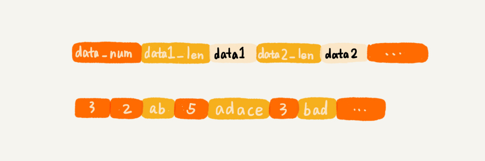
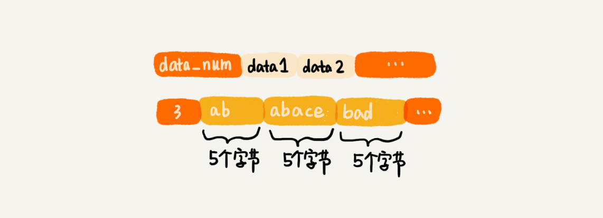

# 详解 redis的数据类型


## ziplilst

列表（list）我们先来看列表。列表这种数据类型支持存储一组数据。这种数据类型对应两种实现方法，一种是压缩列表（ziplist），另一种是双向循环链表。

当列表中存储的数据量比较小的时候，列表就可以采用压缩列表的方式实现。

具体需要同时满足下面两个条件：

* 列表中保存的单个数据（有可能是字符串类型的）小于 64 字节；
* 列表中数据个数少于 512 个。

关于压缩列表，我这里稍微解释一下。它并不是基础数据结构，而是 Redis 自己设计的一种数据存储结构。它有点儿类似数组，通过一片连续的内存空间，来存储数据。

**不过，它跟数组不同的一点是，<font color=red>它允许存储的数据大小不同。具体的存储结构也非常简单，你可以看我下面画的这幅图。</font>**



现在，我们来看看，压缩列表中的“压缩”两个字该如何理解？听到“压缩”两个字，**直观的反应就是节省内存。**

之所以说这种存储结构节省内存，是相较于数组的存储思路而言的。我们知道，数组要求每个元素的大小相同，如果我们要存储不同长度的字符串，那我们就需要用最大长度的字符串大小作为元素的大小（假设是 20 个字节）。那当我们存储小于 20 个字节长度的字符串的时候，便会浪费部分存储空间。听起来有点儿拗口，我画个图解释一下。



压缩列表这种存储结构，**一方面比较节省内存，另一方面可以支持不同类型数据的存储。**而且，因为数据存储在一片连续的内存空间，通过键来获取值为列表类型的数据，读取的效率也非常高。 但是不支持随机访问的能力；


---


## 双向链表


当列表中存储的数据量比较大的时候，也就是不能同时满足刚刚讲的两个条件的时候，列表就要通过双向循环链表来实现了。

解决ziplist 数据搬迁的问题；

但是双向链表每一个节点都会有pre 和 next 占用内存会比较大；

## quicklist  同时解决 ziplist 的数据搬迁  和  双向链表的内存太大的问题

就是把双向链表的每一个节点都换成ziplist； 来解决这个问题；


## hash 哈希表

哈希因子 = 节点数/哈希表大小；


---


## 集合


集合（set）集合这种数据类型用来存储一组不重复的数据。这种数据类型也有两种实现方法，一种是基于有序数组，另一种是基于散列表。

有序数组 查询效率会logn；查询效率会比较高；logn；

当要存储的数据，同时满足下面这样两个条件的时候，Redis 就采用有序数组，来实现集合这种数据类型。

* 存储的数据都是整数； 
* 存储的数据元素个数不超过 512 个。

当不能同时满足这两个条件的时候，Redis 就使用散列表来存储集合中的数据。


----


##有序集合（sortedset）有序集合这种数据类型，我们在跳表里已经详细讲过了。

它用来存储一组数据，并且每个数据会附带一个得分。通过得分的大小，我们将数据组织成跳表这样的数据结构，以支持快速地按照得分值、得分区间获取数据。实际上，跟 Redis 的其他数据类型一样，有序集合也并不仅仅只有跳表这一种实现方式。

当数据量比较小的时候，Redis 会用压缩列表来实现有序集合。具体点说就是，使用压缩列表来实现有序集合的前提，有这样两个：

* 所有数据的大小都要小于 64 字节；
* 元素个数要小于 128 个。


---


## c语言的数组 和 php的数组  和 压缩列表


`````c
//c语言的数组  要求 数据类型是一致的;  要想支持随机访问，必须是这样的；
int a[3] = {1,2,3}
int *p = a;
*(p+1)  1 = int 4个字节；
    
//php 每一个变量都是 zval 而且zval的大小是 16 个字节 ； 无论什么样的数据类型，zval 都是16个字节；支持随机访问；
    
//  其实说白了就是用一个最大长度的zval来做zval的大小；12-16个字节，我们就用16做一个zval；
// 其实php也是使用了相同的数据类型（c语言中的），就是zval，16个字节，是一种结构体；struct;
$arr = [1,2,'3'];
int *p = arr;
*(p+16个字节)  = 2  // 这个也是 php数组可以存储不同的数据类型的原因；
// 注意当我们存储 1的时候其实只需要占用 4+8 =12 个字节就可以了，会浪费4个字节；
    
    
// redis 的ziplist 不能随机访问只能进行遍历；   
//redis的压缩 ziplist    压缩列表不支持随机访问，但是省空间； 只能从开始到结束进行遍历，找数值；prevlen ztail 仅仅是为了逆序遍历
//ziplist 牺牲了随机访问，得到了节省内存的目的； 
    

`````

----

