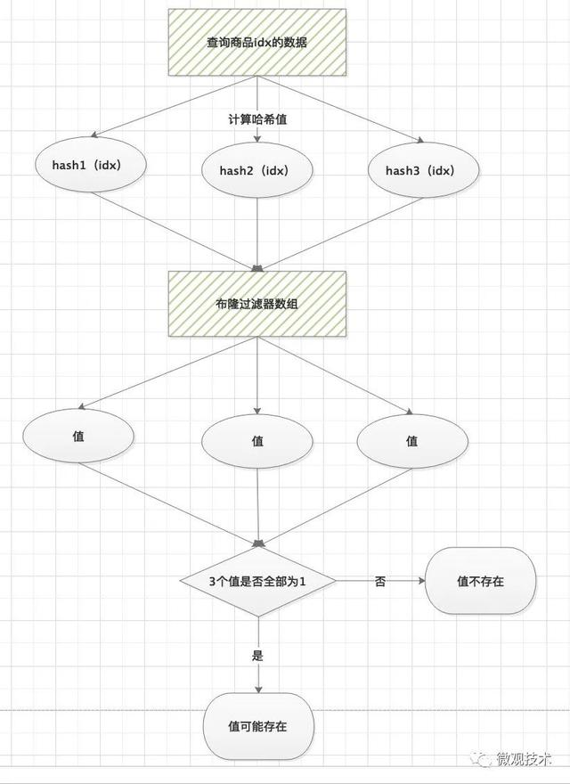

#缓存策略

----


<font color=red>**缓存击穿和缓存雪崩本质都是缓存穿透 缓存击穿和缓存雪崩都是缓存穿透的特殊表现** </font>


----


####**缓存雪崩**

**大量的数据在同一时刻失效，就会全部去请求数据库，数据库压力太大了；就会形成缓存雪崩；**

​	**场景：**

* 一般是数据同时过期
* redis宕机

处理：

* **处理的防范 加一个随机数不要让他一起失效；**

* **互斥锁；只有一条请求可以请求去和创建缓存，当缓存创建完成之后再释放锁；**

  **宕机：**

  
  
  redis 宕机 ，主从复制；**高可用**；主从+哨兵；


----


####**缓存击穿**


**某一个热点数据失效**


  //**不设置过期时间；**

///**互斥锁；**  很影响效率  有锁的部分开销；

//恶意的请求；和攻击；

----


####**缓存穿透**  （穿过 缓存直接请求到数据库；）

如果缓存中数据不存在，压力会转嫁给数据库。

假如被竞争对手利用，搞无效请求流量攻击，瞬间大量请求打到数据库中，对系统性能产生很大影响，很容易把数据库打挂，这种现象称为缓存穿透。**雪崩和击穿都是缓存穿透的表现；**

**某些数据即不在数据库中，也不在缓存中**，当这些数据存在大量的请求的时候，数据库的压力就会剧增；

**主要是被恶意的攻击；**


处理：

* 非法请求限制；//  限流；
* **redis缓存空值和默认值把；** 
* **布隆过滤器进行过滤**


预热缓存的概念：就是可以提前做好缓存，然后再去接收请求；

----


### 布隆过滤器  （只要有一个哈希值是0，肯定不存在于数据库中的，那么就没必要请求数据库了，只需要返回null，就可以了，如果全部都是1，那也仅仅是有可能存在，需要去数据库查询；）


实际上是一个很长的**二进制向量（bitmaps）和一系列随机映射函数**。

布隆过滤器可以**用于检索一个元素是否在一个集合（bitmaps）中。** **检查某一个元素是否在数据库内；**  有**0则肯定不存在，全是1则有可能存在；**

**底层就是一个哈希表，查询效率是O(1);**


优点：空间效率和查询时间都远远超过一般的算法。

**缺点：有一定的误识别率(哈希冲突)，删除困难。**


因为会存在哈希冲突；（误判率） **哈希冲突**，也叫**哈希碰撞**。

Hash 规则：如果在 Hash 后，原始位它是 0 的话，将其从 0 变为 1；如果本身这一位就是 1 的话，则保持不变。


​	<font color=red>**这个需要每次添加数据的时候就要更新到布隆过滤器中的；**</font>  添加数据的去更新布隆过滤器； 或者是访问数据的时候也可以去和更新；


这里也可以加一个热缓存；


**如果值都是1那么这个值有可能存在，如果有一个不都是1那么这个值肯定不存在数据库中的；那么直接返回null就可以了，就可以解决这个缓存穿透到问题；**       **减少对数据库不存在数据的访问；**


但是还会存在mysql数据库数据删除但是因为哈希碰撞的原因，我们不能删除bitmaps 上的某位的问题？？？？？？？





**注意：布隆过滤器只能精确  判断数据不存在  情况，对于存在我们只能说是可能，因为存在Hash冲突情况，当然这个概率非常低。**


**如何减少布隆过滤器的误判？** 

a）增加二进制位数组的长度。这样经过hash后数据会更加的离散化，出现冲突的概率会大大降低

b）增加Hash的次数，变相的增加数据特征，特征越多，冲突的概率越小


----


**是不是会占用很多内存？**

**计算公式： 10000000/8/1024/1024=1.19M**  1000万条数据才占用不到2M内存；

**占用内存很小；**

----


**应用：**


本文重点介绍的，解决缓存穿透网页爬虫对URL的去重，

避免爬取相同的URL地址反垃圾邮件，

从数十亿个垃圾邮件列表中判断某邮箱是否垃圾邮箱


### 内存满了后的，内存的淘汰策略；

lru    **淘汰最近最少使用的；**

lfu   原理 *LFU*(Least Frequently Used)算法,即 最少访问算法 ,根据访问缓存的历史   **频率来淘汰数据** **淘汰访问频率少的数据**

ttl  寿命 寿命越小越优先被淘汰，根据过期时间来淘汰，**key 的剩余寿命 ttl 的值，ttl 越小越优先被淘汰；**

random  设置了过期时间的键值对中，**进行随机删除；**


### key的过期策略 ---了解一下把；


定时删除 定时器，到期删除；


定期删除  定期的删除


惰性删除  每次访问他的时候进行删除；


 **Redis采用的过期策略**

惰性删除+定期删除。

**惰性删除流程**

在进行get或setnx等操作时，先检查key是否过期：

- 若过期，删除key，然后执行相应操作
- 若没过期，直接执行相应操作


## 2 Redis的key过期策略

- 被动方式 - 惰性删除
- 主动方式 - 定期删除

为保证 Redis 的高性能，所以不会单独安排一个线程专门去删除。

---


### 2.1 惰性删除

**key过期时不删除，每次获取key时，再去检查是否过期。若过期，则删除，返回null。**

### 2.1.1 优点

删除操作只发生在取key时，且只删除当前key，**所以对CPU时间占用较少**。此时删除已非做不可，毕竟若还不删除，就会获取到已过期key。

当查询该key时，Redis再很懒惰地检查是否删除。这和 Spring 的延迟初始化有着异曲同工之妙。

### 2.1.2 缺点

**但这是不够的，因为有过期key，永远不会再访问。若大量key在超出TTL后，很久一段时间内，都没有被获取过，则可能发生内存泄露（无用垃圾占用了大量内存）**。

**无论如何，这些key都应过期，因此还需要定期 Redis 在具有过期集的key之间随机测试几个key。已过期的所有key将从key空间中删除。**


----


### 定时删除

**在设置key的过期时间的同时，为该key创建一个定时器，让定时器在key的过期时间来临时，对key进行删除。**

### 优点

**保证内存被尽快释放**

### 缺点

- **若过期key很多，删除这些key会占用很多的CPU时间，在CPU时间紧张的情况下，CPU不能把所有的时间用来做要紧的事儿，还需要去花时间删除这些key**
- **定时器的创建耗时，若为每一个设置过期时间的key创建一个定时器（将会有大量的定时器产生），性能影响严重**

**所以没人用**


----


### 2.2 定期删除

每隔一段时间执行一次删除过期key操作。

### 优点

- **通过限制删除操作的时长和频率，来减少删除操作对CPU时间的占用–处理"定时删除"的缺点**
- **定期删除过期key–处理"惰性删除"的缺点**

### 缺点

- 在内存友好方面，不如"定时删除"

- 在CPU时间友好方面，不如"惰性删除"

  

----


### 难点

- 合理设置删除操作的执行时长（每次删除执行多长时间）和执行频率（每隔多长时间做一次删除）（这个要根据服务器运行情况来定了）

每秒 10 次：

1. 测试 20 个带有过期的随机键
2. 删除找到的所有已过期key
3. 如果超过 25% 的key已过期，从步骤 1 重新开始

这是个微不足道的概率算法，假设样本为整个key空间，继续过期，直到可能过期的key百分比低于 25%。
这意味着在任何给定时刻，使用内存的已过期的最大键量等于最大写入操作量/秒除以 4。

----


### 定期删除流程


```text
void databasesCron(void) {
    /* Expire keys by random sampling. Not required for slaves
     * as master will synthesize DELs for us. */
    if (server.active_expire_enabled) {
        if (iAmMaster()) {
            activeExpireCycle(ACTIVE_EXPIRE_CYCLE_SLOW);
        } else {
            expireSlaveKeys();
        }
    }
#define ACTIVE_EXPIRE_CYCLE_KEYS_PER_LOOP 20 /* Keys for each DB loop. */

void activeExpireCycle(int type) {
	config_keys_per_loop = ACTIVE_EXPIRE_CYCLE_KEYS_PER_LOOP +
                           ACTIVE_EXPIRE_CYCLE_KEYS_PER_LOOP/4*effort,
 
  // step1
  for (j = 0; j < dbs_per_call && timelimit_exit == 0; j++) {
    /* 如果没有什么可以过期，请尽快尝试下一个数据库 */
    // step2
    if ((num = dictSize(db->expires)) == 0) {
      db->avg_ttl = 0;
      // step3
      break;
    }
 
  }
}
```

对指定N个库的每个库随机删除≤指定个数的过期K。

1. 遍历每个数据库（redis.conf中配置的"database"数量，默认16）
2. 检查当前库中的指定个数的key（默认每个库检查20个key，这相当于该循环执行20次，循环体为下边的描述）
3. 若当前库没有一个K设置TTL，直接执行下一个库的遍历
4. 随机获取一个设置TTL的K，检查其是否过期，若过期，则删除
5. 判断定期删除操作是否已达到指定时长，若已达到，直接退出定期删除

定期删除程序中有个全局变量**current_db**，记录下一个将要遍历的库。默认16个库，这次定期删除遍历了10个，那此时current_db就是11，下一次定期删除就从第11个库开始遍历，假设current_db等于15，那之后就再从0号库开始遍历（此时current_db==0）
