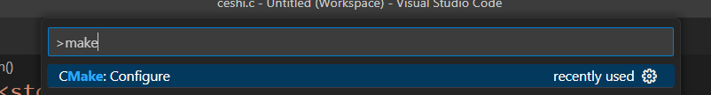

# cmake 

>cmake来实现多文件的编译问题；

生成makefile；生成一个复杂的makefile，使用cmake工具几条命令就可以实现一个复杂的功能；

连接 

**我们想要调试 ，还是需要去修改 launch.json 和 tasks.json 的program部分的配置；*

> program 运行的程序，必须是gdb调式后的代码，不然的话，是无法进行调试的；
>
>也就是执行文件exe,必须是由gcc -g 参数生成的代码；

上面的也可以实现；

上面会省略一步，下面的一步，选择编译器；然后生成build； 然后后面 cmake； 下面是一个cmake的命令；

