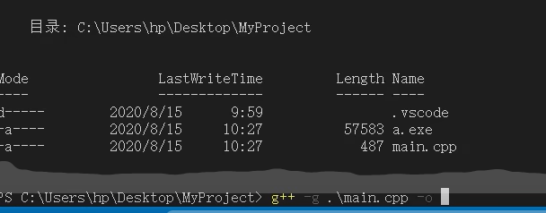
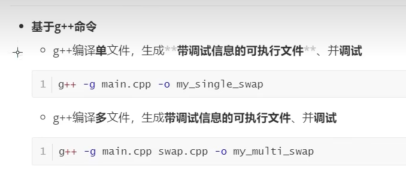

## launch.json 调试配置

> windows系统下：
>
> gcc hello.c  ===> a.exe
>
> gcc -c hello.c    是不带调试信息的文件；会生成 hello.exe
>
> gcc -g hello.c -o   hello    ====》 hello，执行文件时 hello；
>
> -g gdb ，带有调试信息的可执行文件；带有调试信息；可执行文件不一样大的，但是gdb调试信息的文件会大一些；
>
> gdb gcc debugger ====> 调试；
>
> 

## 多文件编译的调试问题；

>多个文件编译的问题；
>
>* 手动编译 gcc  -g hello.c bak.c -o hello   编译问题；
>* 或者使用cmake

## 配置 json

##  launch.json

>pwd linux中的当前目录  
>
>*1、pwd在不同行业有不同的意思:在web开发中,程序员常用pwd表示密码(password)的缩写*。
>
> 2、在Linux系统中,*pwd命令用作显示工作目录的路径名称*,全称是“Print Working Director...
>
>3. 在linux中，cwd指的是某个进程运行时所在的目录；cwd是“current working directory”的缩写，即当前工作目录，cwd不是系统自带的命令，属于系统的属性，可以在“/proc/{id}”目录下看到cwd。 cwd dang'qian
>
>   

---

## 
