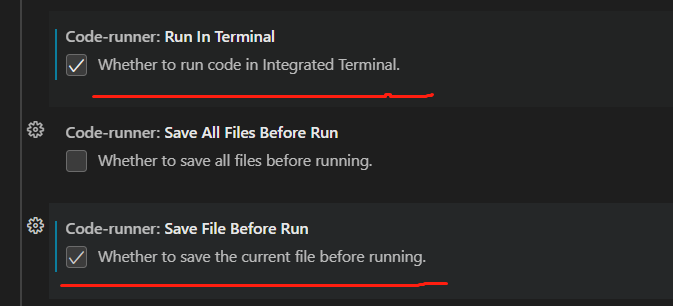
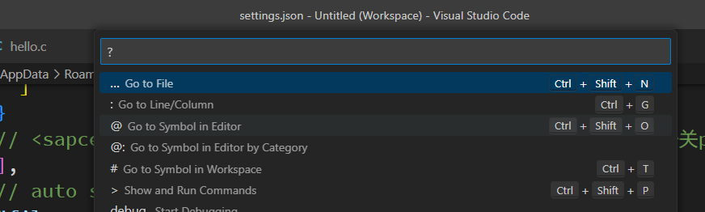

# runner code


runner 运行前一定要先保存，不然他并不会生效；

integrated  integrated terminal  集成；

集成终端

vscode 的集成终端；

//integrate 


open process explorer //  

explorer//探测器，探索；

*server explorer* 服务器资源管理器；服务器总管

打开进程资源管理器


load schema 加载模式；  加载模块；


Injecting Clink!
Preferring Windows commands


preference 偏爱； // 

privacy statement？？  隐私声明

// 运行以前 一定保存；

easymotion 简单动作；简捷操作；




// 找个仅仅是运行 run  并不是debug debug 还需要配置 launch.json 配置他的配置文件；

​	

```c
// release 1.7
//cmder user settings preference
 // cmder terminal
    "terminal.integrated.defaultProfile.windows": "Cmder",
    "terminal.integrated.profiles.windows": {
    "Cmder": {
      "name": "Cmder",
      "path": "C:\\Windows\\System32\\cmd.exe",
      "args": ["/k", "G:\\cmder\\vendor\\bin\\vscode_init.cmd"],
      "icon": "terminal-cmd",
      "color": "terminal.ansiGreen"
    }
  }
```


## ctrl + shit + P show and run commands?

>ctrl+shift+n = 根据文件名查询文件；
>
>ctrl + shift + f ，根据文件内容来进行查询；
>
>ctrl + shift + p 就是全局配置； vscode的全局配置；
>
>




##  vim 删除一个单词 要注意一下 这个插件；

>//todo 后序更新一下把，这样两个命令比较复杂，还是希望只用一套接口的；
>
>

`````c
// 
//要到单词的开始，开始，然后cw，删除这个单词，然后进入到插入模式；
// 可以使用 w 往后 移动 b往前移动，来移动，并且光标一直处于单词的头部，然后cw；进入到编辑状态；
`````

