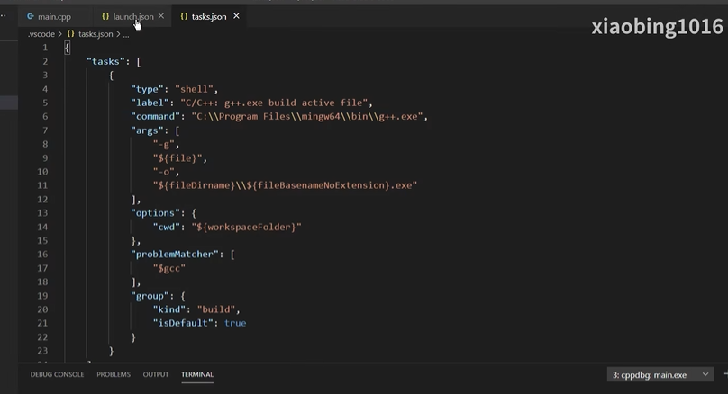

# tasks.json

>调试之前的编译工作；
>
>**生成一个调试后的可执行文件，这就是tasks.json的功能；**
>
>这个可以使用 cmake 来实现这一个编译工作，建议使用cmake来构建工程，以为cmake在大型项目构建有很大的优势；
>
>before debug;
>
>task.json文件是Visual Studio Code的一种配置文件，用于设置自定义任务。

----

****