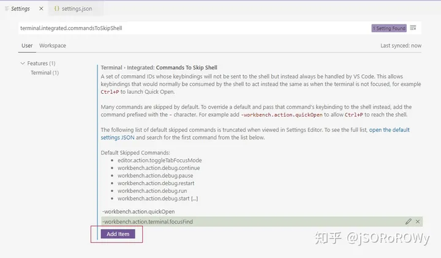
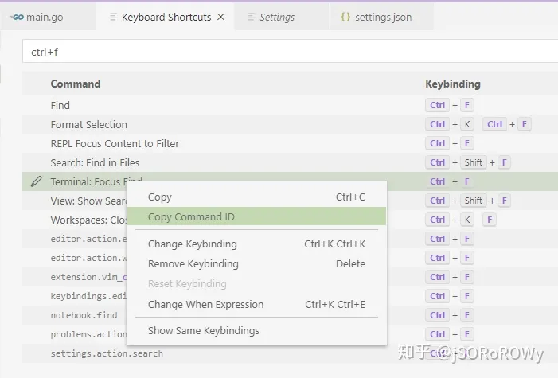
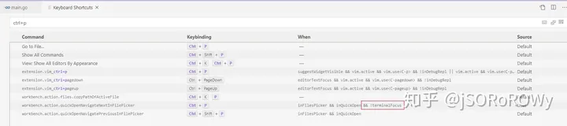
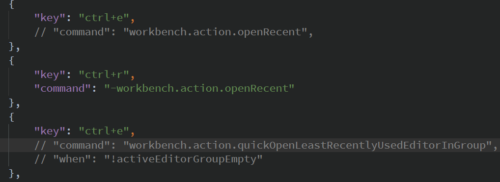

#  禁用快捷键


>Q：ctrl + a可以在terminal 来实现，光标的移动到行首；
>
>但是ctrl +e 不能移动到行尾的问题！！！
>
>A：直接找到keybindings.json修改命令下的command 给删除就可以了ok了；

修改这个配置项

terminal.integrated.commandsToSkipShell

在这个配置的数组里面添加 item

把要禁用的都加上"-"丢进去



不知道命令ID的话可以去 [keyboard shotcuts](https://www.zhihu.com/search?q=keyboard shotcuts&search_source=Entity&hybrid_search_source=Entity&hybrid_search_extra={"sourceType"%3A"answer"%2C"sourceId"%3A1464719074}) 配置里面找



附上 json 的配置

**//  intergrated ide 集成的意思；**

```json
    "terminal.integrated.commandsToSkipShell": [
        "-workbench.action.quickOpen",
        "-workbench.action.terminal.focusFind",
        "-workbench.action.toggleSidebarVisibility"
    ],
```

这三个加上基本 shell 的快捷键都可以用了应该。

------

或者你去直接去改 keyboard shotcuts 的 when，类似这样



同样附上 json

```text
[
    {
        "key": "ctrl+p",
        "command": "workbench.action.quickOpenNavigateNextInFilePicker",
        "when": "inFilesPicker && inQuickOpen && !terminalFocus"
    },
    {
        "key": "ctrl+p",
        "command": "-workbench.action.quickOpenNavigateNextInFilePicker",
        "when": "inFilesPicker && inQuickOpen"
    }
]
```

似乎也没有办法能一次全部禁用，只能是遇到一个禁用一个了

// Place your key bindings in this file to override the defaults [    {        "key": "ctrl+e",        "command": "ctrl+e",        "when": "terminalFocus"    }, ]


## 具体实现

>**上面的内容纯属吹牛皮；**

