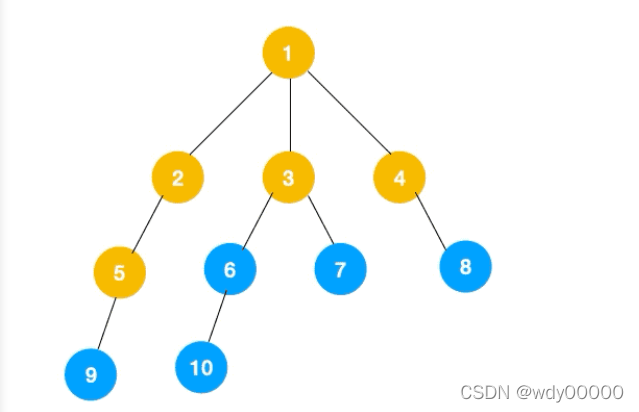

# BFS  （(Breadth First Search）


----


## 图的遍历的定义；

>因为图是可以闭环(回路)的，所以需要注意，解决每一个结点都访问一次，怎么去解决只能访问一次这个问题？
>
><font color=red>**解决方案：记录访问过的顶点；**</font>


<font color=red>**辅助数组里面的key是图的顶点，默认初始值是0，当访问过之后改为1；**</font>


**从某一个顶点出发，访问所有的顶点并且每一个顶点只能访问一次，就叫做图的遍历；**


两种常用的遍历方法：

* 深度优先遍历；depth  first search；dfs；
* 广度优先遍历；breath first search；bfs；

### 深度优先遍历

从某一个顶点出发，任意选择一个邻接点继续往下走，无路可走了，就退到上一个顶点继续往前走；直接退到起始顶点；

一条道走到黑，没有路了回退，看一下还可以往前走吗？（还有没有临界点）有那么继续往前走，没有就回退，直到退到起始顶点；

顶点的访问顺序是不一致的；

类似于树的先根遍历；

深度优先遍历如果定义了邻接矩阵，那么深度优先遍历的顺序都是一致的；只有一种顺序；

### 广度优先遍历  ----- 直接用队列--- 比较简单；

从某一个顶点开始，访问这个顶点的所有的邻接点，然后依次根据邻接点次序依次访问他们所有的顶点；


---

## DFS 和 BFS的时间复杂度 和空间复杂度；  ---- 对于连通图--- 

>**连通图 ：在无（有）向图G=（v，{E}）中，若对任意两个顶点v，都存在从v到u的路径，则称G为连通图（强连通图）；**

### 时间复杂度：

深度优先遍历： 时间复杂度的计算 所有的边和顶点都要遍历一次；遍历图中的每一个顶点都需要从头扫描该顶点所在的行；所以时间复杂度是n\^2;
邻接矩阵的时间复杂度 = n\^2;

邻接表的时间复杂度 = n + e；n 是结点数目，e是边数目；

广度优先遍历： 也是要把所有的边和顶点都要遍历一次；

邻接矩阵的时间复杂度n\^2

邻接表的时间复杂度是n +e;


###空间复杂度：

邻接表 ：n + e;  n是顶点数目，e是边数目；

邻接矩阵： n\^2;  n是顶点数目；


---

## 非连通图怎么遍历


利用 visitied  来判断  那些顶点访问过，那些顶点没有被访问过；选择任意一个结点继续做深度优先遍历

---


##二、广度优先遍历  BFS   广度优先遍历

###主要思路

广度优先遍历，指的是从图的一个未遍历的节点出发，先遍历这个节点的相邻节点，再依次遍历每个相邻节点的相邻节点。

###实现过程

树的广度优先遍历每个节点的值即为它们的遍历顺序。所以广度优先遍历也叫层序遍历，先遍历第一层(节点 1)，再遍历第二层(节点 2，3，4)，第三层(5，6，7，8)，第四层(9，10)。





`````php
#层级遍历
#  二叉树的层级遍历
#//             13
//        10         16
//    9      11   14
/**
 * 二叉树的树的层级遍历 的优化把
 */
function levelTraverseh($root) {
    if ($root == null) return null;
    //queue d队列
    $queue = [];
    array_push($queue,$root);
	// 多少层
    while(!empty($queue)) {
        $qz = count($queue);
		// 遍历的是层； 层的元素数；
        for ($i =0 ; $i < $qz ; $i++) {
            $head = array_shift($queue);
            echo $head->val."---";
            if ($head->left) array_push($queue,$head->left);
            if ($head->right) array_push($queue,$head->right);
        }
        echo "\n";
    }
}
levelTraverseh($root);die;

// result 

//13---
//10---16---
//9---11---14---

`````


