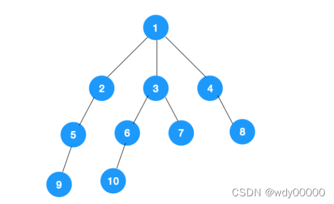

# DFS  （Depth First Search）深度优先遍历

深度优先遍历；


树的前序遍历,实际上树的前序遍历、中序遍历、后序遍历，都属于深度优先遍历。


## 深度优先遍历


### 1.1 主要思路

从图中一个未访问的顶点 V 开始，沿着一条路一直走到底，然后从这条路尽头的节点回退到上一个节点，再从另一条路开始走到底…，不断递归重复此过程，直到所有的顶点都遍历完成，它的特点是不撞南墙不回头，先走完一条路，再换一条路继续走。

### 1.2 实现过程




##深度优先遍历的实现
递归和非递归两种表现形式，接下来我们以二叉树为例来看下如何分别用递归和非递归来实现深度优先遍历。

##递归实现
递归实现比较简单，由于是前序遍历，所以我们依次遍历当前节点，左节点，右节点即可，对于左右节点来说，依次遍历它们的左右节点即可，依此不断递归下去，直到叶节点(递归终止条件)，代码如下：

````php
#  bst的遍历
void traverse(TreeNode root) {
    if (root == null) {
        return;
    }
    // 前序位置
    traverse(root.left);
    // 中序位置
    traverse(root.right);
    // 后序位置
}


````


`````php
#递归的表达性很好，也很容易理解，不过如果层级过深，很容易导致栈溢出。所以我们重点看下非递归实现。
#具体示例查看树一章案例中的Tree类中的 preOrder(Node localRoot) 方法
`````


## 非递归实现

`````php
## 前序遍历 模拟栈来实现；
##对二叉树来说，由于是先序遍历(先遍历当前节点，再遍历左节点，再遍历右节点)，我们可以通过栈来实现非递归
function noCursionHeadTraverse(TreeNode $root) {
    $stack = [];
    array_push($stack, $root);
    while (!empty($stack)) {
        $p = array_pop($stack);
        //前序遍历
        echo $p->val . "---";
        //入栈 先入 右边；
        if (!empty($p->right)) {
            array_push($stack,$p->right);
        }
        
        if (!empty($p->left)) {
            array_push($stack,$p->left);
        }
    }
}
`````


```php
#用栈实现深度优先遍历不用会象递归那样层级过深导致的栈溢出问题
```


## 图的深度优先遍历  DFS

`````
`````


