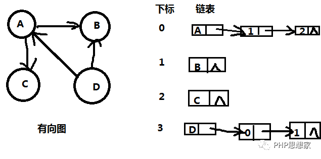
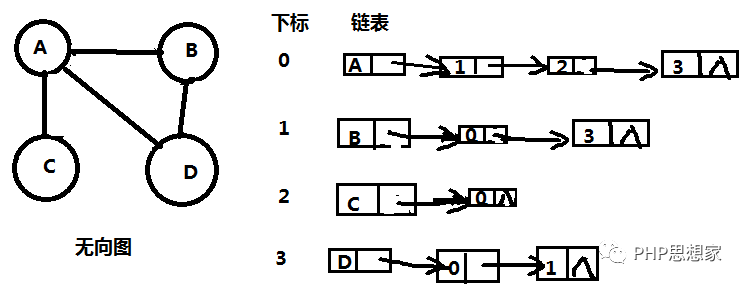
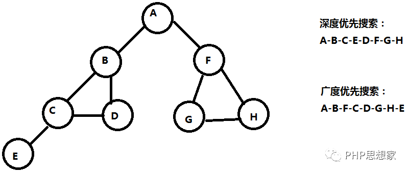
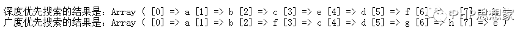

# 图的定义和遍历方式


# HP数据结构（九） ——图的定义、存储与两种方式遍历

[用户1327360](https://cloud.tencent.com/developer/user/1327360)

**PHP数据结构（九）**——图的定义、存储与两种方式遍历

**（原创内容，转载请注明来源，谢谢）**

### 一、定义和术语

​         1、不同于线性结构和树，图是任意两个元素之间都可以有关联的数据结构。

​         **2、顶点：数据元素；弧：顶点A至顶点B的连线，弧是单向的，出发的点称为弧尾，抵达的点称为弧头；边：顶点A和B之间的连线，没有方向性。**

​         3、**有向图：由顶点和弧组成的图；无向图：由顶点和边组成的图。**

​        <font color=red> **4、完全有向图：n个顶点有n(n-1)个弧；完全无向图：n个顶点有n(n-1)/2个边。** An2  Cn2;</font>

​         **5、稀疏图：边或弧很少的图（e<nlogn），反之为稠密图。**

​         **6、权：弧或边带有的系数；网：带权的图。**

​         7、子图：图的边和顶点都被含于另一个图，则该图是另一个图的子图。

​         8、无向图的邻接点：两个顶点A、B和其连接的边x都属于某个图，则称这两个点A、B互为邻接点，连接的边x依附于这两个邻接点，A、B与x相关联。

​         9、有向图的邻接点：两个顶点A、B和弧x=A->B都属于某个图，则称这两个点A邻接到B，B邻接自A， A、B与x相关联。

​         10、无向图的度：与顶点V相关联的边的数目称为V的度，记作TD(V)。

​         11、有向图的度：顶点V作为弧尾的弧的数目称为出度，记作OD(V)；顶点V作为弧头的弧的数目称为入度，记作ID(V)。


​         12**、路径是指从顶点A经过若干边或弧抵达顶点B，经过的边或弧的数目称为路径的长度，起止点相同的路径称为回路或环。顶点不重复的路径称为简单路径，起止点以外不重复的路径称为简单回路或简单环。**

​         13、**无向图与连通：两个顶点之间有路径，称为两个顶点连通；任意两个顶点连通，称为整个图为连通图；无向图的极大连通子图称为连通分量。**

​         14、有向图与强连通：每一对(v,v’)(v不等于v’)都有路径，称为强连通图。有向图的极大连通子图称为强连通分量。

​         15、生成树含义：生成树是连通图的极小连通子图，包含图的全部顶点，但是只有n-1条边。

​         16、有向树含义：有向图中，恰有一个顶点入度为0，其余顶点入度为1。

​         17、生成森林：若干个数，含有图的全部顶点，但是只有足以构成若干不相交的树的弧。

### 二、存储结构

 图通常没有顺序存储结构，但是可以借助数组（通常是二维数组）进行存储。因此，图的存储结构有：数组表示法、邻接表、邻接多重表、十字链表等。

1、数组表示法

 **从0开始，给每个顶点一个下标，用二位数组arr[i][j]（i、j属于顶点）表示顶点i和顶点j的连通情况。连通时arr[i][j]=1（如果是带权的，则连通时arr[i][j]=wij，即ij连接线的权值），不连通时arr[i][j]=0。**

 **对于无向图，数组表示法表示的图是一个对称矩阵，可以仅存半个矩阵节约空间。**45r

2、邻接表

<font color=red> **邻接表采用链表结构，每条边或弧有三个存储空间，分别表示第一个节点、边的权值、下一个节点的位置。因此，对于有向图，邻接表是出度表。如果需要入度表，则称作逆邻接表。**</font>

 有向图和无向图邻接表示例图如下：





3、十字链表

 十字链表是针对有向图的一种存储方式，其结合了有向图的邻接表和逆邻接表，在邻接表的基础上，加一个字段，用于存储以此节点作为弧头的位置。则每个节点都可以追溯到其下一个节点，也可以找回其前一个节点。

4、邻接多重表

 邻接多重表是针对无向图的一种存储方式。使用此存储方式，主要是改进无向图邻接表存储时的一个缺点——改动其中任一内容，需要同时改动对应的另一个内容，因为在无向图中边ab和ba是一样的，改动ab的内容，要同步改动ba的内容。邻接多重表，即对于一条边，仅用一个存储结构进行存储，不区分ab或者ba的方式。


### 三、图的遍历的定义：

1、概念


​         **1）图的遍历，表示从图的某一个顶点出发，访问每个节点有且仅有一次。**

​         **2）为了避免重复反问，需要记录已经访问过的节点。**

​         **3）有两种方式进行遍历，深度优先搜索和广度优先搜索。**


2、深度优先搜索

 **深度优先搜索，运用到栈的概念，当多个点和一个点成线时，先遍历一个节点，并优先遍历其子节点，直至确认没有子节点，才遍历点的下一个节点。**

3、广度优先搜索

 **广度优先搜索，运用到队列的概念，遍历一个点时，先遍历其每一个节点，再按照第一次遍历的顺序，遍历每个节点的子节点。**

4、范例

 如下图所示。



PHP代码执行结果如下：



代码核心步骤：

1、根据指定的输入方式，把各节点的关系生成图。

2、深度优先算法：采用栈（后进先出LIFO）的思想，遍历节点时，被遍历的节点出栈，再遍历其子节点，将子节点逐一进栈。需要注意的是，<font color=red>**为了防止重复遍历，被遍历过的节点以及已经进栈的节点，需要用一个数组存着，避免再次进站。**</font>

3、广度优先算法：采用队列（先进先出FIFO）的思想，遍历节点时，被遍历的节点出队列，再遍历其子节点。关键要点和深度优先算法类似。


PHP源码如下：

```php
<?php
//实现连通图的深度、广度优先搜索
//注意这里图是多对多；
class Node{
         public $val = null;
         public $arrNext = array();//存储下一个节点位置的数组
    
         public function __construct($val = null){
                   $this->val= $val;
         }
}

class Graph{
         //建立连通图，nodes =array('val1'=>array('val2','val3'..),'val2'=>array(...));
         //返回第一个节点，由于是连通图，可以根据第一个节点遍历整个图
         public function generate(array $nodes){
                   $arrNodes= array_keys($nodes);
                   $resNodes= array();
                   foreach($arrNodesas $nodeVal){
                            $resNodes[$nodeVal]= new Node($nodeVal);
                   }
                   foreach($nodesas $key => $val){
                            foreach($valas $node){
                                     if(isset($resNodes[$node]) &&is_object($resNodes[$node])){
                                               $resNodes[$key]->arrNext[]= $resNodes[$node];
                                     }
                            }
                   }
                   return current($resNodes);
         }
    
         //深度优先搜索
         public function searchByDeep(Node $node){
                   $resultWord= array();//存放遍历结果
                   $nodeStack= array();//存放遍历过程中的中间结果
                   $wordStack= array();//**存放当前已经进栈的节点，防止重复进栈**
             
                   array_push($nodeStack,$node);
                   array_push($wordStack,$node->val);
                   while(!empty($nodeStack)){
                            $curNode= array_pop($nodeStack);
                            array_push($resultWord,$curNode->val);//节点进栈
                            $arrNext= $curNode->arrNext;
                       
                            //遍历节点的next数组，找出所有的子节点
                            for($i=count($arrNext)-1;$i>=0;$i--){
                                     $curChildNode= $arrNext[$i];
                                     //判断节点不在结果集且不在栈内，则进栈，避免重复
                                     if(!in_array($curChildNode->val,$resultWord) && !in_array($curChildNode->val, $wordStack)){
                                               array_push($nodeStack,$curChildNode);
                                               array_push($wordStack,$curChildNode->val);//标记该节点已经进栈
                                     }
                            }
                   }
                   return $resultWord;
         }
    
         //广度优先搜索
         publicfunction searchByWide(Node $node){
             $resultWord= array();//存放遍历结果
             $nodeStack= array();//存放遍历过程中的中间结果
             $wordStack= array();//**存放已经遍历过子节点的节点，防止重复遍历**
             array_push($nodeStack,$node);
             while(!empty($nodeStack)){
                      $curNode= array_shift($nodeStack);//第一个节点出栈，实现队列
                      array_push($resultWord,$curNode->val);//节点进栈
                      array_push($wordStack,$curNode->val);//即将开始遍历其子节点
                       $arrNext= $curNode->arrNext;
                       //遍历节点的next数组，找出所有的子节点
                       for($i=0;$i<count($arrNext);$i++){
                            $curChildNode= $arrNext[$i];
                             //判断节点不在结果集且不在栈内，则进栈，避免重复
                         if(!in_array($curChildNode->val,$resultWord) && !in_array($curChildNode->val, $wordStack)){
                      array_push($nodeStack,$curChildNode);
                      array_push($wordStack,$curChildNode->val);//标记该节点已经进栈
                                     }                                   
                            }                          
                   }
                   return$resultWord;
         }
}
$graph = new Graph();

$arrNode = array(
         'a'=> array('b', 'f'),
         'b'=> array('a', 'c', 'd'),
         'c'=> array('b', 'd', 'e'),
         'd'=> array('b', 'c'),
         'e'=> array('c'),
         'f'=> array('a', 'g', 'h'),
         'g'=> array('f', 'h'),
         'h'=> array('f', 'g')
);
//---生成图；
$graphTree = $graph->generate($arrNode);
//
$res = $graph->searchByDeep($graphTree);
echo '<br />深度优先搜索的结果是：';
print_r($res);
echo '<br />广度优先搜索的结果是：';
$res = $graph->searchByWide($graphTree);
print_r($res);
```