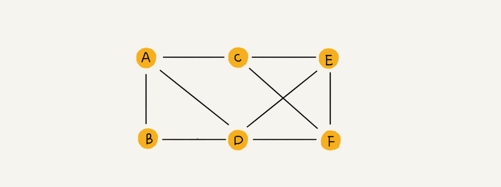
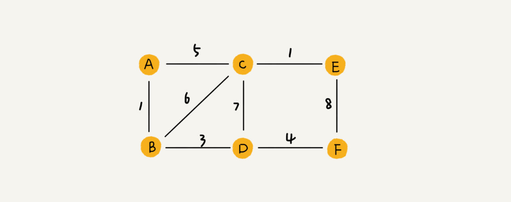
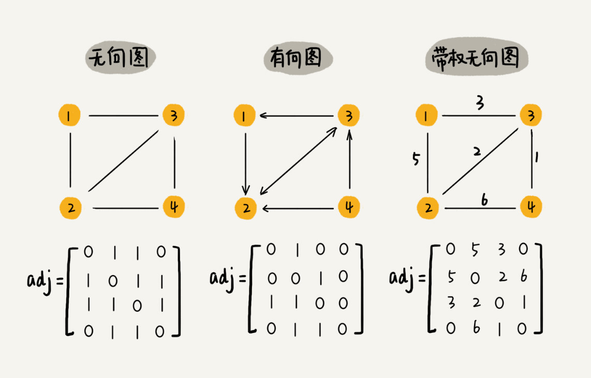
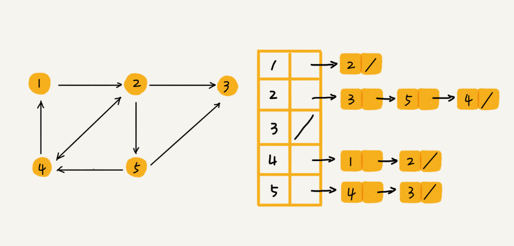
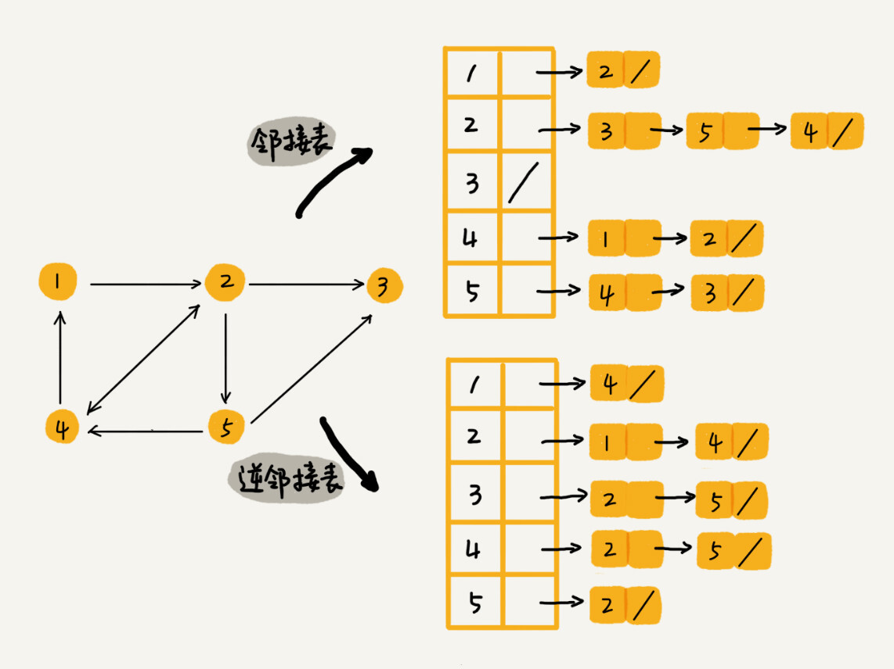

# 基础

**图的遍历：所谓遍历，即是对结点的访问。一个图有多个结点，如何遍历这些结点，有两种访问策略：**

**图的两种遍历方式：**  注意这里 树也是一种特殊的图，没有环的图；

- `深度优先遍历`(Depth First Search, 简称 [DFS](https://so.csdn.net/so/search?q=DFS&spm=1001.2101.3001.7020))
- `广度优先遍历`(Breadth First Search 简称 BFS)

## 图数据结构

>**几个概念：图的种类： 有向 无向  权重图；**
>
>####无向图  undirected graph
>
>顶点； 微信的用户；vertice
>
>边： 微信都是一个关系；edge
>
>度；微信多少个好友；
>
>#### 有向图  directed graph
>
>出度；微博该用户关注了多少人；
>
>入度；微博该用户的粉丝；
>
>####带权图； weighted graph
>
>带权图；QQ的好友度；好友度；
>
>稀疏图；比较适合用临接表；
>
>

我们知道，树中的元素我们称为节点，**图中的元素我们就叫做顶点（vertex）**。从我画的图中可以看出来，图中的一个顶点可以与任意其他顶点建立连接关系。**我们把这种建立的关系叫做边（edge）**。

haoyou

我们就拿微信举例子吧。我们可以把每个用户看作一个顶点。如果两个用户之间互加好友，那就在两者之间建立一条边。所以，整个微信的好友关系就可以用一张图来表示。**其中，每个用户有多少个好友，对应到图中，就叫做顶点的度（degree），就是跟顶点相连接的边的条数。**

实际上，微博的社交关系跟微信还有点不一样，或者说更加复杂一点。微博允许单向关注，也就是说，用户 A 关注了用户 B，但用户 B 可以不关注用户 A。那我们如何用图来表示这种单向的社交关系呢？

我们可以把刚刚讲的图结构稍微改造一下，引入边的“方向”的概念。

如果用户 A 关注了用户 B，我们就在图中画一条从 A 到 B 的带箭头的边，来表示边的方向。如果用户 A 和用户 B 互相关注了，那我们就画一条从 A 指向 B 的边，再画一条从 B 指向 A 的边。我们把这种边有方向的图叫做“有向图”。以此类推，我们把边没有方向的图就叫做“无向图”。

**我们刚刚讲过，无向图中有“度”这个概念，表示一个顶点有多少条边。在有向图中，我们把度分为入度（In-degree）和出度（Out-degree）。**

**顶点的入度，表示有多少条边指向这个顶点；顶点的出度，表示有多少条边是以这个顶点为起点指向其他顶点。对应到微博的例子，入度就表示有多少粉丝，出度就表示关注了多少人。**

QQ 中的社交关系要更复杂一点。不知道你有没有留意过 QQ 亲密度这样一个功能。QQ 不仅记录了用户之间的好友关系，还记录了两个用户之间的亲密度，如果两个用户经常往来，那亲密度就比较高；如果不经常往来，亲密度就比较低。如何在图中记录这种好友关系的亲密度呢？

**这里就要用到另一种图，带权图（weighted graph）。在带权图中，每条边都有一个权重（weight），我们可以通过这个权重来表示 QQ 好友间的亲密度。**

## 图的存储方式；

---

### 邻接矩阵存储方式  ---- 二维数组

邻接矩阵存储方法图最直观的一种存储方法就是，邻接矩阵（Adjacency Matrix）。

邻接矩阵的底层依赖一个二维数组。对于无向图来说，如果顶点 i ·与顶 点 j 之间有边，我们就将 A[i][j]和 A[j][i]标记为 1；对于有向图来说，如果顶点 i 到顶点 j 之间，有一条箭头从顶点 i 指向顶点 j 的边，那我们就将 A[i][j]标记为 1。同理，如果有一条箭头从顶点 j 指向顶点 i 的边，我们就将 A[j][i]标记为 1。对于带权图，数组中就存储相应的权重。

用邻接矩阵来表示一个图，虽然简单、直观，但是比较浪费存储空间。为什么这么说呢？

**对于无向图来说，如果 A[i][j]等于 1，那 A[j][i]也肯定等于 1。实际上，我们只需要存储一个就可以了。也就是说，无向图的二维数组中，如果我们将其用对角线划分为上下两部分，那我们只需要利用上面或者下面这样一半的空间就足够了，另外一半白白浪费掉了。**

**还有，如果我们存储的是稀疏图（Sparse Matrix），也就是说，顶点很多，但每个顶点的边并不多，那邻接矩阵的存储方法就更加浪费空间了。**比如微信有好几亿的用户，对应到图上就是好几亿的顶点。但是每个用户的好友并不会很多，一般也就三五百个而已。如果我们用邻接矩阵来存储，那绝大部分的存储空间都被浪费了。

但这也并不是说，邻接矩阵的存储方法就完全没有优点。

**首先，邻接矩阵的存储方式简单、直接，因为基于数组，所以在获取两个顶点的关系时，就非常高效。**

**其次，用邻接矩阵存储图的另外一个好处是方便计算。这是因为，用邻接矩阵的方式存储图，可以将很多图的运算转换成矩阵之间的运算。**

---

###邻接表存储方法

> 邻接表采用链表结构，每条边或弧有三个存储空间，分别表示第一个节点、边的权值、下一个节点的位置。**因此，对于有向图，邻接表是出度表。如果需要入度表，则称作逆邻接表。** 
>
>所以有向图 必须有两张表来表示，一张是出度表，一张是入度表；

###针对上面邻接矩阵比较浪费内存空间的问题，我们来看另外一种图的存储方法，邻接表（Adjacency List）。

我画了一张邻接表的图，你可以先看下。乍一看，邻接表是不是有点像散列表？

每个顶点对应一条链表，链表中存储的是与这个顶点相连接的其他顶点。另外我需要说明一下，图中画的是一个有向图的邻接表存储方式，每个顶点对应的链表里面，存储的是指向的顶点。**对于无向图来说，也是类似的，不过，每个顶点的链表中存储的，是跟这个顶点有边相连的顶点，你可以自己画下。**

有向图；

还记得我们之前讲过的时间、空间复杂度互换的设计思想吗？邻接矩阵存储起来比较浪费空间，但是使用起来比较节省时间。

**相反，邻接表存储起来比较节省空间，但是使用起来就比较耗时间。就像图中的例子，如果我们要确定，是否存在一条从顶点 2 到顶点 4 的边，那我们就要遍历顶点 2 对应的那条链表，看链表中是否存在顶点 4。而且，我们前面也讲过，链表的存储方式对缓存不友好。所以，比起邻接矩阵的存储方式，在邻接表中查询两个顶点之间的关系就没那么高效了。**

在散列表那几节里，我讲到，在基于链表法解决冲突的散列表中，如果链过长，为了提高查找效率，我们可以将链表换成其他更加高效的数据结构，比如平衡二叉查找树等。我们刚刚也讲到，邻接表长得很像散列。所以，我们也可以将邻接表同散列表一样进行“改进升级”。

我们可以将邻接表中的链表改成平衡二叉查找树。实际开发中，我们可以选择用红黑树。这样，我们就可以更加快速地查找两个顶点之间是否存在边了。当然，这里的二叉查找树可以换成其他动态数据结构，比如跳表、散列表等。除此之外，我们还可以将链表改成有序动态数组，可以通过二分查找的方法来快速定位两个顶点之间否是存在边。解答开篇

## 微博的图关系

需要两个  邻接表  来存储；

邻接表  每个用户关注了谁？？？？

逆邻接表  用户的粉丝

