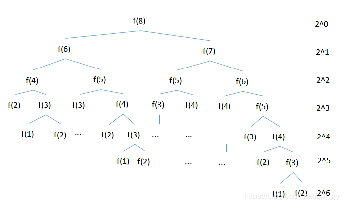

# DP 动态规划

>*动态规划*（Dynamic Programming，DP）是运筹学的一个分支，是求解决策过程最优化的过程；

---

## 理论基础 --- 状态转移

>DP数组以及下标的含义！
>
>递推公式！
>
>DP 输入如何初始化！
>
>遍历顺序！
>
>打印dp数组！


## 基础类问题


## 背包问题


## 打家劫舍


## 股票问题 

>怎么获取最打利润；


## 子序列问题


## 不同路径问题；


## 区间 dp 和概率dp --- 比较难； 过于难；


## 斐波那契数列的时间复杂度分析


1.时间复杂度 O(2^n) 空间复杂度 O(n)

```go
def fib(n):
	if(n<3):
		return 1
	return f(n-1)+f(n-2)
```

推导：时间复杂度
f(n) = f(n-1) + f(n-2) 每一层都包含一个加法操作
例如n = 8时，T(n) = 2^0 + 2^1 + 2^2 + 2^3 + 2^4 + 2^5 + 2^6 = 2^7-1
O(n) = 2^7-1 = 2^n



推导：空间复杂度

`````c
// 需要去思考一下执行顺序；
// 这里需要考虑一下执行顺序！！！  
//总结： 树的深度就是kong'jian
`````


递归算法是利用栈进行的，在例如计算 f(8)时，栈中最多同时存在f(8)-f(2）8个元素
,计算某个元素时并不知道哪个元素先入栈,为方便讲解，假设元素大的先入栈。下面计算顺序为栈中元素最多时的顺序
1.计算f(8)，f(8)进栈
2.计算f(8)时需要计算f(7)f(6)，f(7)先进栈
3.计算f(7)时需要计算f(6)f(5)，f(6)先进栈
4.计算f(6)时需要计算f(5)f(4)，f(5)先进栈
5.计算f(7)时需要计算f(6)f(5)，(4)先进栈
6.计算f(4)时需要计算f(3)f(2)，f(3)先进栈
7.计算f(3)时需要计算f(2)f(1)，f(2)先进栈，至此，栈中元素最多
8.计算f(2)时，返回1，f(2)出栈
9.根据7计算f(3)时还需要计算f(1)，f(1)进栈
10.计算f(1)时，返回1，f(1)出栈
11.得到f(3)=f(2)+f(1) = 2
12.根据4计算f(4)时还需要计算f(4)，f(4)进栈
13,计算f(4)时需要计算f(3)f(2),f(3)先入栈
…

2.时间复杂度 O(n) 空间复杂度 O(n)

`````go
def fib(n):
	tmp = np.zeros(n)
    tmp[0] = 1
    tmp[1] = 2
	for i in range(2,n):
		tmp[i] = tmp[i-1]+tmp[i-2]
	return tmp[n-1]
`````

3.时间复杂度 O(n) 空间复杂度 O(1)

`````go
def fib(n):
	a = 1
	b = 1
	c = 0
	for i in range(2,n):
		c = a + b
		a = b
		b = c 
	return c

`````
