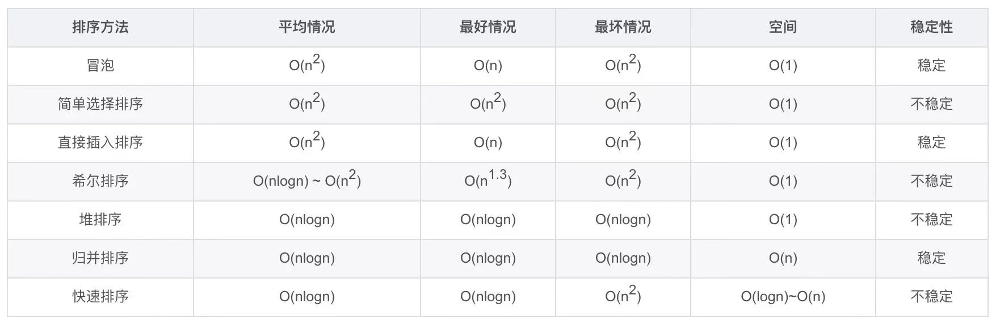
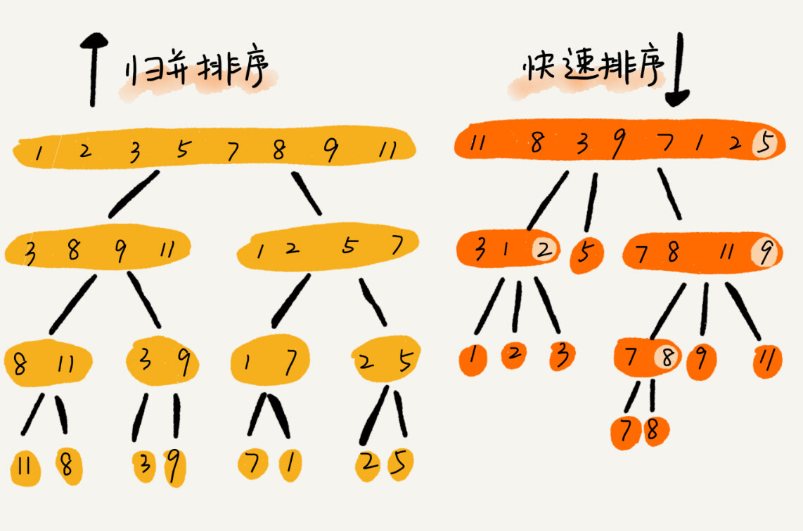
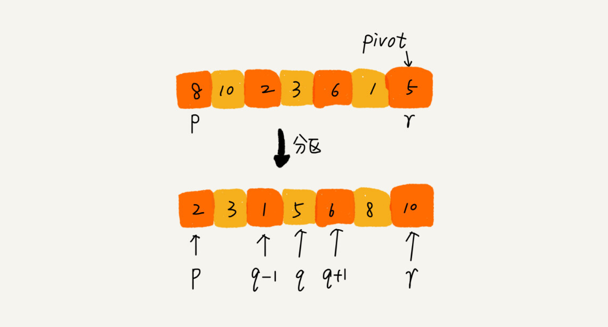
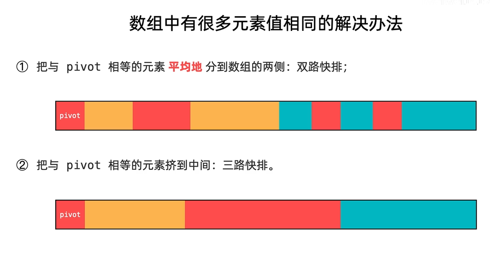

# 排序 算法

>**评测标准；**
>
>**<font color=red>平均，最好，最坏，空间，或者是稳定性；</font>**
>
>**注意： 概率：分步是相乘，分类相加；**

---


### 几种算法的优劣势； 主要由下面几点来评测:

**<font color=red>平均，最好，最坏，空间，或者是稳定性；</font>**

注意：因为是递归 所以  归并和快速排序；

<font color=red>注意 下面图片看不懂的去看递归的时间复杂度；那一章节看一下；用递归树来计算</font>


----


## 稳定性表现在哪里？？？？

**不会改变相同元素的相对顺序**

### 应用：

<font color=red>**比如先按照age年龄排序，然后按照姓名排序；  如果姓名是稳定性的，那么相同的姓名，那么age也是有序的；**</font>

-----

##排序的分类

>时间复杂度：比较和交换的次数；


---

## 几种算法的性能比较；

交换实现的排序；




---

不是交换实现的排序

桶排序和基数排序；

----


快排可以是原地排序，空间是O(1)

快排缺点：

* 不稳定，并不是稳定的；
*  时间复杂度不稳定？  有可能会变成一个n的树高；所以；不过概率比较下；因为每次都取最后一个值作为分区点，而且没法分为左右两个区，那么就会导致一个树为n的书高，那么时间复杂度就贬称n^2;

----

### 快排最坏时间复杂度是n^2的原因？

这个答案还得看枢轴（pivot）的选择策略。在[快速排序](https://so.csdn.net/so/search?q=快速排序&spm=1001.2101.3001.7020)的早期版本中呢，最左面或者是最右面的那个元素被选为枢轴，那最坏的情况就会在下面的情况下发生啦：

1）[数组](https://so.csdn.net/so/search?q=数组&spm=1001.2101.3001.7020)已经是正序（same order）排过序的。
2）数组已经是倒序排过序的。
3）所有的元素都相同（1、2的特殊情况）

因为这些案例在用例中十分常见，所以这个问题可以通过要么选择一个随机的枢轴，或者选择一个分区中间的下标作为枢轴，或者（特别是对于相比更长的分区）选择分区的第一个、中间、最后一个元素的中值作为枢轴。有了这些修改，那快排的最差的情况就不那么容易出现了，但是如果输入的数组最大（或者最小元素）被选为枢轴，那最坏的情况就又来了

----


归并的优点： 

* 然后就是时间复杂度是稳定的 就是nlogn；
* 稳定排序；相同的元素，排序之后相对位置不发生改变；

缺点： merge 操作需要 辅助数组，所以空间复杂度比较高；


----

## 堆排序 

>堆排序其实是一种特殊的选择排序，选择出最大的值和最后一个数值做交换，然后做一下向下的堆化；

因为选择排序，选出最大值或者最小值的时间复杂度是n，但是堆做堆化的时间复杂度是logn；所以一个时间复杂度是n^2  一个是nlogn；

* 时间复杂度稳定nlogn

* 原地排序；// 

* 不稳定  // 

  空间时间复杂度: 不需要额外的内存空间所以时间复杂度是O(1)//

> 整个排序过程，包括初建堆、交换顶底元素、重建堆，未用到其他多余的空间，主要进行比较与交换工作，所以空间复杂度是O(1)

---

## 快排和归并 的重点

>快排是一种，前序遍历；
>
>归并是一种后序遍历；因为需要merge； 所以也就是需要合并；

<font color=red>快排：**快排的pivot分区点 就是最后一个元素；分区算法，是怎么分区的partition** </font>

归并排序：



---


### 归并算法

#### 递归 

````php
/**
 * 归并
 * nlogn
 * nlongn 归并 排序；
 * 递归 
 */
//

class MergeSort
{

    public function mergeSortRecursion($arr, $l, $r) {
        $len = count($arr);
        if ($len == 0 || $len == 1)  return $arr; // 排序已经完成 ；
        return $this->process($arr,$l,$r);
    }

    //处理逻辑过程；//划分的过程 需要logn的时间复杂度 肯定是很稳定的；
    public function process($arr, $l, $r) {
        //终止条件
        if ($l >= $r) return [$arr[$l]]; //一个数值；这里一定要是数组；
        // mid
        $mid = $l + (($r - $l) >> 1);//mid wocao nima le ;;; z这里写法一定要加括号 为运算；

        //递归 分而治之  分成两部分；
        $left = $this->process($arr, $l, $mid);
        $right = $this->process($arr, $mid + 1, $r);

        // 合并的时候 才会进行排序；
        return $this->merge($left,$right);  // 肯定要全部遍历啊完，需要n的时间复杂度
    }

    /**
     * @param $left
     * @param $righ
     * 合并的过程很重要；
     * n时间复杂度；
     */
    public function merge($left, $right) {
//        $max = count($arr);

        $maxl = count($left) - 1;
        $maxr = count($right) - 1;
        $max = $maxl + $maxr + 2; //  g跟下面的$i<$max 的条件有关；

        $helper = [];
        $i = 0; // 数组的指针 php 自动累加  但是为了限制$helper 的大小，不然就会一直循环的问题；

        $p1 = 0;
        $p2 = 0;

        //没有越界 指针p1 和指针p2 没有越界
        while ($p1 <= $maxl && $p2 <= $maxr) {
            // 这边来保证稳定性；
            $helper[$i++] = $left[$p1] < $right[$p2] ? $left[$p1++] : $right[$p2++];
        }
        
        // 越界处理了  p1  越界 就是组编处理完了  之后只需要处理 右边就好了
        while ($p1 > $maxl && $i < $max) {
            $helper[$i++] = $right[$p2++];
        }
        // 右边处理完了 然后处理左边的逻辑;
        while ($p2 > $maxr &&  $i < $max) {
            $helper[$i++] = $left[$p1++];
        }
        // return
        return $helper;
    }
}

$arr1 = [1, 2, 3, 4, 5];
$r = count($arr1) - 1;
$obj = new MergeSort();
var_dump($obj->mergeSortRecursion($arr1, 0, $r));die;


/**
 * Class MergeSort
 * 归并排序
 * 时间复杂度也是nlogn
 * 空间复杂度是n
 * 肯定是稳定的；
 */
class MergeSort
{
    public function main($arr,$len) {
        return $this->process($arr,0,$len - 1);
    }

    public function process($arr,$l,$r) {
        if ($l >= $r) return [$arr[$l]];
        // 返回一个数组才可以合并
        // 
        $p = $l + (($r - $l) >> 1);
        //  归并// 
        $larr = $this->process($arr,$l,$p);
        $rarr = $this->process($arr,$p+1,$r);
        return $this->merge($larr,$rarr);
    }

    /**
     * @param $arr
     * 有序数组的合并
     */
    public function merge($larr,$rarr) {
        $rmax = count($rarr);
        $lmax = count($larr);
        // 辅助函数
        $helper = [];
        //双指针
        $p0 = 0; // left
        $p1 = 0; //right
        //helper index
        $i = 0;
        // ？？？ 这个很重要呀；
        $helperMax = $lmax + $rmax;
        //
        while($p0 < $lmax && $p1 < $rmax) {
             // 关于稳定性；这里是关键，当相等的时候先放左数组的元素然后再放右数组的元素；
            // 等于也是先放左边的；d等于的时候也是先放左边的；
            // 选最小的；等于的时候 也要先放左边的 就可以保证稳定性；
            $helper[$i] = $larr[$p0] >= $rarr[$p1] ? $rarr[$p1++] : $larr[$p0++];
            $i++;
        }
		// left 没了 然后就要添加右边数组的内容；
        while($p0 >= $lmax && $i < $helperMax) {
            $helper[$i] = $rarr[$p1];
            $i++;
            $p1++;
        }

        while($p1 >= $rmax && $i < $helperMax) {
            $helper[$i] = $larr[$p0];
            $i++;
            $p0++;
        }
       return $helper;
    }
}

$mergeObj = new MergeSort();

var_dump($mergeObj->main($arr,$len));die;
//
//$arr1 = [2,3,5];
//$arr2 = [1,4,6,];
//var_dump($mergeObj->merge($arr1,$arr2));die;


````


#### 非递归

```php
#待后更新；
```


### 快排算法

>---
>
>
>
>时间复杂度：基于随机选取主元的快速排序时间复杂度为期望 O(nlogn)，其中 n 为数组的长度。
>
>空间复杂度：O(h)，其中 h 为快速排序递归调用的层数。我们需要额外的 O(h) 的递归调用的栈空间，由于划分的结果不同导致了快速排序递归调用的层数也会不同，最坏情况下需 O(n) 的空间，最优情况下每次都平衡，此时整个递归树高度为 logn，空间复杂度为 
>O(logn)。
>
>空间调用栈层数 * 每层使用的空间 ==  就是空间复杂度；
>
>----
>
>

//快排算法  非递归；

快排的思想是这样的：如果要排序数组中下标从 p 到 r 之间的一组数据，我们选择 p 到 r 之间的任意一个数据作为 pivot（分区点）。

我们遍历 p 到 r 之间的数据，将小于 pivot 的放到左边，将大于 pivot 的放到右边，将 pivot 放到中间。经过这一步骤之后，数组 p 到 r 之间的数据就被分成了三个部分，前面 p 到 q-1 之间都是小于 pivot 的，中间是 pivot，后面的 q+1 到 r 之间是大于 pivot 的。



根据分治、递归的处理思想，我们可以用递归排序下标从 p 到 q-1 之间的数据和下标从 q+1 到 r 之间的数据，直到区间缩小为 1，就说明所有的数据都有序了。


### 快速排序的重点就是拿到分区点 pivot  

````php

## 伪代码
// code

// 快速排序，A是数组，n表示数组的大小
quick_sort(A, n) {
  quick_sort_c(A, 0, n-1)
}
// 快速排序递归函数，p,r为下标
quick_sort_c(A, p, r) {
  if p >= r then return
  
  q = partition(A, p, r) // 获取分区点
  quick_sort_c(A, p, q-1)
  quick_sort_c(A, q+1, r)
}

//code end
/**
 * 快速排序 quickSort
 * 时间复杂度是nlogn
 * 空间复杂度是 原地排序
 * 稳定性肯定是不稳定的；
 *  
 * 因为是原地操作 所以需要使用 & 可以直接操作就行了；
 */
class QuickSort
{
    public function main(&$arr,$len) {
        // 
        $this->process($arr,0,$len - 1);
    }

    public function process(&$arr,$l,$r) {
        // 不需要 直接不需要做排序；
        if ($l >= $r) return null;
        // 不重复的话  每次都会确定一个元素； //  重复会确定所有的等于divide的元素；
        $p = $this->partition($arr,$l,$r);//获取分区点 pivot 获取分区点；
        $this->process($arr,$l,$p[0]);
        $this->process($arr,$p[1],$r);
    }
    //
    public function partition(&$arr,$l,$r) {
        $divide = $r;//分区点
        // 双指针；
        $lessR = $l - 1; //  $l -1  代表左边界 数组元素为0；
        
        $moreL = $divide;  // 分区点； 默认是最后一个元素；

        $index = $l;//index
		//$moreL 是大于 分区值的最小左边的值；
        while ($index < $moreL) {
            // 数组一般用交换；不要用删除；删除时间复杂度太高了！！！ 注意呀；
            if ($arr[$index] < $arr[$divide]) {
                swap($arr[$index],$arr[$lessR + 1]);
                $index++;
                $lessR++;
            } else if ($arr[$index] > $arr[$divide]) {
                swap($arr[$index],$arr[$moreL - 1]);
                $moreL--;
            } else {
                $index++;
            }
        }
        // 因为swap之后，moreL++ 增多了；
        swap($arr[$divide],$arr[$moreL]);
        $moreL++;

        //划分的分区  就是lessR  and moreLd的位置；
        //  分别是代表大于
        return [$lessR ,$moreL];
    }

}
$len = count($arr);
$quciksortobj = new QuickSort();
// 2 5 也是准确的；
//var_dump($quciksortobj->partition($arr,0,$len - 1));die;

$quciksortobj->main($arr,$len);
var_dump($arr);die;

/**
 * @param $a
 * @param $b
 * swap
 */

function swap(&$a,&$b) {
    list($a,$b) = array($b,$a);
}


$arr = [4,5,6,77,6,4,3,4,33,4];
//var_dump(splitNum($arr));die;
//var_dump(splitMoreNum($arr));die;
// 排序 直接操作的是数组，所以不需要返回； 所以返回是null；
quickSort($arr);
var_dump($arr);die;

//我举一个比较极端的例子。如果数组中的数据原来已经是有序的了，比如 1，3，5，6，8。如果我们每次选择最后一个元素作为 pivot，那每次分区得到的两个区间都是不均等的。我们需要进行大约 n 次分区操作，才能完成快排的整个过程。每次分区我们平均要扫描大约 n/2 个元素，这种情况下，快排的时间复杂度就从 O(nlogn) 退化成了 O(n^2)。
````


注意：上面的快排有很大的问题；因为并不是随机分区点是选择的是最后一位来做分区点所以当是  321  逆序排序使用最后一个元素当分区点，或者123 正序排列，把第一个元素当成分区点；时间复杂度会回退到O(n^2); 

**<font color=red>就是数组越有序，排序效果越差；</font>**


快速排序理想中的样子是区间中的元素越随机越好；

``````php
#快排的优化；
// 
partition //部分
//  pivot 的分区的优化；
    
class Solution1 {

    /**
     * @param Integer[] $nums
     * @return Integer[]
     * // 快排问题
     * 随机分区点 ；
     * 重复元素的排序；
     */

    function sortArray($nums) {
        $l = 0;
        $r = count($nums) - 1;
        $this->process($nums, $l, $r);
        return $nums;
    }

    function process(&$nums, $l, $r) {
        // end condition
        if ($l >= $r) return null;// 当只有一个元素的时候 结束递归；
        $p = $this->partition($nums, $l, $r);
        $this->process($nums, $l, $p[0]);
        $this->process($nums, $p[1], $r);
    }

    // 三路快排
    // 主要是分为三部分 大于 分区点小于分区点和等于分区点 三个部分；
    function partition(&$nums, $l, $r) {
        // 先不随机 先选择最后一个元素作为分区点
        // 这边会有问题，当数组是逆序或者是顺序的再排序的时候时间复杂度会很高，达到了O(n^2)的时间复杂度；
        $randomkey = rand($l, $r);
        // 和最后一个做交换；
        $this->swap($nums[$randomkey], $nums[$r]);
        // 然后还是用最后一个元素来做分区点 但是已经是随机分区点了；
        $pivot = $r;
        //
        $moreL = $r;
        $lessR = $l - 1;
        //索引 从 $l  开始
        $index = $l;

        while ($index < $moreL) {
            if ($nums[$index] > $nums[$pivot]) {
                //大于 放在后面
                $this->swap($nums[$moreL - 1], $nums[$index]);
                $moreL--;
            } else if ($nums[$index] < $nums[$pivot]) {
                $this->swap($nums[$index], $nums[$lessR + 1]);
                $index++;
                $lessR++;
            } else {
                $index++;
            }
        }


        //分区点要移动到等于他的位置
        $this->swap($nums[$moreL], $nums[$pivot]);
        $moreL++;
        //
        return [$lessR, $moreL];
    }

    function swap(&$val, &$val1) {
        [$val, $val1] = array($val1, $val);
    }
}
$arr1 = [5,2,3,1];
$obj1 = new Solution1();
var_dump($obj1->sortArray($arr1));di
``````


**下面 会存在一个特殊情况，也就是数组中有很多相同元素值的解决方案！**  --- 我们使用的就是三路快排；




----


## 冒泡 

> 本质也是比较；
>
> **第一次遍历就是把最大的元素移动到最后就行了**
>
> **然后遍历数组个数次就可以完成排序；**
>
> 当有序的时候 时间复杂度是O(1) // 因为加入了 flag 来进行判断；


``````php
# 冒泡
$a11 = 1;
$b22 = 2;
function swap(&$a,&$b){
    [$a,$b] = array($b,$a);
}

//success
//swap($a11,$b22);
//echo $a11,$b22;
//die;
/**
 * @param $arr
 *  把最大的值移动到最后  一个个的冒泡
 * 	有序的时间复杂度是O（n） 无序的时间复杂度是o(n^2)
 * 	空间复杂度是O(1)  原地排序
 *  稳定性是稳定的；
 */

function bubble($arr){
    $len = count($arr);// $len - 1
    if ($len <= 1) return $arr;
    //i  //$i = 0  就是一个元素是排序完成；
    $flag = false;// 本身是有序的
    for ($i = 0; $i < $len; $i++) {
        //j  比较 compare  其中 $i 是有序的;    == 等于不换位置 那么就是稳定的；
        //但是 j + 1   所以 不能越界 所以 $j 最大只能是$len - 1  - $i  (有序)
        // 保证j+1 不能越界 所以这里是$j+1 < $len - $i ; $i代表的是已经有序的；不需要检查的；
        // $i 代表本身就有序的；
        for ($j = 0; $j < $len - $i - 1; $j++) {
            //这里要保证稳定性；
            if ($arr[$j + 1] < $arr[$j]) {
                swap($arr[$j + 1], $arr[$j]);
                $flag = true;
            }
        }
        if (!$flag) break;
    }
    return $arr;
}


$arrarr =  [1,21,8,44,5,6,6,7,7,7,7];
var_dump(bubble($arrarr));die;


//method 2两种写法都是可以的！！！
//

    function sortArray($nums) {
        // $l = 0;
        // $r = count($nums) - 1;
        // return $this->process($nums, $l, $r);
        return $this->bubble($nums);

    }
    function swap(&$index1, &$index2) {
        [$index1,$index2] = array($index2,$index1);
    }
    function bubble($nums) {
        $n = count($nums);
        if ($n <= 1) return $nums;
        $flag = false;
        // 这些循环条件本身就是为了防止溢出的！！！ 
        // for ($i = 0; $i < $n; $i++) {
        //     for ($j = 0; $j < $n -1 -$i; $j++) {
        //         if ($nums[$j+1] < $nums[$j]) {
        //             $this->swap($nums[$j+1], $nums[$j]);
        //             $flag = true;
        //         }
        //     }
        //     //本身是有序的；
        //     if (!$flag) break;
        // }
        // method 2
        for ($i = 0; $i < $n; $i++) {
            for ($j = 1; $j < $n - $i; $j++) {
                if ($nums[$j - 1] > $nums[$j]) {
                    $this->swap($nums[$j - 1], $nums[$j]);
                }
            }
        }
        return $nums;
    }
//优化： 就是没有比较的时候，表示数组已经是有序的，程序终止！
``````


## 插入 排序

>打扑克牌；的方式来进行排序；  
>
><font color=red>**基本思想：就是把一个数，插入一个有序数组中；**</font>
>
>这个还是比较重要的，也是一个动态的逻辑排序；
>
>**数组越有序，那么排序效果越好；**
>
>缩小增量排序
>
>希尔排序(Shell's Sort)是插入排序的一种又称“缩小增量排序”（Diminishing Increment Sort），是直接插入排序算法的一种更高效的改进版本

`````php
#直接插入排序
/**
 * insertSort
 * 插入排序
 * 时间复杂度是O(n^2);  当有序的时的时间复杂度是O(n) 
 *  当有序的时间 时间复杂度是O(N)
 * 原地排序
 * 稳定性比较强；
 */

function insertSort($arr) {
    $len = count($arr);
    if ($len <= 1) return $arr;
    for ($i = 1; $i < $len; $i++) {
        $val = $arr[$i];
        //要插入的位置
        // 顺序找到插入的位置；
        $j = $i - 1;
        // 移动大于未排序的值；
        for (; $j >= 0; $j--) {
            if ($arr[$j] > $val) {
                // 移动数据  // 这里是w
                $arr[$j + 1] = $arr[$j];
            } else {
                //直接跳出循环
                break;
            }
        }
        //插入
        $arr[$j + 1] = $val;
    }

    return $arr;
}

//var_dump(insertSort($arr));die;


----
## 二分法


`````

----

## 希尔排序

>插入排序的一种优化；！！

----


## 选择排序

>leetcode -- 912 排序数值；可以作为测试！
>
>超时代表算法是正确的！！！
>
>选择排序的时间复杂度：
>
>

````php
/**
 * 选择排序
 * 求出最小的数值 将其放在已经排序的末尾；
 * 
 */
function selectSort($arr) {
    $len = count($arr);
    if ($len <= 1) return $arr;
    
    for ($i = 0; $i < $len; $i++) {
        //$i 需要排序下标数组
        // 未排序的最小值 //假设这是最小的；
        $min = $i;// 假设这边是最小的！！！
        $j = $i + 1;
        for (; $j < $len; $j++) {
            if ($arr[$j] < $arr[$min]) {
                // 只有遍历完才能找到最小的； 记录 最下值得索引就可以了；
                $min = $j;
            }
        }
        
        $tmp = $arr[$i];
        $arr[$i] = $arr[$min];
        $arr[$min] = $tmp;

    }
    return $arr;
}

//var_dump(selectSort($arr));die;
## 时间复杂度求解：
# 假设数据为N
#那么时间复杂度是O(N-1)+O(N-2) + (N-3)...(1)  ====> （1+N-1）*（N-1）/2   等差数列  === 首项加末项 乘以项数 除以2； 所以是N^2的时间复杂度！！！

````


### 交换排序的特点


---


## 


----

## 数组的随机访问特性


**这也是从0开始的原因！！**

数组 随机访问；删除和添加元素时间复杂度O(N);

链表 顺序访问；删除和添加元素时间复杂度O(1);
