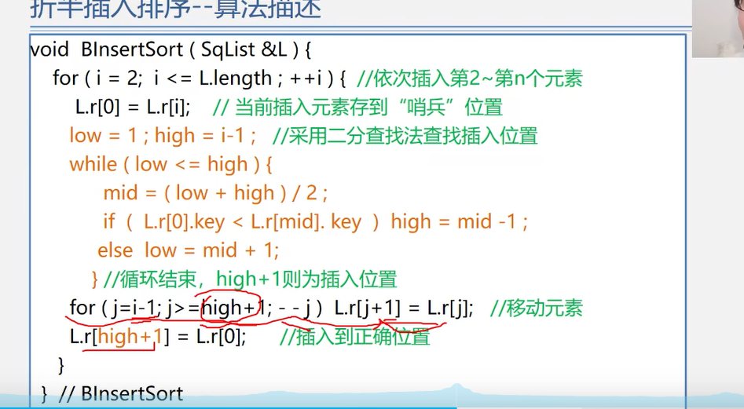

# sort 排序算法 

>主要是分析，插入排序；选择排序，和基数排序；

---

## 插入排序

>根据怎么去寻找插入位置，分为三种方法：
>
>1. 顺序法，挨个查找，遍历，这个是直接插入；
>2. 二分法，用二分法，来寻找插入位置；二分插入排序；
>3. 缩小增量，多遍插入排序；希尔排序；
>
>特性：
>
>1.  稳定排序；
>2. 时间复杂度是O(n^2) ; 当已经是有序的时候会变成O(n)
>3. 空间复杂度是 原地排序；O(1)

---

### 直接插入排序；


````php
/**
 * 插入排序
 * 类似于 打扑克牌 摸牌的时候 一张张的给排序
 * 首先a[0] 肯定是有序的  然后依次a[1] 开始进行插入排序， 到底是在a[0]的左边还是右边；
 * 数组的交换；多注意一下把；
 * 关键是寻找插入位置，分为很多类型的插入排序，主要是分为直接插入排序，二分插入排序和希尔插入排序；
 * 希尔排序 就是缩小增量，多遍插入排序；
 */

/**
 * 直接插入排序；
 * 时间复杂度是 O(n^2)
 * 空间复杂度 原地排序
 * 稳定的，相等的时候插入到后面就行了；
 * direct
 * 查找 ，可以从后往前找，大于的就往后移位，当小于等于的就插入就行了；
 * 当有序的时候，
 * 向后移动元素这里其实就是覆盖；会简单一些；
 * 先找到 需要插入的位置，然后插入；
 */

// 时间复杂度的计算；
// 查找元素位置的过程，其实就是一个比较；
// 移动的位置； 也就是数据搬迁的位置；
function directinsertSort($nums) {
    $n = count($nums);
    //从1开始
    for ($i = 1; $i < $n; $i++) {
        //  要插入的数据
        $tmp = $nums[$i];
        //和有序的比较
        //[$i , ($n - 1)]是无序的，[0 , $i]是有序的；
        //寻找位置
        // 位置就是$j + 1;
        for ($j = $i - 1; $j >= 0; $j--) {
            if ($nums[$j] > $tmp) {
                // 移动数据 向后移动数据 ，就是覆盖后面的元素；
                // 覆盖掉；后面的元素；
                $nums[$j + 1] = $nums[$j];
            } else {
                //直接放在排序的后面；
                break;
            }
        }
        // 插入数据
        // break  跳出 寻找到位置，位置就是$j + 1,
        $nums[$j + 1] = $tmp;
    }
    return $nums;
}
// 直接排序
var_dump(directinsertSort($arr3));die;

// 优化  
function directinsertSort1($nums) {
    $n = count($nums);
    //从1开始
    for ($i = 1; $i < $n; $i++) {
        //  要插入的数据
        $tmp = $nums[$i];
        //和有序的比较
        //[$i , ($n - 1)]是无序的，[0 , $i]是有序的；
        //寻找位置
        // 位置就是$j + 1;
        // 只有 $j >= 0 &  $tmp < $nums[$j]; $j--  
        // 条件语句的优化； 不满足条件那个break 可以直接省略；
        // 这里比较了两次，所以时间复杂度相对来说大一些；
        for ($j = $i - 1; $j >= 0 & $tmp < $nums[$j]; $j--) {
                // 移动数据 向后移动数据 ，就是覆盖后面的元素；
                // 覆盖掉；后面的元素；
                $nums[$j + 1] = $nums[$j];
        }
        // 插入数据
        // break  跳出 寻找到位置，位置就是$j + 1,
        $nums[$j + 1] = $tmp;
    }
    return $nums;
}
var_dump(directinsertSort1($arr3));die;


###上面做了两次 比较，所以下面要做优化；哨兵的优化；
// 减少比较次数的哨兵模式
// 哨兵模式减少了一次比较次数
function sentryInsertSort($nums) {
    $n = count($nums);
    for ($i = 2; $i < $n; $i++) {
        //只有大于来回执行下面的元素
        // 等于 也是直接进行下一个元素的插入；
        if ($nums[$i - 1] > $nums[$i]) {
            //sentry guard ??? 哨兵
            $nums[0] = $nums[$i];
            for ($j = $i - 1; $nums[$j] > $nums[0]; $j--) {
                $nums[$j + 1] = $nums[$j];
            }
            $nums[$j + 1] = $nums[0];
        }
    }
    return $nums;
}
var_dump(sentryInsertSort($arr3));die;


## 时间复杂度来求解： 主要分为两部分的时间复杂度：
## 最坏情况-- 逆序： 时间复杂度是O(n^2)
## 1. 比较：  O(n^2)
## 2. 移动：  O(n^2)
## 最好的情况-- 顺序； 时间复杂度是O(n)
## 1. 比较 ： O(n)
## 2. 移动 ： 0 ; 
````


比较次数的优化； 不需要有\$j >=0的比较；因为肯定会存在；哨兵放在0位置，注意当你传的数据格式也要从 1开始，才会进行排序，

0的位置仅仅是哨兵；


`````php
### 仅仅是优化了，比较次数，减少了比较次数；移动次数没有发生改变；
#二分查询 要插入的数据位置，然后插入；

##  注意二分查询的开闭区间的计算；

// 二分法的插入排序
// 因为是本身是有序的，再一个是提高了查询位置的效率；
//
function sentrybinaryInsertSort($nums) {
    $n = count($nums);
    for ($i = 2; $i < $n; $i++) {
        $nums[0]  = $nums[$i];
        //这个是遍历的方式
//        for ($j = $i - 1; $nums[$j] > $nums[0]; $j--) {
//
//        }
        $l = 1;
        $r = $i - 1;
        while ($l <= $r) {
            $mid = $l + (($r - $l) >>1);
            //  保证稳定性，相等的收也要往右边去找；插在最后面；
            if ($nums[$mid] <= $nums[0]) {
                // 去右边找；
                //注意等于的时候 也要去往右边去找
                $l = $mid + 1;
            } else {
                $r = $mid - 1;
            }
        }
        //上面找完位置  然后下面是移动  位置
        // 需要插入的位置是 $r + 1
        //向后移动位置
        for ($j = $i - 1; $j >= $r + 1; $j--)  $nums[$j + 1] = $nums[$j];
        //插入数据
        $nums[$r + 1] = $nums[0];
    }
    return $nums;
}
var_dump(sentrybinaryInsertSort($arr3));die;

#### 和下面比较一下
/**
 *  数组 元素 会有重复部分
 *  找到有序数组，满足  >=value 值最左边的位置; 返回的是位置；至少是什么值？？
 *  大于等于3的最左边；
 */
//左边界的问题；
$arr1 = [1,2,3,3,3,3,4,5,5];
function repeatminvalue($arr,$value){
    $len = count($arr);
    if ($len == 0) return false;

    $l = 0;
    $r = $len - 1;

    while ($r >= $l) {
        $mid = $l + (($r - $l) >> 1);
        
        if ($arr[$mid] >= $value){ //  比value 还小那么应该去左区间去找；注意要满足 >= value的值；左边还有更大的应该左边去找；		//向左边走，取找最小的；
            $r = $mid - 1;
            $index = $mid; // 已经记录了整个mid的值，就没必要去搜索了；
        } else {
            $l = $mid + 1;
        }
    }
    return $index;
}
//var_dump(repeatminvalue($arr1,3));die;
`````

 

	


----

### 二分插入排序；