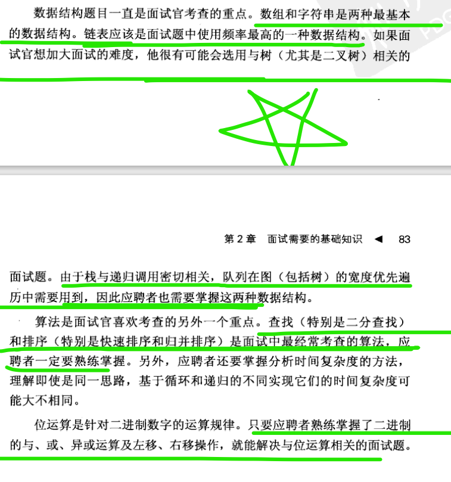

#alg

思路问题：


复杂的问题都是找**重复性**的问题；电脑太傻了，只会做这些重复性的东西；

优化的思想    空间换时间 升维；

**改变元素位置的问题，两种常见的操作 覆盖和交换；**

数组的**双指针** 和 **滑动窗口**的案例；

双指针（索引）和 滑动窗口；

非性能模式，首先要考虑的是表达方式；

**所有的递归都是可以用非递归方式来实现**； **递归的本质就是压栈，循环中如果加上栈操作其实和递归没区别**；递归用非递归的方式去解，并不会从本质上降低问题层次的深度；

---

## 几个比较特别和比较常用的方法

>一般数组的原地操作都是需要用双指针；交换变量，或者覆盖的方式；

---


## 双指针 

**双指针的几个条件：**  双指针要做一个题 看一下；

1. **初始值；**

   ``````php
   $left = $right = 0;
   $lftt = 0;
   $right = $n - 1;
   #指针都是在一起  还是 left right 利用夹逼来进行运算；
   ``````

2. **遍历终止条件；**

   ```php
   while($j > $i)
     
   for($i = 0,$j = $n-1;$j>$i;){
       
   }
   #上面的两者是等价的；
   ```

   

3. **左/右指针的变化条件；左右指针移动的条件；**

   `````php
   这个需要自己去判断 移动那一边的指针； 或者指针一起移动（夹逼）
   `````


---


## 快慢指针；

就是两个指针相向而行，一快一慢；**一般用在链表中；**


----

## 滑动窗口；

>**滑动窗口和双指针的区别？？？** 
>
>**滑动窗口算法通常用于处理子数组或子串的问题**

---

**数组map**

php 数组 可以当 map 哈希表

---

**数组 set 去重问题**

然后 注意数组当 set的时候 不能满足 无序性； 需要用array_unique(); 来去重；

但是处理 [0,0,0,0,0,0,0] 数据 会很麻烦 效率很低

**用key的互异性 来去重；**

最好使用 key 来去重；用key来存储数据，来去重；用key键来去重；

---


**集合的特性：**（**redis set 就是用数组和哈希表来实现**）

无序性；{3，4，5} {5，4，3} 是一个集合   集合中的元素是平等的，没有先后顺序

确定性；对任意对象都能确定它是不是某一集合的元素,这是集合的最基本特征   

互异性；php 数组 来当set 根本无法满足互异性；需要array_unique();  集合中的任何两个元素都不相同,即在同一集合里不能出现相同元素。一般用map的key来过滤；

---

**环型链表  === 快慢指针；**

head == null 代表是一个空链表；

---

**递归：**  注意这两个过程  递 分解大问题到小问题，小问题回归大问题的过程；递是拆分成小问题的过程，归是回归成大问题的过程；

条件： 

1. 一个问题的解可以分解为几个子问题的解；
2. 这个问题与分解之后的子问题，除了数据规模不同，求解思路都是完全一样的；
3. 存在递归终止条件；
4. **确定递归函数的参数和返回值：**

---

使用递归的条件包括以下几点：

1. **问题具有递归的定义：问题可以被分解为相同类型的子问题，这些子问题可以通过相同的方法来解决。递归通常适用于具有自相似性质的问题，即问题的解决方法可以应用于其子问题。**
2. **子问题规模逐渐减小：在递归中，问题的规模应该在每一次递归调用中逐渐减小，直到达到基本情况（递归的终止条件）。**
3. **问题的解决方法是可分解的：问题的解决方法可以通过将问题分解为更小的子问题来实现。这种分解通常是递归定义的关键。**
4. **递归的终止条件：递归函数必须有一个或多个终止条件，以避免无限递归。在满足终止条件时，递归函数应该返回一个确定的值，而不再进行递归调用。**

总的来说，递归适用于能够被分解为子问题、子问题规模逐渐减小、具有递归定义的问题。在使用递归时，需要确保问题满足递归的条件，并且需要小心处理终止条件，以避免出现无限递归的情况。


---


**如何写递归：**

**寻找大问题和小问题之间的规律，写出递推公式(可以直接寻找n（最后一次）与n-1（倒数第二次）之间的关系；)，找到终止条件；**

**写递归代码的关键就是找到如何将大问题分解为小问题的规律，并且基于此写出  递推公式，然后再推敲终止条件，最后将递推公式和终止条件翻译成代码。**

**递归要警惕重复性计算，可以使用缓存解决这个问题；O(n)**

1.优点：代码的表达力很强，写起来简洁。
 2.缺点：空间复杂度高、有堆栈溢出风险、存在重复计算（时间复杂度高；）、过多的函数调用会耗时较多等问题。

f(n) =  f(n-1)  +1;

````php
function feir($n){
    $ret = 1;
    for($i=2;$i<=$n;$i++){
        $ret = $ret + 1;
	}
    retrun $ret;
}
````

f(n) = f(n-1) + f(n-2);

````php
// 起始效率并没有改变，而且还增加了实现的复杂度；
function feir($n){
    if($n == 1) return 1;
    if($n == 2) return 2;
    $n1 = 1;
    $n2 = 2;
    $ret = 0; //初始设置为0；
    for($i =3 ;$i <=$n;$i++){
        $ret = $n1 + $n2;
        $n1 = $n2;
        $n2 = $ret;
    }
    return $ret;
}
````


**注意递归的这个思想：**  **这个问题很重要；超级重要；**

**如果一个问题 A 可以分解为若干子问题 B、C、D，<font color="red">你可以假设子问题 B、C、D 已经解决，在此基础上思考如何解决问题 A(函数内的回调 都是已经解决了)</font>。而且，<font color="red">你只需要思考问题 A 与子问题 B、C、D 两层之间的关系即可(也就是1层与2层之间的关系，或者n与n-1之间的关系)</font>，不需要一层一层往下思考子问题与子子问题，子子问题与子子子问题之间的关系。屏蔽掉递归细节，这样子理解起来就简单多了。**

**所有的递归都是可以用非递归方式来实现**； **递归的本质就是压栈，循环中如果加上栈操作其实和递归没区别**；递归用非递归的方式去解，并不会从本质上降低问题层次的深度；


**所以一些比较难的递归转非递归就需要栈的辅助；**





### 注意一点  php数组 for while 需要自己判断是否越界的问题；

**在php 的数组**

<font color=red>**当使用循环去遍历，判断是否越界 ， 需要自己去判断;**</font>

使用foreach 迭代器，用vaild 来判断的；

```php
	public function valid()
	{
		return isset($this->data[$this->point]);
    }

// 来判断是否结束
//而用while 来判断数组是否执行完需要用$i;变量和数组的长度变量辅助；不然就会有null；
$arr111 = [1,2,3,4,5];
foreach ($arr111 as $item) {
    echo $item;
}
echo "\n";

$i = 0;
$len = count($arr111); // 5
while ($i < $len) {
    echo $arr111[$i];
    $i++;
}
echo "\n";

for ($i = 0;$i<$len;$i++) {
    echo $arr111[$i];
}
```


## 哈希表

>确定性，判断某个元素是否在集合（set）中；这个时候才会出；

什么情况的时候用哈希表？？？

**判断这个元素是否出现过；判断某个元素是否在这个集合出现过就需要用哈希表来判断；**	


## set  array map的三者之间的区别：


###set  就是一个集合；php数组也可以实现，就是用index 来保存数据；


无序性；{3，4，5} {5，4，3} 是一个集合   集合中的元素是平等的，没有先后顺序

确定性；对任意对象都能确定它是不是某一集合的元素,这是集合的最基本特征  ；这里当元素比较少的时候可以使用数组，当时当元素比较多的时候，就需要用到了哈希表；来提高查询的效率；

互异性；php 数组 来当set 根本无法满足互异性；需要array_unique();  集合中的任何两个元素都不相同,即在同一集合里不能出现相同元素。一般用map的key来过滤；


* 要满足：
* 互异性；
* 确定性；
* 无序性；


### array index 就是0 ，1，2 就是php的索引数组


### map  就是php的关联数组


map的底层就是一个 哈希表；通过key来寻找value； 是一个哈希表；
