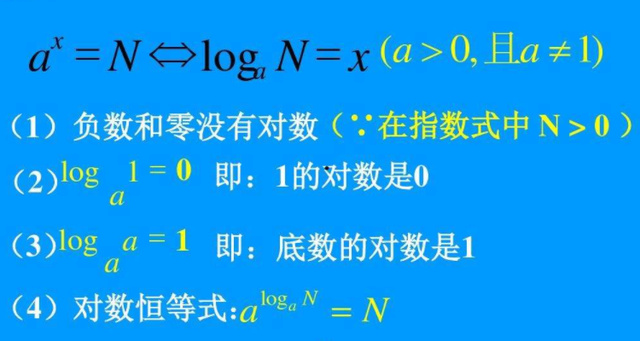
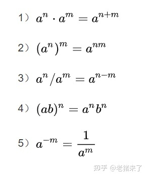
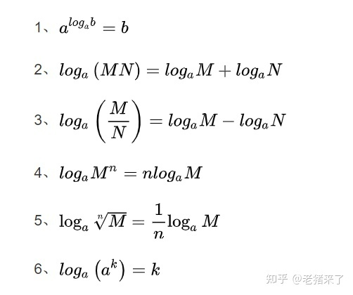
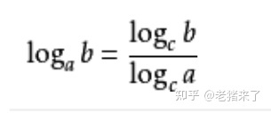

# math

----

###排列和组合

``````php
A 排列  取出来 然后排序  A{n,m} = n!/(n-m)! = n*(n-1)*...(n-m+1);  就可以看成第一次取了n个 第二次取了n-1  依次类推，取了三次 有序的
C 组合 C{n,m}= A{n,m}/m!  除以m就是不考虑排序；  就是取出来 不考虑排序的问题；
    
//是否排序---主要是看顺序可变而产生更多情况；
``````


等比数列求和

``````php
Sn = a1(1-q^n)/1-q  q！=1
Sn = na1            q=1
# 指数的底数为0没意义
# 等比的通项公式
an = a1q^n-1 (q！=1)
a1 = a1 (q=1)
``````

等差数列求和

`````php
Sn=n*a1+n(n-1)d/2或Sn=n(a1+an)/2
    
#等差数列 通项公式
    
an = a1 + (n-1)d  这就是等差数列的通项公式；
`````

等差数列和公式：Sn=n(a1+an)/2=na1+n(n-1)/2 d


等比数列求和公式：q≠1时 Sn=a1(1-q^n)/(1-q)=(a1-anq)/(1-q)

q=1时Sn=na1，(a1为首项,an为第n项,d为公差,q 为等比)


###  对数和指数运算

指数和对数的转换：

a^y=x    y=log(a)(x)。












