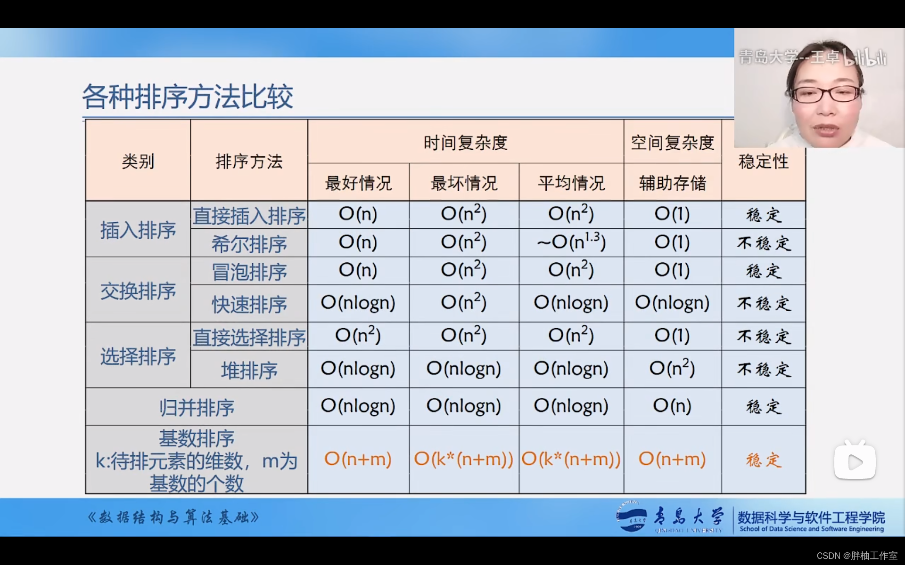
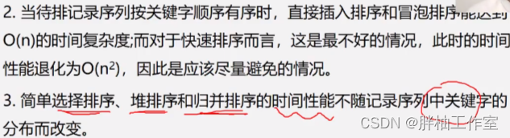
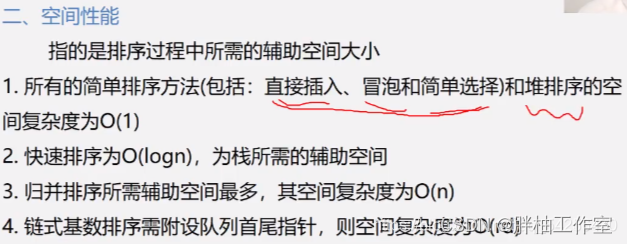

# sort 排序的分类


排序的定义：
将杂乱无章的数据按照一定规律顺次排列起来，即，将无序序列排成一个有序序列（从小到大或从大到小）的运算

如果参加排序的数据结点包括多个数据域，那么排序往往是针对其中某一个域而言

排序方法的分类：
1、按数据存储介质：内部排序和外部排序
2、按比较器个数：串行排序和并行排序
3、按主要操作：比较排序和基数排序
4、按辅助空间：原地排序和非原地排序
5、按稳定性：稳定排序和非稳定排序
6、按自然性：自然排序和非自然排序

---

①按照存储介质分（重点）：
内部排序：数据量不大、存储在内存，无需内外存交换数据
外部排序：数据量较大、数据在外存（文件排序）

②按比较器个数分（重点）：
串行排序：单处理机（同一时刻比较一对元素）
并行排序：多处理机（同一时刻比较多对元素）

③按主要操作分（重点）：

**比较排序：用比较的方法**
**插入排序、交换排序、选择排序、归并排序**

**基数排序：不比较元素的大小，仅仅根据元素的取值确定其有序位置**

④按辅助空间分：
**原地排序：辅助空间用量O(1)的排序方法**
**（所占的辅助储存空间与参加排序的数据量大小无关）**
**非原地排序：辅助空间用量超过O(1)的排序方法**

⑤按稳定性分：
稳定排序：能够使任何数值相等的元素，排序以后相对次序不变
非稳定性排序：不是稳定排序的方法
排序的稳定性只对结构类型数据排序有意义

⑥按自然性分：
自然排序：输入数据越有序，排序速度越快的排序方法
非自然排序：不是自然排序的方法





---







## php sort 和 natsort的区别


```php
##sort 就是ascii 挨个比较  
##natsort 数字自然数的比较；
## a（assosiation 关联） k r nat case  
### 下面的都是ascii的排序 单个字母排序
//sort() 函数用于对数组单元从低到高进行排序。  默认并不保持索引关系
//rsort() 函数用于对数组单元从高到低进行排序。
//asort() 函数用于对数组单元从低到高进行排序并保持索引关系。
//arsort() 函数用于对数组单元从高到低进行排序并保持索引关系。
//ksort() 函数用于对数组单元按照键名从低到高进行排序。
//krsort() 函数用于对数组单元按照键名从高到低进行排序。

###自然排序 natsort
//natsort()：对数组使用 自然算法 进行排序。
//本函数实现了一个和人们通常对字母数字字符串进行排序的方法一样的排序算法并保持原有键名和值的关联。

$arr1 = $arr2 = array("a1", "a11", "a2");
sort($arr1); //不保留索引；
//Array
//(
//    [0] => a1
//    [1] => a11
//    [2] => a2
//)
print_r($arr1);
echo "\n";
natsort($arr2);  //   1 2 11  nat  // 数字 按照自然数来排序；
//Array
//(
//    [0] => a1
//    [2] => a2
//    [1] => a11
//)
print_r($arr2);

## usort

/**
 * usort();
 * // 用户自己定义数组的排序
 * usort();用于自己定义数组的排序；
 */
$intervals =  [[1,4],[3,6],[2,8],[2,7]];
//usort($intervals,function ($a,$b) {
//    if ($a[0] == $b[0]) {
//        return $b[1] - $a[1];  //尾部逆序排序
//    }
//    return $a[0] - $b[0]; // 首部顺序排序
//});
```

