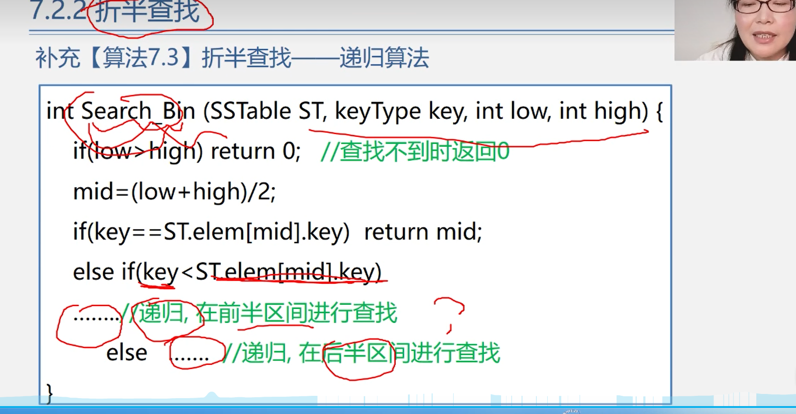
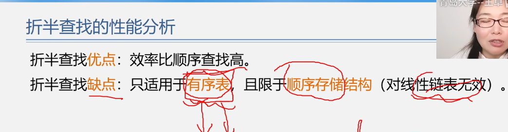
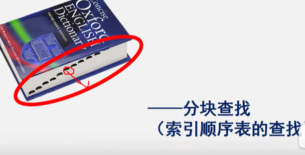
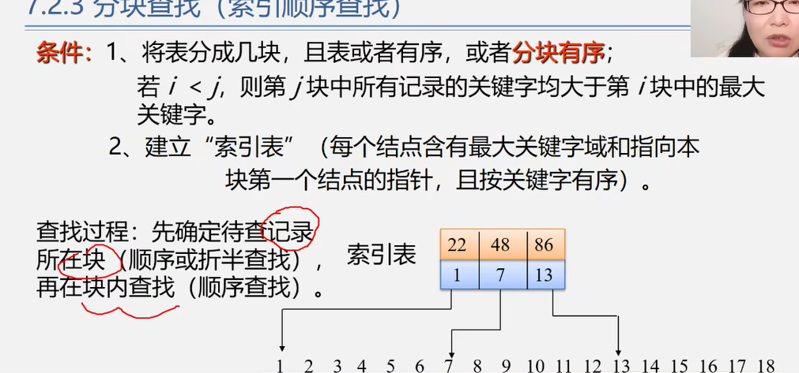
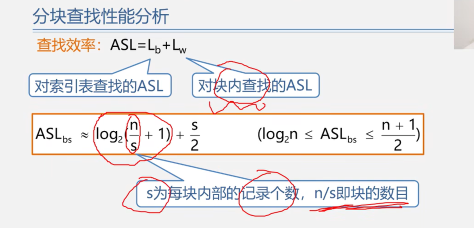
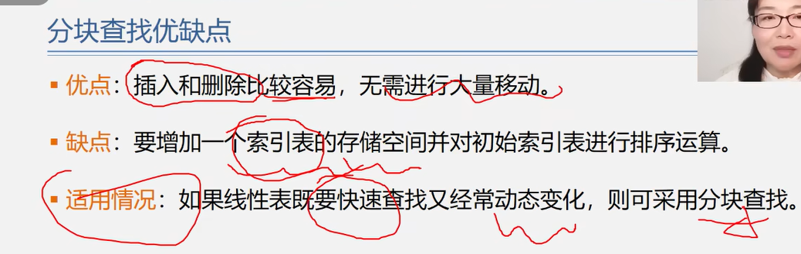
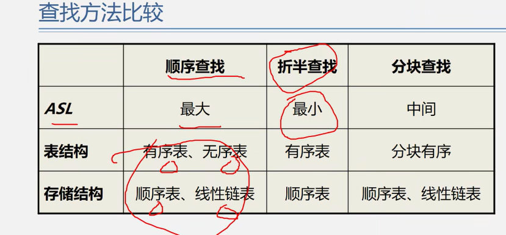

# 二分法

>有序数组找某个数存在不存在；
>
>logn  时间复杂度；
>
>----
>
>注意代码的鲁棒性，多考虑参数值为null 还有只有一个数值的特殊情况；
>
>---
>
>
>
>边界条件多去考虑一下： 
>
>````php
>// 定制商品，需要上传用户的图片 ，但是有很多图片内容，有可能是违规的，需要人工审核；
>//
>// 这边需要推送到审核部分进行审核；审核通过之后才能推送供应商；然后供应商去生产；
>// 这边一般会是一个小时推送一次；
>// 但是在 天数的临界值会有问题？？？？  晚间  24点推送会出问题？？？ // 	
>//
>````
>
>

---

##**二分法需要注意的细节**
**二分法的思路很简单，无非就是每次根据中值判断，然后缩减区间到原来的一半；二分法最容易出错的地方在于边界和细节处理，大体逻辑并不难写出，我们往往死在细节处理上。**

二分法的边界模板分为两种；

一种是左闭右闭的区间写法[left,right]： while(left<=right) left的改变为left=mid+1,right的改变为right=mid-1;

一种是左闭右开的区间写法[left,right) : while(left<right) left的改变为left=mid+1,right的改变为right=mid;


https://blog.csdn.net/gdnlnsjd/article/details/115567810   有一些例题，可以看一下把；

----


##面试的几种二分法算法；

非递归  二分法

````php
/**
 *  二分法
 * 经典题 ：找数组中的某个数
 * 有序数组中没有重复元素 查找某一个元素
 *  二分法 必须是有序的；
 * return false;?
 * 这个仅仅是实现一个，return false；
 */

$arr = [1,4,5,6,7];//排序唯一；
function lookValueByBinary($arr,$value){
    $len = count($arr);
    // 终止条件 没有元素了；//null 一个也是
    if ($len == 0) return false;

    $r = $len - 1;
    $l = 0;		
    // 1 2 3 4 5 // 3   2  
    $mid = $l + (($r - $l) >> 1); // 右移动 除以2；//越界的问题；l+r/2 不要这么写，容易溢出；//位运算运算速度比较快；

    if ($arr[$mid] > $value) {
        // 大于
        lookValueByBinary(array_slice($arr,$l,$mid + 1),$value);
        
    } else if ( $arr[$mid] < $value ) {
        // 小于
        lookValueByBinary(array_slice($arr,$mid + 1),$value);
    } else {
        // 存在；
        return true;
    }
    return false;
}

//var_dump(lookValueByBinary($arr,6));die;
//$arr1 = [1];
//var_dump(lookValueByBinary($arr1,10));die;
//var_dump(lookValueByBinary([],10));die;
/
/**
 * @param $arr
 * @param $value
 * @return false
 * 非递归的查询某个值；
 * 肯定是有序的；注意；
 * 左闭右闭得区间
 */
function nonRecursiveLookValue($arr,$value){
    $len = count($arr);
    if ($len == 0) return false;

    $r = $len - 1;
    $l = 0;
    // >= 代表只有一个值的话 也运行  注意这个判决条件  > 那么肯定最后还会剩下一个元素需要判断一下 最后一个元素 $arr[$l] == $value ;
    //  $r $l 之间只需要有一个数  就可以二分；
    while ($r >= $l) {
        $mid = $l + (($r - $l) >> 1); // 当只有一个元素的时候还是0 位置是0

        if ($arr[$mid] < $value) {
            $l = $mid + 1;
        } else if ( $arr[$mid] > $value) {
            $r = $mid - 1;
        } else {
            return $p;
        }
    }
    return -1;
}
// 非递归
//var_dump(nonRecursiveLookValue($arr,4));die;


/**
 * @param $arr
 * @param $target
 * 左闭右开
 */
function search3($arr,$target){
    //这样才满足 左开右闭
    $r = count($arr);
    $l = 0;
// 左闭右开
    // $r $l 之间只需要有一个数  就可以二分；
    while ($r > $l) {
        // 注意这里一定要这么写；
        $mid = $l + (($r - $l) >> 1);
        if ($arr[$mid] < $target) {
            $l = $mid + 1;
        } else if ($arr[$mid] > $target){
            // $r  不包含 r
            $r = $mid;
        } else {
            return $mid;
        }
    }
    return -1;
}

//var_dump(search3($arr48,5));die;


/**
 *  数组 元素 会有重复部分
 *  找到有序数组，满足  >=value 值最左边的位置; 返回的是位置；至少是什么值？？
 *  大于等于3的最左边；
 */
//左边界的问题；
$arr1 = [1,2,3,3,3,3,4,5,5];
function repeatminvalue($arr,$value){
    $len = count($arr);
    if ($len == 0) return false;

    $l = 0;
    $r = $len - 1;

    while ($r >= $l) {
        $mid = $l + (($r - $l) >> 1);
        
        if ($arr[$mid] >= $value){ //  比value 还小那么应该去左区间去找；注意要满足 >= value的值；左边还有更大的应该左边去找；		//向左边走，取找最小的；
            $r = $mid - 1;
            $index = $mid; // 已经记录了整个mid的值，就没必要去搜索了；
        } else {
            $l = $mid + 1;
        }
    }
    return $index;
}
//var_dump(repeatminvalue($arr1,3));die;

/**
 * 数组重复部分  仔细的理解题意；
 *  找到y有序数组，满足 <= value 最右侧的位置 <=4的最右侧；至多是那个值；
 * <=4 的最右边；
 */
// 右边界的问题
$arr2 = [1,2,3,4,4,4,4,7,87,7,7];

function reaptMaxvalue($arr,$value){
    $len = count($arr);
    if ($len == 0) return false;

    $l = 0;
    $r = $len - 1;

    while ($r >= $l) {
        $mid = $l + (($r - $l) >> 1);
        if ($arr[$mid] <= $value){
            $l = $mid + 1;
            $index = $mid;
        } else { // 全部的4 都在右边的情况；
            $r = $mid - 1;
        }
    }
    
    return $index;
}
//var_dump(reaptMaxvalue($arr2,4));die;


/**
 * 局部最小值的问题
 * 无序数组  （正 负 0 ） 任意相邻的数不相等；
 * 这个是无序的，但是也可以使用二分法；
 * 数据比较特殊； 规则也比较特殊就需要二分法；
 * 注意边界条件，要判断0，或者n-1的情况； 只需要找到一个位置 找到一个局部最小值就行；
 */

$arr3 = [1,0,-1,1,0,1];
// return返回局部最小的位置
// 必定存在局部最小
function localMinima($arr){
    $len = count($arr);
    // 三种特殊情况;
    if ($len == 0) return false;// 没有局部最小值
    if ($arr[0] < $arr[1]) return 0;//也存在 局部最小值；
    if ($arr[$len - 1] < $arr[$len - 2]) return $len -1; // 也存在局部最小值；
    // 不满足上述条件 那么曲线就是 上                上 那么中间必定会有最小值；
    // index 0 和 n-1 肯定是不满足条件的；
    $r = $len -2;
    $l = 1;
    // loop
    while ($r >= $l) {
        $mid = $l + (($r - $l) >> 1);
        //这个是怎么回事？？？
        if ($arr[$mid] > $arr[$mid - 1]) {
            $l = $mid + 1;
        } else if ($arr[$mid] > $arr[$mid + 1]) {
            $r = $mid - 1;
        } else {
            // 慢慢的逼近 $mid;
            return $mid; //必定存在局部最小值
        }
    }
}
//var_dump(localMinima($arr3));die;
````


##  二分法中区间得概念；

计算机默认向下取整；

`````php
$p = $l + (($r - $l) >> 1);  //必须要这么写 注意一下执行顺序；
//这个写法注意 主要是为了防止溢出；
// 如果是  ($l + $r)/2  因为是 int 所以有可能会溢出；2^32 = 40亿；所以当两个数相加超过 40亿那么就会溢出；
// 但是再php中当溢出的时候会自动转换成long；long的位数由操作系统决定是64位操作系统那么就是8个字节，如果是32位操作系统，那么就是4个字节；
$a = 5;
$b = 2;
echo (int)($a/$b);

#  php 自己设置 向下取整 (int)($a/$b)  这里要转换成浮点型的；long的形式；
`````

* 左闭右闭  [a,b]  区间包含 ab
* 左闭右开  [a,b)  区间包含a，但是不包含b；
* 左开右闭 (a,b]  比较少；用得比较少；  区间包含b，但是不包含a；


## 注意二分法得两个 判断的选择问题

```php
function nonRecursiveLookValue($arr,$value){
    $len = count($arr);
    if ($len == 0) return false;
	// $r 和 $l 选择也要闭区间；0 - $len-1;就是一个闭区间；
    $r = $len - 1;
    $l = 0;
    // >= 代表只有一个值的话 也运行  注意这个判决条件  > 那么肯定最后还会剩下一个元素需要判断一下 最后一个元素 $arr[$l] == $value ;
    //注意 -----------------------------------------------
    while ($r >= $l) {
        $mid = $l + (($r - $l) >> 1); // 当只有一个元素的时候还是0 位置是0

        if ($arr[$mid] < $value) {
            //注意 -------------------------------------
            $l = $mid + 1; //闭区间
            
        } else if ( $arr[$mid] > $value) {
            //注意------------------------------------
            $r = $mid - 1; // 闭区间
            
        } else {
            return $mid;
        }
    }
    return -1;
}

# 注意一下他的判断依据；
```


## 递归的二分法

注意返回的值；存在这个值； return  怎么去返回数值；

这里 多去注意一下；可以自己去实现一下 //todo




## 折半查找法 只适合  顺序存储结构； 并不适合链表查找‘

>logn的时间复杂度；必须是顺序结构；

因为找不到 \$mid ，或者说找$mid 需要 顺序查找，所以效率会很低；


顺序存储结构，可以使用索引来随机访问；




## 线性查找 分块查找  (先通过 索引 查找到块，然后在进行块内查询；)

> **优势就是插入和删除会比较方便，只要块内是无序的插入和删除还是比较方便的，块不包含全部元素，比起全部元素的插入和删除，更加方便和简单；**
>
> **分块查询，通过索引先找到要查询的块，然后再进行块内查询；**
>
> <font color=red>**磁盘也是使用类似的这种方式，先通过，磁盘里的哈希表来通过文件名，查找inode，根据inode招到保存文件的块，然后获取数据；**</font>
>
> <font color=red>**// 可以实现快速查找，又经常动态变化；**</font>


----


索引的分块查找；需要先建立索引；目录； 索引顺序表的查找；






说白了就是在索引表中进行查找，找到了我们需要的块，然后再进行块内查找；

索引块的查询效率由两部分组成= 索引表的查询 + 块内的查询；


根据块内是否是有序和无序来进行折半查询或者是顺寻查询；

当然，无序块也有优点，当你插入一个元素的时候直接插入就行了，但是有序块你要保证有序性，就会变的很麻烦；





// 缺点： 分块查询的缺点：会需要额外的空间保存索引，数据更新也会导致索引的更新；

// 优点 插入 和 删除比较容易，不需要大量移动；

**// 可以实现快速查找，又经常动态变化；**




---


// 链表不支持随机访问，所以不能进行折半查找；

// 压缩列表，ziplist 也不支持随机访问，自然也就不能进行二分查找；但是节约了内存；

//顺序查找，适合链表和顺序表；


// 几种操作方式的优缺点： 插入，删除，更新；

ASL average search length 平均查找长度； 就是效率，时间复杂度；

顺序查找 n；

折半查找  logn；

分块查找  

-
