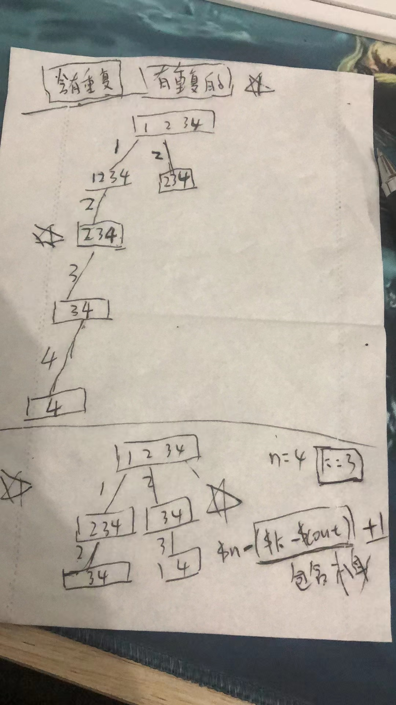

#  二叉树的回溯技巧2

>回溯技巧2

---


``````php
## 组合和

/**
 * leetcode 216 - 组合和
 */
class Solution1 {

    /**
     * @param Integer $k
     * @param Integer $n  //sum  == $n
     * @return Integer[][]
     * 只有数字  1 - 9 ；
     */
    public $res = [];
    public $tmp = [];
    public $sum = 0;//和

    function combinationSum3($k, $n) {
        //1-9 ;;;;;;
        $this->help($k,$n,1);
        return $this->res;
    }

    function help($k,$n,$startIndex) {
        //end cond
        $len = count($this->tmp);
        if ($len == $k) {  // 主要是等于$k的都会去回溯 ，但是等于$n的会加入到$res
            if ($this->sum == $n) {
                $this->res[] = $this->tmp;
            }
                return;//就算不等于 也要做回溯；做回退； 
        }
//        if ($this->sum == $n && $len == $k) {
//            $this->res[] = $this->tmp;
//            return;
//        }

        //单层遍历
        // 1-9;
        //      总长度   $k 
        // 剪枝  $n - ($k - count($this->tmp)) + 1; 
        for ($i = $startIndex; $i <= 9 - ($k - $len) + 1; $i++) {
            array_push($this->tmp,$i);
            $this->sum += $i;
            $this->help($k, $n, $i + 1);
            $this->sum -= $i;
            array_pop($this->tmp);
        }
    }
}

//$obj1 = new Solution1();
//var_dump($obj1->combinationSum3(3,7));die;
``````


---


`````php
/**
 * 17. 电话号码的字母组合 leetcode
 * // b暴力求解 就是for循环的方式； 多个for循环去实现
 * 输入的而数字个数 就代表了数的深度；
 * //树的层数；
 *
class Solution2 {

    /**
     * @param String $digits
     * @return String[]
     */
	//map
    public $map = ['2'=>'abc','3'=>'def','4'=>'ghi','5'=>
        'jkl','6'=>'mno','7'=>'pqrs','8'=>'tuv','9'=>'wxyz'];
    public $tmp = [];
    public $res = [];
    
    //
    function letterCombinations($digits) { //level  从0开始；
        $max = strlen($digits);// 0 - 4;
        // 需要那几个参数？？？
        //需要多少层；
        if (!$max) return [];
        
        $level = 0; // 0 - 3// 最多四层；
        $this->help($digits,$max,$level);//   从第0层开始  // $level  当前层数；是多少 从0层开始；	
        return $this->res; // 字符串；
    }

    public function help($digits,$max,$level) {
        // 决定了怎么结束
        $max = count($digits);// 和上面一样 ，也可以只传在那一层就可以了；
        
        if ($max == 0) { // $max == 0 就代表[] 返回的是[]  // 还一个结束条件就是 count($this->tmp) == $max 也可以来判断；
            $this->res[] = implode($this->tmp);
            return;
        }

        //单层遍历  第一层的个数//第几个数字的；
        for ($i = 0; $i < strlen($this->map[$digits[$level]]); $i++) {
            array_push($this->tmp,$this->map[$digits[$level]][$i]);
            $this->help($digits,$max - 1,$level + 1);
            array_pop($this->tmp);
        }
    }
}
`````


----


`````php
##leetcode - 39. 组合总和
//  注意去重； $startIndex 的去重；  这个 很关键；
//
//candidates 中的 同一个 数字可以 无限制重复被选取

/**
 * ##leetcode - 39. 组合总和
 */

class Solution3 {

    /**
     * @param Integer[] $candidates
     * @param Integer $target
     * @return Integer[][]
     */
    public $tmp = [];
    public $res = [];
    public $sum = 0;

    function combinationSum($candidates, $target) {
        //结束条件是什么
        //找到
        //怎么才算找不到？？
        //sum >= 都要结束； =  添加到res   > return
        $this->help($candidates,$target,0);
        return $this->res;//这边最好用一个set 来保存；但是php的key 不能保存复式数据结构；
    }

    /**
     * @param $candidates
     * @param $target
     * @param $startIndex // 去重去重； 去重；去重；去重；去重；去重；去重； // 利用往后找的特性来去重；
     */
    
    public function help($candidates,$target,$startIndex) {//注意去重；//
        // end cond
        if ($this->sum == $target) { //
            $this->res[] = $this->tmp;
            return;
        } else if ($this->sum > $target) {  //
            return;
        }
        // 单层递归
        $len = count($candidates);
        // sum + $candidates[$i] >= $target  剪枝掉 这部分内容；
        for ($i = $startIndex; $i <= $len - 1 ; $i++) {
            array_push($this->tmp, $candidates[$i]);
            $this->sum += $candidates[$i];
            // 注意这里 那么肯定会存在 $target //一般就存在； // 
            $this->help($candidates,$target,$i); // 这里必须要$i  但是深度 不变 所以是 $i + 1;// 深度会变成加1 ；
            $this->sum -= $candidates[$i];
            array_pop($this->tmp);
        }
    }
}
###----
$cand = [2,3,6,7];
$obj3 = new Solution3();
var_dump($obj3->combinationSum($cand,7));die;


## 剪枝操作 ，但是做剪枝操作之前先要做一个排序；
## sort(); a 
class Solution {

    /**
     * @param Integer[] $candidates
     * @param Integer $target
     * @return Integer[][]
     */
    public $tmp = [];
    public $res = [];
    public $sum = 0;

    function combinationSum($candidates, $target) {
        
        //必须先要排序
        sort($candidates);//排序；
        //结束条件是什么 
        //找到
        //怎么才算找不到？？ 
        //sum >= 都要结束； =  添加到res   > return
        $this->help($candidates,$target,0);
        return $this->res;
    }

    public function help($candidates,$target,$startIndex) {
        // end cond
        if ($this->sum == $target) {
            $this->res[] = $this->tmp;
            return;
        } else if ($this->sum > $target) {// 
            return;
        }
 
        // 单层递归//
        $len = count($candidates);
        // 他的代码部分 有问题 leetcode 本地完全正确； // 
        for ($i = $startIndex; ($i <= $len - 1) && ($this->sum + $candidates[$i]<= $target); $i++) {

            array_push($this->tmp, $candidates[$i]);
            $this->sum += $candidates[$i];
            $this->help($candidates,$target,$i);
            $this->sum -= $candidates[$i];
            array_pop($this->tmp);
        }
    }
}


/**
*  组合 2
 * 40. 组合总和 II
 * 有重复的数组
 * leetcode -- 40
 */

class Solution40 {

    /**
     * @param Integer[] $candidates
     * @param Integer $target
     * @return Integer[][]
     */
    public $res = [];
    public $tmp = [];
    public $sum = 0;

    function combinationSum2($candidates, $target) {
        //sort
        sort($candidates);
        $this->help($candidates,$target,0);
        return $this->res;
    }

    function help($candidates,$target,$startIndex) {
        //end cond
//        var_dump($candidates);die;
        $n = count($candidates);
        //等于 结束
        //这样就可以了；
        if ($this->sum == $target) {
            $this->res[] = $this->tmp;
            return;
        }
        // 都要return；
//        if ($startIndex >= $n || $this->sum > $target) {
//            return;
//        }
        //为什么这里要删除 $startIndex  >= $n;就是整个就小于 $target;
        if ($startIndex >= $n || $this->sum > $target) return;

        //
        for ($i = $startIndex; $i < $n; $i++) {
            //去重；
            if ($candidates[$i] == $candidates[$i - 1] && $i > $startIndex) continue;
            //
            array_push($this->tmp,$candidates[$i]);
            $this->sum += $candidates[$i];
            $this->help($candidates,$target,$i + 1);
            $this->sum -= $candidates[$i];
            array_pop($this->tmp);
        }
//        return; //函数隐藏的回溯 ；；
    }
}
$arr40 = [2,5,2,1,2];
$obj40 = new Solution40();
var_dump($obj40->combinationSum2($arr40,5));die;

`````


`````php
// 假如 是一个数组 [1,2,3,4]本层使用了2 之后下一层依然从2开始；那么递归\$startIndex =\$i 就行了，不需要 \$i + 1; 
// 很核心的一个思想；自己多注意一下；
`````





----

## 全排列

`````php
###全排列

### 没有重复的元素 所以就不需要去重的问题；
## 排列 强调元素顺序 顺序不同也是不同的排列；
// 组合  元素相同顺序不同 是相同的组合； 用 startIndex来去重；//防止重复的问题；只能往后取，不能往前取；
### 全排列 需要使用used 数组来标记访问过的元素；

## leetcode - 46. 全排列 

/**
 * 全排列；
 * leetcode - 46
 * 不存在重复的问题；
 *  123
 */

class Solution4 {

    /**
     * @param Integer[] $nums
     * @return Integer[][]
     */
    // 不重复；没有重复元素
    //全排列 需要一个visited 访问过的元素

    public $res = []; // 这个不算space 因为要求返回一个数组 这不算是额外内存；
    public $tmp = []; // 6 const； // 常量space 空间； 并不是n的space
    public $visited = []; //  6 const // 常量space 空间；并不是n的space；

    function permute($nums) {
        $this->help($nums);
        return $this->res;
    }

    public function help($nums) {
        //end c
        $len = count($nums);
        //数组的大小 就是他的结束条件
        if ($len == count($this->tmp)) {
            $this->res[] = $this->tmp;
            return;
        }

        // single level recursion
        for ($i = 0; $i <= $len - 1; $i++) {
            // exists //
            if ($this->visited[$nums[$i]]) continue;
            //not exists
            //对重复的数组 并不友好
            array_push($this->tmp,$nums[$i]);
            $this->visited[$nums[$i]] = 1;
            $this->permute($nums);
            array_pop($this->tmp);
            unset($this->visited[$nums[$i]]);
        }
    }
}


// 

class Solution {

    /**
     * @param Integer[] $nums
     * @return Integer[][]
     */
     // 不重复；没有重复元素
     //全排列 需要一个visited 访问过的元素

    public $res = []; // 这个不算space 因为要求返回一个数组 这不算是额外内存；
    public $tmp = []; // 6 const； // 常量space 空间； 并不是n的space
    public $visited = []; //  6 const // 常量space 空间；并不是n的space；
	
     function permute($nums) {
            //end c
        $len = count($nums);
        if ($len == count($this->tmp)) {
            $this->res[] = $this->tmp;
            return;
        }
        
        // single level recursion
        for ($i = 0; $i <= $len - 1; $i++) {

            // exists // 用tmp来做去重怎么样？
            if ($this->visited[$i]) {
                continue;
            }

            //not exists
            array_push($this->tmp,$nums[$i]);
            // used 按照 1
            $this->visited[$i] = 1;
            $this->permute($nums);
            array_pop($this->tmp);
            unset($this->visited[$i]);
        }
         return $this->res;

     }

}


//  存在 重复元素的数组 排列问题

/**
 * 全排类2
 * leetcode -- 47
 * // 存在重复元素；的全排列 怎么去去重的问题； 1123
 * 1123
 * 1123 是同一个排列 去重的问题；
 * 有重复元素  去重的问题；
 * 同样的元素    不能用多次；只能用一次；
 */

class Solution47 {

    /**
     * @param Integer[] $nums
     * @return Integer[][]
     */
    public $res = [];
    public $tmp = [];
    public $used = [];

    function permuteUnique($nums) {
        //先要排序
        sort($nums);
        $this->help($nums);
        return $this->res;
    }

    function help($nums) {
        //end cond
        $n = count($nums);
        if (count($this->tmp) == $n) {
            $this->res[] = $this->tmp;
            return;
        }
        //recursion
        for ($i = 0; $i < $n; $i++) {
            // 就是剪层 不存在 第一次进入；
            // 层级的剪枝
            // 第一个元素是0 有问题；// 注意；
            // [0,3,3,3]
            // 0  == null 所以这里要用全等；这里很重要；
            // 这里很重要--- ---   这边 只能这么做；
            if ($nums[$i] === $nums[$i - 1] && !isset($this->used[$i - 1])) {
                continue;
            }

            // 被访问过了的  就不再访问了
            if (isset($this->used[$i])) {//注意0
                continue;
            }

            //
            array_push($this->tmp,$nums[$i]);
            $this->used[$i] = true;
            $this->help($nums);
            unset($this->used[$i]);
            array_pop($this->tmp);
        }
    }
}

$arr47 = [3,3,0,3];
$obj47 = new Solution47();
var_dump($obj47->permuteUnique($arr47));die;
`````


----

## 子集  --  也是组合的一类

````php
#我觉得可以这样写就暂时不需要那个used标记，
//就是把第一个给删除掉；i > 0 ;
#if(i>startindex && candidates【i】==candidates【i-1】) continue;
# 
````


````php
##子集问题  也是组合的一类；
### 子集 和 组合排列的区别，并不是在结束条件之后保存结果，每一次都要输入到$this->res

//子集问题
/**
 * leetcode -  78
 * 子集
 * 收获的结果 都是在每一个结点里面  每一个结点都会有结果；
 */
class Solution78 {

    /**
     * @param Integer[] $nums
     * @return Integer[][]
     */
    public $res = [];
    public $tmp = [];

    function subsets($nums) {
        $this->help($nums,0);
        return $this->res;
    }

    public function help($nums,$startIndex) {
        //每进入一个递归就是 一个结点； // 要放在前面
        $this->res[] = $this->tmp;
        //end cond
        $n = count($nums);
//        if ($startIndex >= $n) return; // 代码 可以不写；
        if (count($this->tmp) == $n) {
            //
//            $this->res[] = $this->tmp;
            return;
        }
//        $this->res[] = $this->tmp;

        //single level recursion
        /**
 *  子集2
 * leetcode -- 90
 *  存在重复数组
 */

class Solution {

    /**
     * @param Integer[] $nums
     * @return Integer[][]
     */


    public $res = [];
    public $tmp = [];
    public $used = [];

    function subsetsWithDup($nums) {
        sort($nums);  //也是排序 然后 处理
        $this->help($nums,0);

        return $this->res;
    }

    function help($nums,$startIndex) {
        // 结点
        $this->res[] = $this->tmp;
        //end c
        $n = count($nums);
        if ($startIndex >= $n) return;

        for ($i = $startIndex; $i < $n; $i++) {
            //这里是剪去分支；
            // if (isset($this->used[$nums[$i]])) continue;
            //是真的需要排序 吗的；//不是第一次进来 ？ 往下遍历 是可以的；但是for层级遍历不能重复；
         
            // if ($nums[$i] === $nums[$i - 1] && $this->used[$i -1 ] == false) continue;
            // 另外一种写法
            if ($nums[$i]  == $nums[$i - 1] && $i > $startIndex) continue;
            // for 循环代表的是 树的分支；可以判断要不要这个分支；
            $this->used[$i] = true;
            array_push($this->tmp,$nums[$i]);
            $this->help($nums,$i + 1);
            array_pop($this->tmp);
            unset($this->used[$i]);
        }
    }
}
        for ($i = $startIndex; $i < $n; $i++) {
            array_push($this->tmp,$nums[$i]);
            $this->help($nums,$i + 1);
            array_pop($this->tmp);
        }
    }
}


//
/**
 *  子集2
 * leetcode -- 90
 *  存在重复数组
 */

class Solution {

    /**
     * @param Integer[] $nums
     * @return Integer[][]
     */


    public $res = [];
    public $tmp = [];
    public $used = [];

    function subsetsWithDup($nums) {
        sort($nums);
        $this->help($nums,0);

        return $this->res;
    }

    function help($nums,$startIndex) {
        // 结点
        $this->res[] = $this->tmp;
        //end c
        $n = count($nums);
        if ($startIndex >= $n) return;

        for ($i = $startIndex; $i < $n; $i++) {
            //这里是剪去分支；
            // if (isset($this->used[$nums[$i]])) continue;
            //是真的需要排序 吗的；
            if ($nums[$i] === $nums[$i - 1] && $this->used[$i -1 ] == false) continue;
            // for 循环代表的是 树的分支；可以判断要不要这个分支；
            $this->used[$i] = true;
            array_push($this->tmp,$nums[$i]);
            $this->help($nums,$i + 1);
            array_pop($this->tmp);
            unset($this->used[$i]);
        }
    }
}
````


---

## 分割问题； -- 也是组合的一类；


---

## 数层 去重 和树枝去重；

数层  
