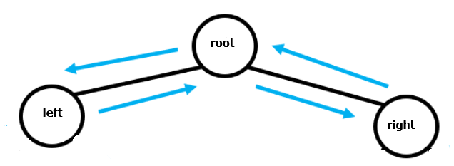
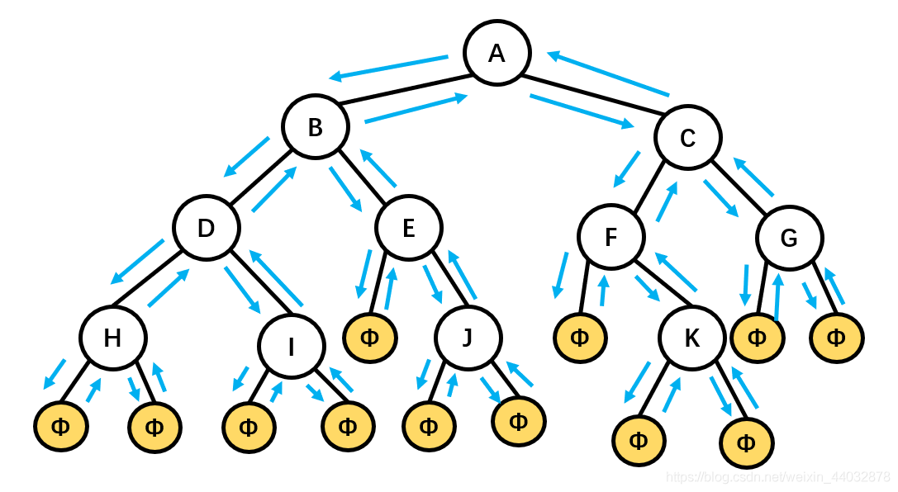
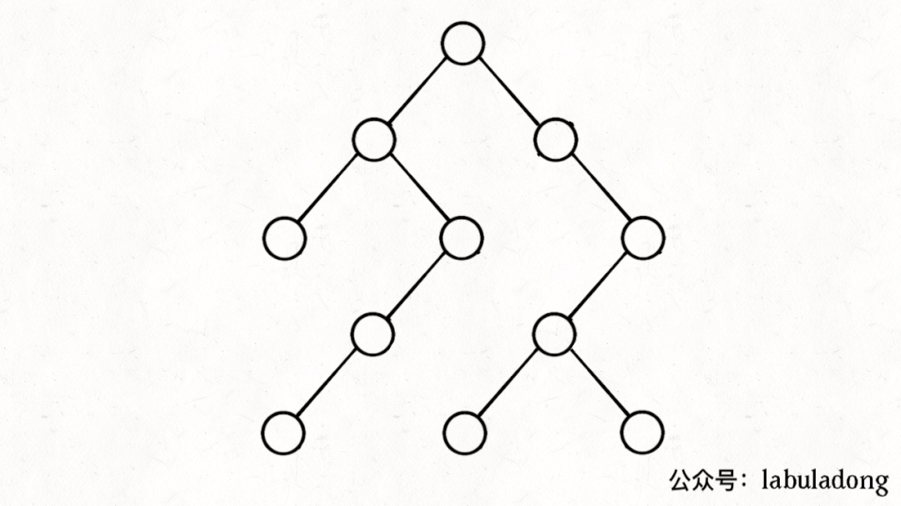

# 二叉树的遍历


这个和当时学习输入输出流很像，一直不明白为啥输入流是input、reader，输出流是output、writer。所以学习的时候心态简直爆炸。后来才知道这个输入输出流是相对于内存来说的**，数据读到内存，就是输入流即reader，从内存写到文件就是输出流，即writer。**

----


##前序遍历中序遍历和后序遍历

###每一个节点都要看成这样的； 就是root  和left 和right 节点这三个节点；

## <font color=red>函数开始 并且执行就是入栈，当函数结束的时候开始出栈；return 也是要出栈的； </font>

````php
/**
 * 模板
 * 遍历模板
 * 递归序列
 *  ***** 这个很重要的递归序；怎么去运行的；
 */
function bstTravel($head) {
    if ($head == null) return null;
    //1  前序 第一次访问这个节点 遍历
    //$head 节点入栈 array_push();
    bstTravel($head->left);  
    //2 中序 遍历完左子树
    bstTravel($head->right);
    //3  后序 遍历完左右子树
    // head 节点出栈 array_pop();
    // 函数结束就是出栈的过程，
}

````

##  root先入栈 先遍历完 左子树  然后右子树   然后出栈； 出栈的时候用return来返回数据，如果没有return 那么返回就是 null return null；默认返回null；



每一个节点都会被遍历三次，那么前中后分别代表 第一次  第二次 和第三次；

一个是从它的**父节点指向它**，一个是从它的**左孩子指向它**，一个是从**它的右孩子指向它**。

一个结点有三个箭头指向它，说明**每个结点都被经过了三遍**。一遍是从它的**父节点来的时候**，一遍是从它的**左孩子返回时**，一遍是从**它的右孩子返回时**。

---


##  <font color=red>二叉树递归序就是 二叉树最重要的东西；</font>




```php
/**
 * 模板
 * 遍历模板
 * 递归序列
 *  ***** 这个很重要的递归序；怎么去运行的；
 */
function bstTravel($head) {
    if ($head == null) return null;
    //1  前序 第一次访问这个节点 遍历
    bstTravel($head->left);
    //2 中序 遍历完左子树
    bstTravel($head->right);
    //3  后序 遍历完左右子树
}

// 什么用前序遍历？
// 什么是后序遍历？
// 翻转二叉树 为什么不能使用中序遍历？
/**
 * 翻转二叉树
 * leetcode 226
 * zh注意这里为啥要用前序遍历
 *  不能用中序遍历，中序遍历，中序遍历相当于左子树翻转了两次；
 */
function invertBst($head) {
    if ($head == null) return null;
    //swap  翻转  
    $tmp = $head->left;
    $head->left = $head->right;
    $head->right = $tmp;

    invertBst($head->left);
    invertBst($head->right);
    // 也可以在这里翻转
    return $head;
}


#  php 代码中的栈和队列

# array_push(); 后入
# array_pop();  后出
# array_shift();  前弹出
# arrat_unshift(); 	 前插入；


```


## 层级遍历  二叉树的层级遍历


````php
#  二叉树的层级遍历
#//             13
//        10         16
//    9      11   14
/**
 * 二叉树的树的层级遍历 的优化把
 */
function levelTraverseh($root) {
    if ($root == null) return null;
    //queue d队列
    $queue = [];
    array_push($queue,$root);
	// 多少层
    while(!empty($queue)) {
        $qz = count($queue);
		// 遍历的是层； 层的元素数；
        for ($i =0 ; $i < $qz ; $i++) {
            $head = array_shift($queue);
            echo $head->val."---";
            if ($head->left) array_push($queue,$head->left);
            if ($head->right) array_push($queue,$head->right);
        }
        echo "\n";
    }
}
levelTraverseh($root);die;

// result 

//13---
//10---16---
//9---11---14---

````


## 非递归遍历 二叉树的非递归遍历

>递归的本质就是借用**栈**来迭代地的执行递归函数；
>
>递归的核心 就是栈；递归栈；

---




简单说就是这样一个流程：

**1、拿到一个节点，就一路向左遍历（因为`traverse(root.left)`排在前面），把路上的节点都压到栈里**。

**2、往左走到头之后就开始退栈，看看栈顶节点的右指针，非空的话就重复第 1 步**。

````php
#写成迭代代码就是这样：

private Stack<TreeNode> stk = new Stack<>();

public List<Integer> traverse(TreeNode root) {
    pushLeftBranch(root);

    while (!stk.isEmpty()) {
        TreeNode p = stk.pop();
        // 中序遍历  这里弹出的是 中序遍历
        # p.right = null  那么直接弹出 pop
        // 因为这里出栈之后要往右子树走，所以这里是中序遍历
        pushLeftBranch(p.right);
    }
}

// 左侧树枝一撸到底，都放入栈中
private void pushLeftBranch(TreeNode p) {
    while (p != null) {
        // 这里是 前序遍历
        stk.push(p);
        p = p.left;
    }
}
#上述代码虽然已经可以模拟出递归函数的运行过程，不过还没有找到递归代码中的前中后序代码位置，所以需要进一步修改。
````


---


````php

#树的非递归遍历 
#主要是想考察关于递归栈的问题；

# php code
#前序遍历   head  左    右
/**
 * 非递归遍历 模拟z栈；
 */
class mululateStack
{
    public  $stack = [];

    /**
     * @param TreeNode $p
     * 左边一入到底
     */
    function pushLeftBranch($p){
        while (!empty($p)) {
            // 入栈；
            // 前序遍历
            echo $p->val."-----";
            array_push($this->stack,$p);
            $p = $p->left;
        }
    }

    function monizhantreeqian(TreeNode $root) {
        $this->pushLeftBranch($root);
        while(!empty($this->stack)) {
            $p = array_pop($this->stack);
            //echo $p."---";
            // 右子树入栈；
            $this->pushLeftBranch($p->right);
        }
    }
}
$newmululateStack = new mululateStack();
$newmululateStack->monizhantreeqian($root);die;


## 前序遍历
function noCursionHeadTraverse(TreeNode $root) {
    $stack = [];
    array_push($stack, $root);
    while (!empty($stack)) {
        $p = array_pop($stack);
        //前序遍历
        echo $p->val . "---";
        if (!empty($p->right)) {
            array_push($stack,$p->right);
        }
        if (!empty($p->left)) {
            array_push($stack,$p->left);
        }
    }
}

# 中序遍历

/**
 * 非递归遍历 模拟z栈；
 */
class mululateStack
{
    public  $stack = [];

    /**
     * @param TreeNode $p
     * 左边一入到底
     */
    function pushLeftBranch($p){
        while (!empty($p)) {
            // 入栈；
            // 前序遍历
//            echo $p->val."-----";
            array_push($this->stack,$p);
            $p = $p->left;
        }
    }

    function monizhantreeqian(TreeNode $root) {
        $this->pushLeftBranch($root);
        while(!empty($this->stack)) {
            $p = array_pop($this->stack);
            echo $p->val."---";
            // 右子树入栈；
            $this->pushLeftBranch($p->right);
        }
    }
}
$newmululateStack = new mululateStack();
$newmululateStack->monizhantreeqian($root);die;

#后序遍历；

/**
 * 后序遍历
 * 前序 是 root left right  ->  root right left ->
 *
 */
/**
 * 原地翻转数组
 * 空间复杂度是O(1)
 * 原地的数组翻转
 */
function reverseArray($arr){
    $p0 = 0;
    $p1 = count($arr) - 1;
    // 注意奇偶数
    while($p1 - $p0 >= 1 ) {
        [$arr[$p0],$arr[$p1]] = array($arr[$p1],$arr[$p0]);
        $p0++;
        $p1--;
    }
    return $arr;
}
//$arr234 = [2,3,4,55,5,8,5];
//$arr135 = [2,4,45,66,9];
//var_dump(reverseArray($arr234));die;
//var_dump(reverseArray($arr135));die;

function noCursionAfterTraverse(TreeNode $root){
    if ($root == null) return null;
    $stack = [];
    $tmpStack = [];
    array_push($stack, $root);
    while (!empty($stack)) {
        $p = array_pop($stack);
        //后序
        array_push($tmpStack,$p->val);
//        $tmpStack[] = $p->val;
        // 先 左边
        if (!empty($p->left)) {
            array_push($stack,$p->left);
        }
        // 先右边
        if (!empty($p->right)) {
            array_push($stack,$p->right);
        }
    }
    return $tmpStack;
    return reverseArray($tmpStack);
}
echo implode(noCursionAfterTraverse($root),"---");
````


## BST 增删查


```php
/**
 * 二叉树的查找bst binary search tree
 * $root = head;
 * O(logn)
 * O(1)
 */

function findDataIntree($root,$data){
    if ($root == null) return;

    while ($root != null) {
        if ($root->val > $data) {
            $root = $root->left;
        } else if ($root->val < $data) {
            $root = $root->right;
        } else {
            return $root;
        }
    }
    //未找到返回null；
    return null;
}

/**
 * 二叉树的插入 bst insert
 * 插入某一个j节点
 */
$newNode = new TreeNode(18);
function insertBst($root,$newNode){
    while ($root != null) {
        if ($root->val < $newNode->val) { // 大于
            if (!isset($root->right)) {// 右节点是null
                $root->right = $newNode;
                break;
            } else {
                $root = $root->right;
            }
        } else { // 小于等于 往左子树去插入
            if (!isset($root->left)) {//左边是null
                $root->left = $newNode;
                break;
            } else {
              $root = $root->left;
            }
        }
    }
    // 遍历 返回bst  需要自己遍历
}


/**
 * delete bast  bst的删除
 * 步骤:
 * 1. 找到要删除的节点;
 * 2. 删除节点；
 * 出现的情况:
 * 1. 要删除节点的左孩子为null
 * 2. 右孩子为null
 * 1.2 中解决方案，就是连接到父节点就可以了
 * 3. 左右孩子都不为null；
 * 最主要的是3这种解决方案：
 * 需要找后继节点；后继节点就是右子树的最小值；替换删除的节点，然后删除右子树的最小值；
 */


/**
 * 寻找最小值  bst
 * 寻找一个树的最小值；
 * bst  直接往最左边走就行了；
 */
function minBst($root){
    while ($root->left) { // not nul  最左的一个值；
        $root = $root->left;
    }
    return $root;
}


/**
 * @param $root
 * @param $val
 * 递归
 */
function deleteBst($root,$val){
    if ($root == null) return;

    if ($root->val > $val) {// 要删除的节点在左节点，删除之后返回的root放在左节点上；
        $root->left = deleteBst($root->left,$val);
    } else if ($root->val < $val) { //要删除的节点在右节点，删除要删除的节点之后右节点，放在右节点上；
        $root->right = deleteBst($root->right,$val);
    } else { // 找到root->val = $val
        
        if ($root->left == null) {// todo  ???什么意思？ 应该是递归要返回的结果；
            return $root->right;//右子树
        } else if ($root->right == null) {
            return $root->left; //  左子树
        } else { //
            //修改要删除的值；直接修改val就行； // 直接用右子树的最小值就行了； 右子树的最小值是大于所有的左子树的值，并且小于右子树的值；//这里做一个交换就可以了；
            $root->val = minBst($root->right);
            // 然后删除右子树的最小值； // 删除右子树的最小值；
            $root->right = deleteBst($root->right,$root->val);
        }
        
    }
    //  这里就是 后序遍历   直接返回$ root;
    return $root;
}
//inorderTravel($root);
//echo "\n";
//$res = deleteBst($root,9);
//inorderTravel($res);die;
```


## BFS 广度优先遍历


`````php
`````

