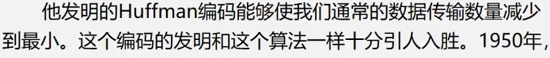
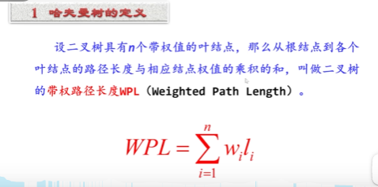
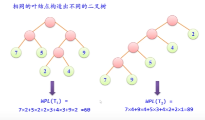
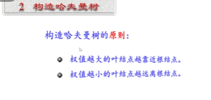

# 哈夫曼树

---

**具有 最小 带权路径长度 的二叉树称为哈夫曼树（最优树）**

**用于编码出现频率比较高那么字符，那么就会离根节点越近，出现频率越低的离根节点越远；**

NLJ  =   Nested-Loop Join  ==   NLJ：Nested-Loop Join（嵌套循环连接）。 检讨 

**哈夫曼编码的作用：**

---

# 编码 其实就是把一个字符转换成字节流的形式；

0 1 的形式； 因为tcp 是面向字节流传输的；

---

**带权路径长度WPL；**       **weighted path length  带权路径长度；**

**哈夫曼树的特点：**

