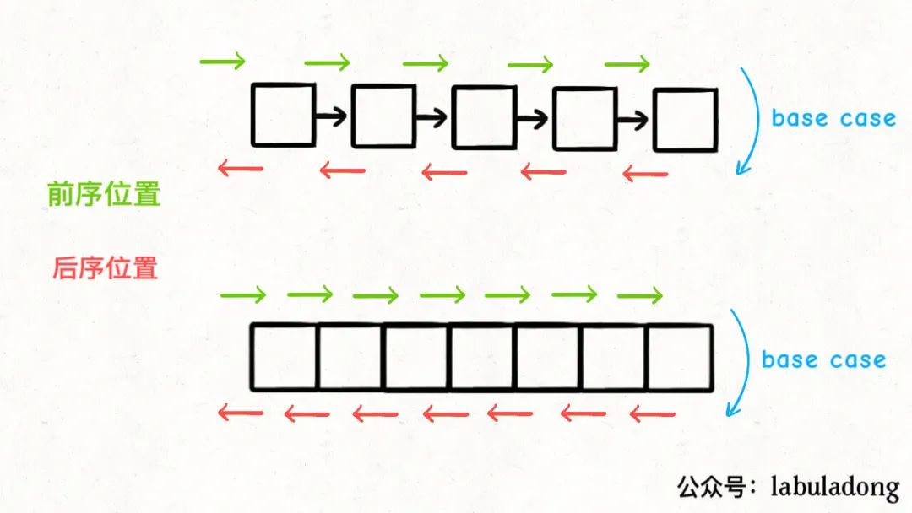
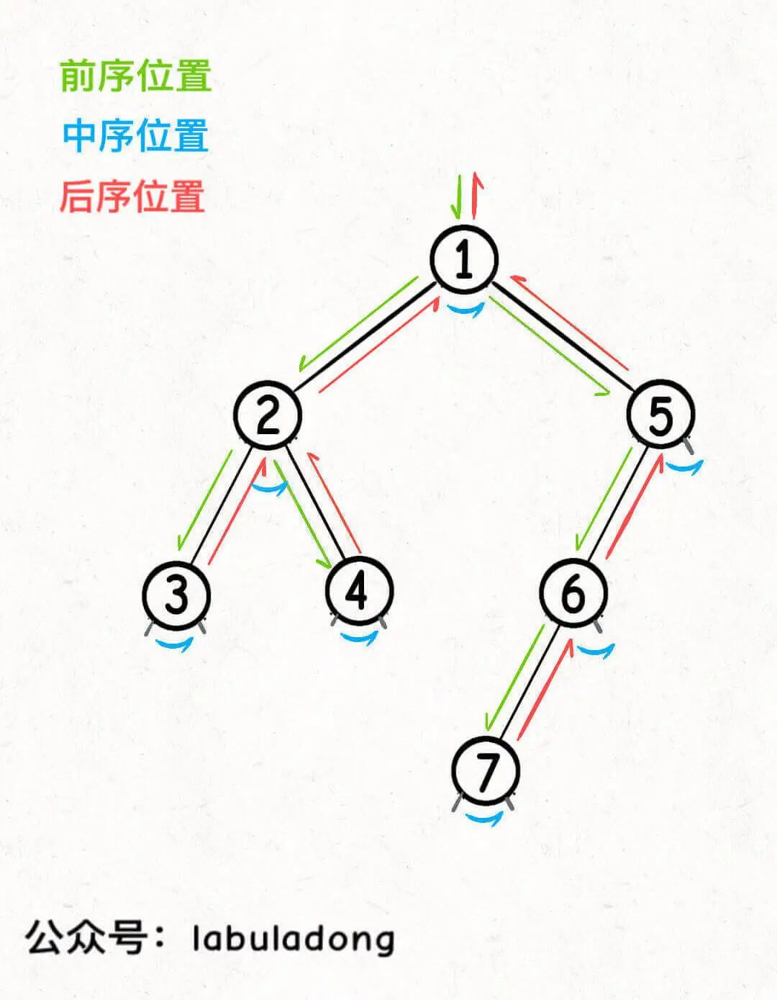

#  遍历技巧

><font color=red>**写树的递归 只需要关注三个结点就可以了，父结点和父节点的左子树结点和右子树结点；**</font>
>
>不要去全局的都看待这递归的问题；


##  树的遍历

````php
#  bst的遍历
void traverse(TreeNode root) {
    if (root == null) {
        return;
    }
    // 前序位置
    traverse(root.left);
    // 中序位置
    traverse(root.right);
    // 后序位置
}
````


##  数组和链表的前后序遍历


````php

/* 迭代遍历数组 */
void traverse(int[] arr) {
    for (int i = 0; i < arr.length; i++) {

    }
}

/* 递归遍历数组 */
//注意 数组必须要有i；不然是没法遍历的；i+1 才能实现遍历；废话；----
// 随机访问 来实现数组的遍历
    void traverse(int[] arr, int i) {
        if (i == arr.length) {
            return;
        }
        // 前序位置
        traverse(arr, i + 1);
        // 后序位置
    }

/* 迭代遍历单链表 */
void traverse(ListNode head) {
    for (ListNode p = head; p != null; p = p.next) {

    }
}

/* 递归遍历单链表 */
void traverse(ListNode head) {
    if (head == null) {
        return;
    }
    // 前序位置
    traverse(head.next);
    // 后序位置
}
````


单链表和数组的遍历可以是迭代的，也可以是递归的，二叉树这种结构无非就是二叉链表，不过没办法简单改写成迭代形式，所以一般说二叉树的遍历框架都是指递归的形式。

你也注意到了，只要是递归形式的遍历，都会有一个前序和后序位置，分别在递归之前和之后。


<font color=red>**所谓前序位置，就是刚进入一个节点（元素）的时候，后序位置就是即将离开一个节点（元素）的时候。**</font>


**你把代码写在不同位置，代码执行的时机也不同**：




````php
/* 递归遍历单链表，倒序打印链表元素 */
void traverse(ListNode head) {
    if (head == null) {
        return;
    }
    traverse(head.next);
    // 后序位置
    print(head.val);
}
````


## 二叉树的遍历


但是我想说，**前中后序是遍历二叉树过程中处理每一个节点的三个特殊时间点**，绝不仅仅是三个顺序不同的 List：

**前序位置的代码在刚刚进入一个二叉树节点的时候执行；**

**后序位置的代码在将要离开一个二叉树节点的时候执行；**

**中序位置的代码在一个二叉树节点左子树都遍历完，即将开始遍历右子树的时候执行。**


你可以发现**每个节点都有「唯一」属于自己的前中后序位置**，所以我说前中后序遍历是遍历二叉树过程中处理每一个节点的三个特殊时间点。

**这里你也可以理解为什么多叉树没有中序位置，因为二叉树的每个节点只会进行唯一一次左子树切换右子树，而多叉树节点可能有很多子节点，会多次切换子树去遍历，所以多叉树节点没有「唯一」的中序遍历位置。**


## <font color=red>一定要注意 这个递归序的图片，看看是怎么运行的---很重要的；  递归序 就是bst最重要的部分；</font>




## 解题方法


综上，遇到一道二叉树的题目时的通用思考过程是：

<font color=red>**但这里面大有玄妙，意味着前序位置的代码只能从函数参数中获取父节点传递来的数据，而后序位置的代码不仅可以获取参数数据，还可以获取到子树通过函数返回值传递回来的数据**。</font>  ---很重要的一句话；

<font color=red>**那么换句话说，一旦你发现题目和子树有关，那大概率要给函数设置合理的定义和返回值，在后序位置写代码了**。</font>

----


**是否可以通过遍历一遍二叉树得到答案？如果不能的话，是否可以定义一个递归函数，通过子问题（子树）的答案推导出原问题的答案**？

例子：

举具体的例子，现在给你一棵二叉树，我问你两个简单的问题：

1、**如果把根节点看做第 1 层，如何打印出每一个节点所在的层数？**

2、如何打印出每个节点的左右子树各有多少节点？

第一个问题可以这样写代码：

````php

# 前序遍历
//  每个结点所在的层数；
/**
 * 1.把根节点看做第 1 层，如何打印出每一个节点所在的层数？
 */
function travelandlevel($root,$level) {
    if ($root == null) return null;
    echo $root->val.'----'.$level."\n";
    travelandlevel($root->left,$level + 1);
    travelandlevel($root->right,$level + 1);
}


/**
 * 2、如何打印出每个节点的左右子树各有多少节点？
 * return 树的总节点数
 * 和子树有关；  需要用后序来做遍历；
 */
function travelaNodeNum($root) {
    if ($root == null) return null;
    $leftnum = travelaNodeNum($root->left);
    $rightnum = travelaNodeNum($root->right);	
    $leftnum = isset($leftnum) ? $leftnum : 0;
    $rightnum = isset($rightnum)? $rightnum : 0;

//    echo "root:".$root->val."---leftNum:".isset($leftnum) ? $leftnum : 0 ."---rightNum:".isset($rightnum) ?  $rightnum : 0 ."\n";
    echo "root:".$root->val."---leftNum:".$leftnum ."---rightNum:".$rightnum ."\n";
    return $leftnum + $rightnum + 1;
}

echo travelaNodeNum($root);
````


##  前后遍历特殊之处；

>后序必须是前序所有的都运行完之后，后序才能运行，这边是归的过程；
>
>````php
>// 后序肯定是一个归的过程；
>// 前序和调用自身都是一个递的过程；
>````
>
>
>
>

前序遍历很普通一般都是放在前序，


说后序位置之前，先简单说下中序和前序。

中序位置主要用在 BST 场景中，你完全可以把 BST 的中序遍历认为是遍历有序数组。

<font color=red>前序位置本身其实没有什么特别的性质，之所以你发现好像很多题都是在前序位置写代码，实际上是因为我们习惯把那些对前中后序位置不敏感的代码写在前序位置罢了。</font>

接下来主要说下后序位置，和前序位置对比，发现前序位置的代码执行是自顶向下的，而后序位置的代码执行是自底向上的：


这不奇怪，**因为本文开头就说了前序位置是刚刚进入节点的时刻，后序位置是即将离开节点的时刻**。

<font color=red>**但这里面大有玄妙，意味着前序位置的代码只能从函数参数中获取父节点传递来的数据，而后序位置的代码不仅可以获取参数数据，还可以获取到子树通过函数返回值传递回来的数据**。</font>  


