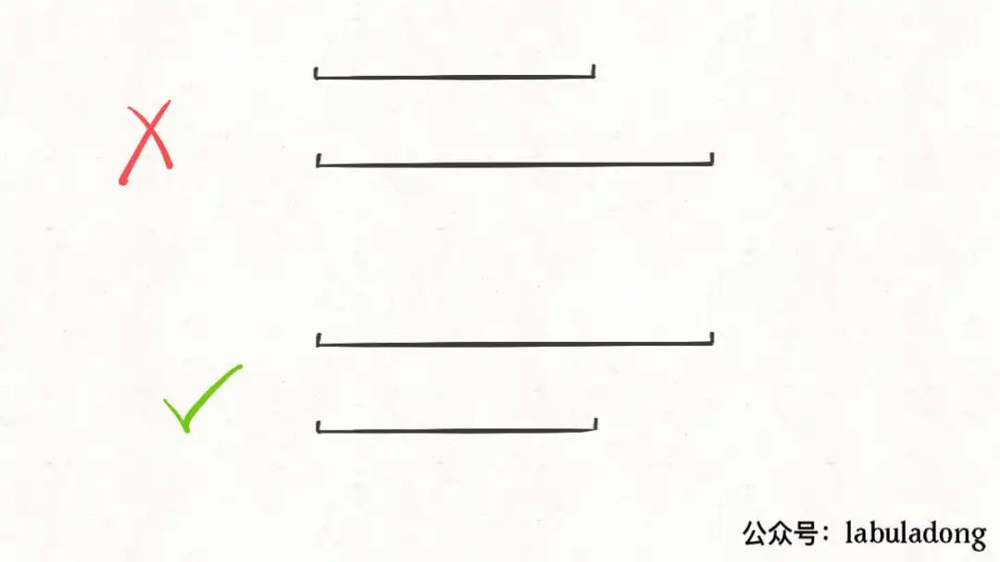

# 线段问题

>所谓区间问题，就是线段问题，让你合并所有线段、找出线段的交集等等。主要有两个技巧：
>
>**1、排序**。<font color=red>**常见的排序方法就是按照区间起点排序，或者先按照起点升序排序，若起点相同，则按照终点降序排序。**</font>  当然，如果你非要按照终点排序，无非对称操作，本质都是一样的。
>
>**2、画图**。就是说不要偷懒，勤动手，两个区间的相对位置到底有几种可能，不同的相对位置我们的代码应该怎么去处理。


---

## 理论知识

> 因为做了排序，所以只能是一下情况；

## 

按照区间的起点排序，区间存在的几种情况：

*  覆盖 ，找到覆盖的区间；
* 相交  ，需要去做合并，合成一个大区间；
* 两个区间完全不相交；分别都是单独区间；

还存在的问题：

> 当起始一样的时候，按照结束来进行排序；
>
>前面的覆盖后面；



对于这两个起点相同的区间，我们需要保证长的那个区间在上面（按照终点降序），这样才会被判定为覆盖，否则会被错误地判定为相交，少算一个覆盖区间。

## 排序函数 usort 了解一下；

`````php
//

最近在一个项目中, 需要对一个数组的顺序进行调整, 允许手动将某一个元素提到数组的开头位置. 在这里, 使用了PHP中的usort函数进行了数组的排序, 代码大致如下:

usort($arr, function ($a, $b){
  // 这里添加了 order 字段, 默认为0, 将order大的提到前边
    return $b['order'] - $a['order'];
});
但是, 今天我大哥突然告诉我, php的usort是不稳定的, 也就是在两个元素相等的情况下, 不能够保证两个元素的位置不变.

`````


---

`````php
//leetcode -1288
// 
// 起始的排序  和 相等的时候 按照结束排序

/**
 * usort();
 * // 用户自己定义数组的排序
 */
$intervals =  [[1,4],[3,6],[2,8],[2,7]];

usort($intervals, function($a, $b) {
    //  大于 往前走
    //  大于0排前面
    // 小于0 排h
    // 0 相等的，代表会放在一起，但是并不一定就是稳定的；但是不稳定排序 快排；  
    if ($a[0] > $b[0]) {
        return 1; // 大的排在前面；
    } else if ($a[0] < $b[0]) {
        return -1; // 小的排在后面；
    } else {
        // 起始一样，然后按照结束来排序；
        return $a[1] < $b[1] ? 1 : -1; // 大的排在前面；  1 排在前面， -1 排在后面；
    }
});

var_dump($intervals);die;

##起始排序，当起始相等的时候结束排序；
##  a  b 的含义；前面的元素 和后面的元素吗？
## a - b   和 b -a 的区别？？？？？
## a-b  是顺序的排序 小的在前面    b - a 代表的逆序大的在前面；
usort($intervals,function ($a,$b) {
    
      if (a[0] == b[0]) {
            return b[1] - a[1];  // 大的///  
        }
    //顺序
        return a[0] - b[0];   // 大于0 肯定排在前面；小于0 肯定排在后面
    
});

`````

