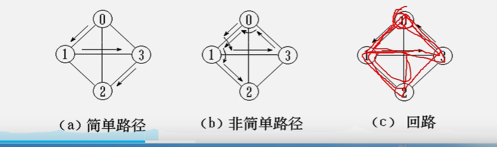

# 图的基础概念和理论


## 数据的逻辑结构

>集合  线性结构  树形结构  图性结构

集合 -----   数据元素间除了        同属于一个集合外    无其他关系；

 

线性结构 ----  **一个对一个的关系  只有一个前驱  只有一个后继节点**     如线性表（数组和链表），栈和队列；


树形结构---- 一个对 多个  可以有一个前驱  多个后继节点  ： 比如：树；

图形结构-----   多个对多个 ，可以 有多个前驱 和多个后继；比如 图：


###  图的定义  ---  几个 很重要的概念：

>Ｅ  V vertice edge;
>
>

**定义：Ｇ　＝　（V，E）　；　　  Vertice  Edge   顶点和边；**

**V：顶点，有穷非空集合，如果为null那么就是空图；**

<font color=red>**E: 边；有穷集合；有向的边又叫做弧；**</font>

**网： 带权的图称之为网；  图称之为网；**

---


无向图：每条边都是无方向的；

有向图：每条边都是有方向的；


**无向完全图：任意的两个顶点都有一条边相连；边的数量等于：v(v-1)/2  : v是顶点的数量；**   

`````php
Cv2 = v(v-1) / 2; //无向完全图； 任意两个顶点都有一条线，不考虑方向性；
Av2 = v(v-1)  // 有向完全图；//任意两个点有一条边，考虑方向性；
`````

**有向完全图：v(v-1) : v是顶点的数量；**

----


<font color=red>**稀疏图：有很少的边或弧的图，叫做稀疏图；（e < vlongv);**  </font>

**稠密图：较多的边或者弧的图；**


----


**邻接**：**有边和弧**相连的**两个顶点**之间的关系；<font color=red>两个顶点之间有边或者弧，就代表是邻接的；</font>   （这个是顶点之间的关系，邻接） 

**无向图：(vi,vj) vi vj邻接;    有向图 的邻接<vi,vj>; 有向图相互邻接；**	 

**关联（依附）：边/弧与顶点之间的关系；**


**顶点的度：与该顶点相关联的边的数目，记为：TD(v) ;** 度：degree ； total degree 

**在有向图中，顶点的度等于该顶点的入度ID(v)和出度OD(v)；**  input 入度；output 出度；  // 度  = 入度 + 出度；


<font color=red>**有向树： 当有向图中，仅有一个顶点的入度为0（树的根节点），其余顶点的入度均为1（除了根节点的其他节点；），那么这个有向图就是一颗树；**</font>  这个是图的一种特殊情况，是颗树；并不一定是二叉树；


### 路径的相关定义；

路径：接续的边构成的顶点的序列；（顶点的序列；）

路径的长度：路径上边/弧数目/权值之和； **无向图 就是边的数量  有向图：有权值，那么就是权值之和；**


回路（环）：第一个顶点和最后一个顶点相同的路径；

简单路径：除了路径的起点和终点可以相同之外，其余的顶点，均不相同路径；  （除了起点和终点外，每一个顶点都是不同的，每一个顶点只经历过一次；）

简单回路： 除了路径的起点和终点相同之外，其余的顶点，均不相同路径；  （起点和终点相同并且，每一个顶点只经历过一次；）

复杂回路：  非简单路径；





**连通图 ：在无（有）向图G=（v，{E}）中，若对任意两个顶点v，都存在从v到u的路径，则称G为连通图（强连通图）；**


注意有向图；


权： 图中边或弧所具有的相关数称为权；代表的是边的距离和损耗；

带权的图叫做网；

---

子图其实就是子集；

**注意下面的定义；可以是相等的；顶点和边都是包含且等于的的关系；**


**极小连通子图；你删除任意一个边，那么这个图都不会再连通；**


**生成树；  包含无向图G所有顶点的极小连通子图；**


-----

## 案例的引入；

六度分隔理论==  六度空间理论；小世界理论；


