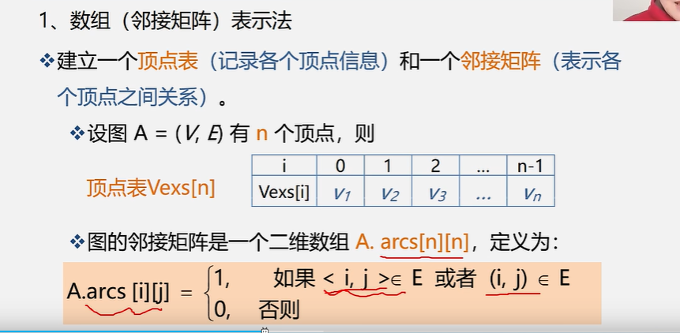
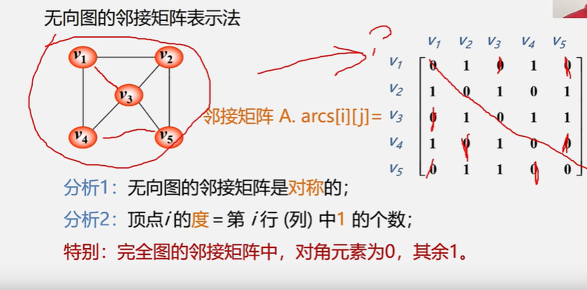
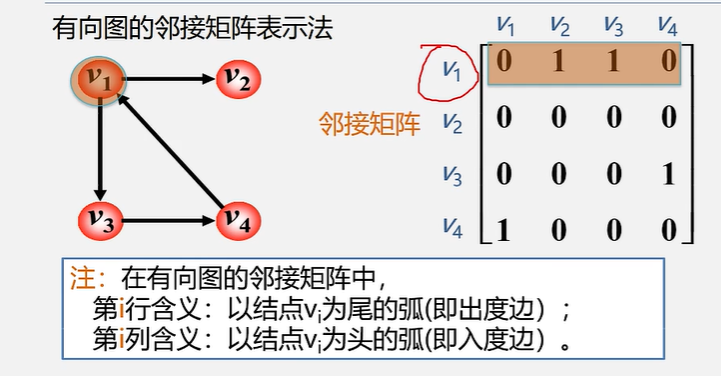
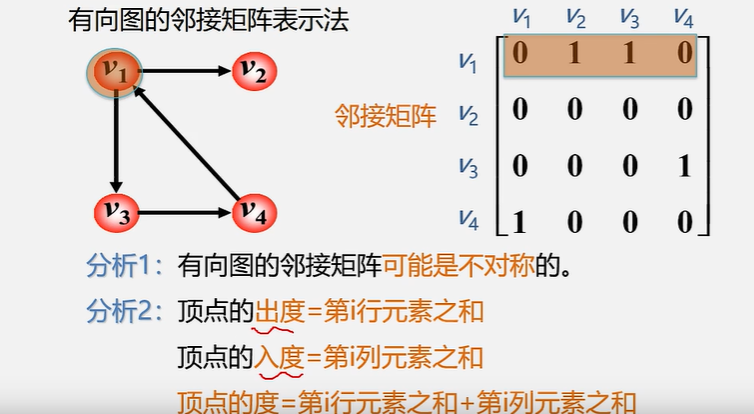
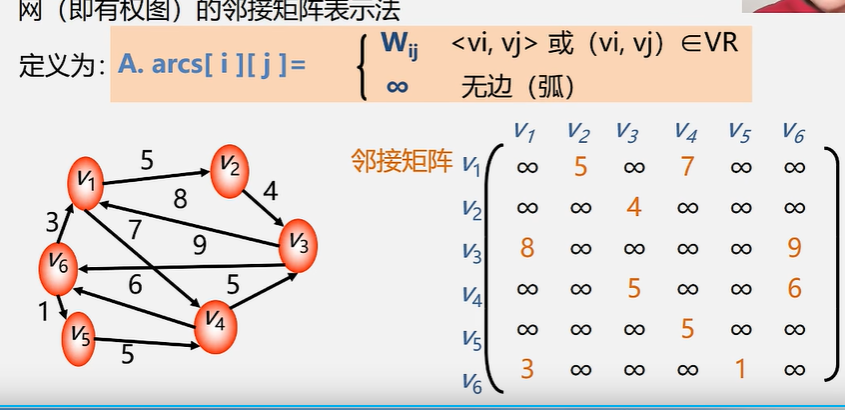
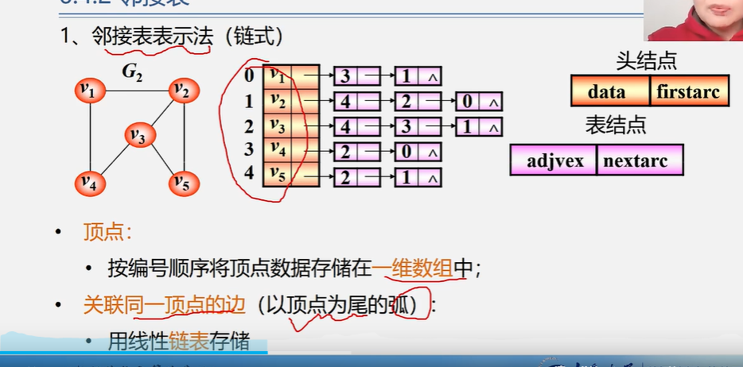
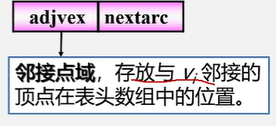
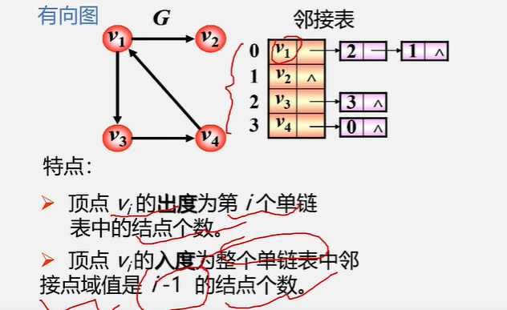

# 图的表示方法  --- 图的存储方式；

>最重要的是邻接矩阵和邻接表；
>
>分别代表的是数组和链表两种方式；


## 图的类型定义；

图的几个基本操作：

* 构建图；怎么去表示一个图；生成一个图；CreateGraph

* DFS  深度优先遍历；前提：图已经存在；所以DFS的操作是在已知图的基础上去操作的；

* BFS广度优先遍历； 前提：图已经存在；所以BFS的操作也是在已知图的基础上去操作；

  


## 图的表示方法 ---- 图的存储结构；--- 存储结构其实就是两种 数组和链表；

因为图的逻辑结构是有多个前驱和多个后继节点；所以逻辑结构是多对多的关系；是以一种复杂数据结构；

**图没有顺序结构存储结构，但是可以借助二维数组来表示元素间的关系；**

**但是因为 图是一个复杂的数据结构是有多个前驱和多个后继节点；所以这里只能用二维数组来保存；**

---


表示方法：最重要的就是下面两种表示方法---**邻接矩阵+邻接表；** 

### 数组表示法---邻接矩阵：

**存储空间复杂度是O(n\^2)**

**二维数组来表示顶点与顶点之间的关系；**

**二维数组的行和列取决于顶点的个数；** 

**首先先会有一个顶点数组；**

行和列都是顶点数组；然后就是一个二维数组；

---


#### 无向图；







###无向图的邻接矩阵的特点：

**无向图邻接矩阵是对称的；**

**顶点i的度其实就是第i行(列)中1的个数；**

**无向完全图的邻接矩阵都是1；对角元素是0；其余是1；**

---

###有向图的邻接矩阵

 ````php
 //a[i][j];
 //从 i  到 j；有向图；注意的是i代表的是第几行；j代表的是第几列；
 //a[k][i][j] 代表  第k页，然后第k页的第i行
 ````




​							

特点：

*  **可能不是对称的；**

* **度  = 入度  + 出度；**

  **顶点的度 =  第i行元素之和 和第i列元素之和；  就是顶点的度；**


---


### 网的邻接矩阵  网就是带权的图；

有向d




----


缺点： 

* 无向图会浪费一般的空间；
* 对于稀疏图也会浪费很多空间；很多都是0；所以缺点就是空间的浪费；

优点：

​	因为是数组所以查询速度会比较快；（二维数组的查询有一个公式；）


###链式存储结构： --- 邻接表   邻接多重表，十字链表来表示一个图；


###无向图

都是指针；rc；

链表的顶点的位置是可以变化的；







info 字段用来存储权值；不存在默认是1；


特点：

* 邻接表不唯一；因为链表的元素顺序是可以变化的；
* 边也就是E出现的次数要出现两次；例如(v1 - v2)  (v2-v1)也出现一次；也就说空间复杂度是(N + 2E) (N代表顶点，E代表的是边),所以比较适合存储稀疏图；  因为邻接矩阵是n\^2;
* 度的计算；也就是关联的边有几个；需要去计算；链表有几个结点无向图的度是多少；单链表结点个数就是度；


### 有向图

有向图 边不需要保存两次了；

但是  需要保存成两个邻接表，一个是入度邻接表，一个是出度邻接表；

空间时间复杂度是N + E; 有几条边就会有几个单链表的结点（这里是所有的单链表的总和）；


###邻接表； ------- 出度；




特点： 

* 出度 == 单链表的结点的个数；
* 找邻接点比较方便；
* 找出度容易，找入度难；
* 入度，需要遍历全部的单链表去查找等于顶点的数值； 需要遍历全部的单链表所以效率会很低；
* 比较适合存储稀疏图节约空间；空间复杂度降低了很多；从n\^2 到了n；
* 计算度 对于无向图很方便；对于有向图不方便了，需要两个邻接表和逆邻接表；
* <font color=red>**不方便检查任意一对顶点之间是否有边对于，邻接图并不方便；**需要全部遍历；</font>


###逆邻接表--- 入度   --- 入度查询简单，出度查询比较难；


## 邻接矩阵和邻接表的区别？

* 对于任意确定的无向图，邻接矩阵是唯一的，但是邻接表不唯一；
* 邻接矩阵空间复杂度是O（N\^2）  邻接表是O（N）；
* 用途：稀疏图可以使用邻接表；非稀疏图可以使用邻接矩阵；
