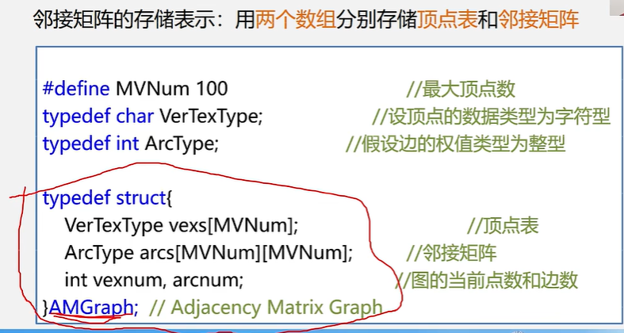

# 邻接矩阵的建立

----


这个下面的案例是一个无向网 默认值 赋值是无穷； 边的值就是权值；




可以去看一下 视频 B战  王卓  数据结构课程；  --  114 小结；


`````php
class AMGraph
{
	public $Mvnums = [];// 顶点表
    public $arcs; //邻接矩阵；  二维数组；
    public $vexnum,$arcnum;
}
`````


