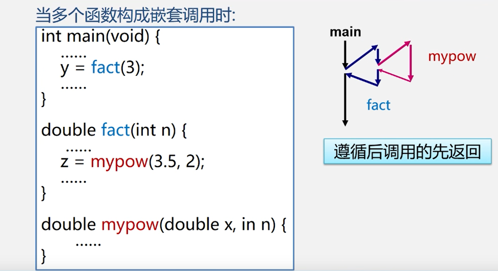
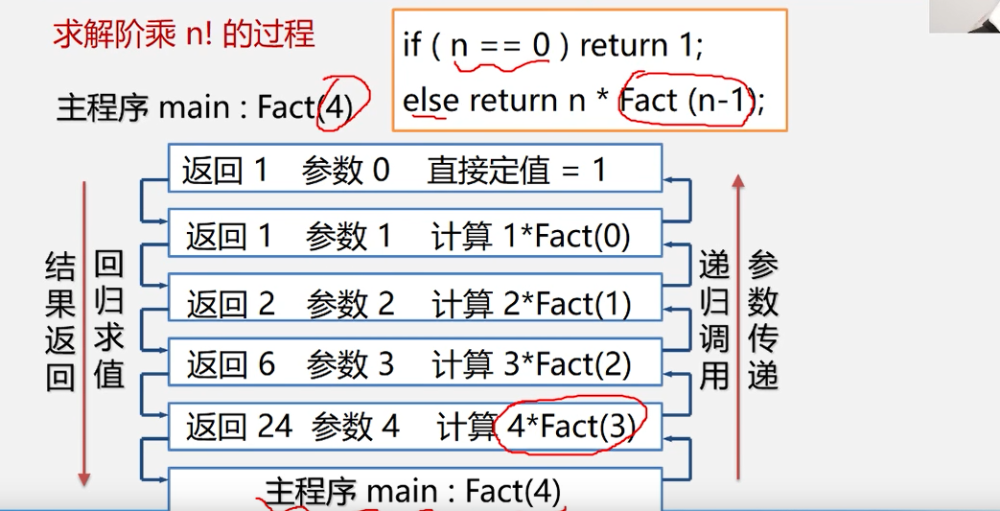
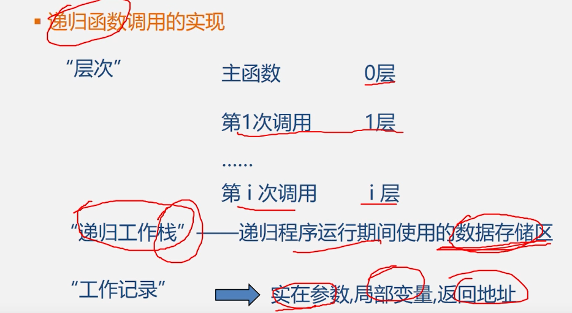
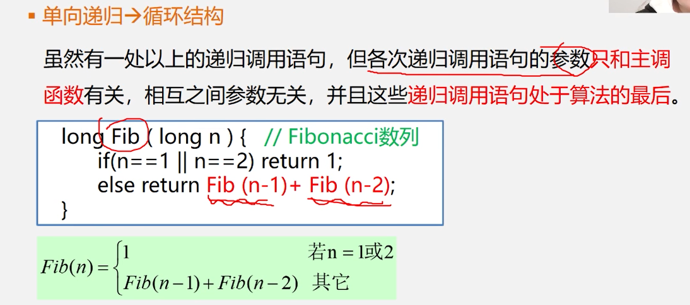
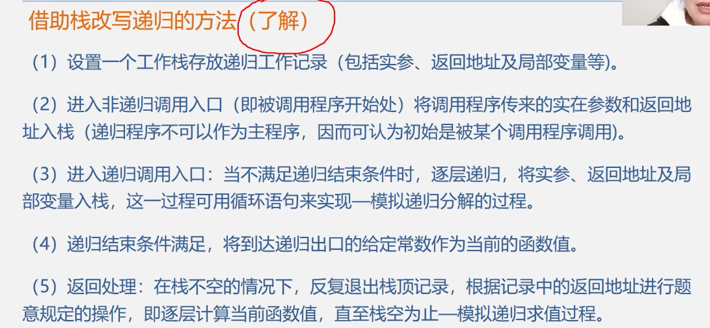
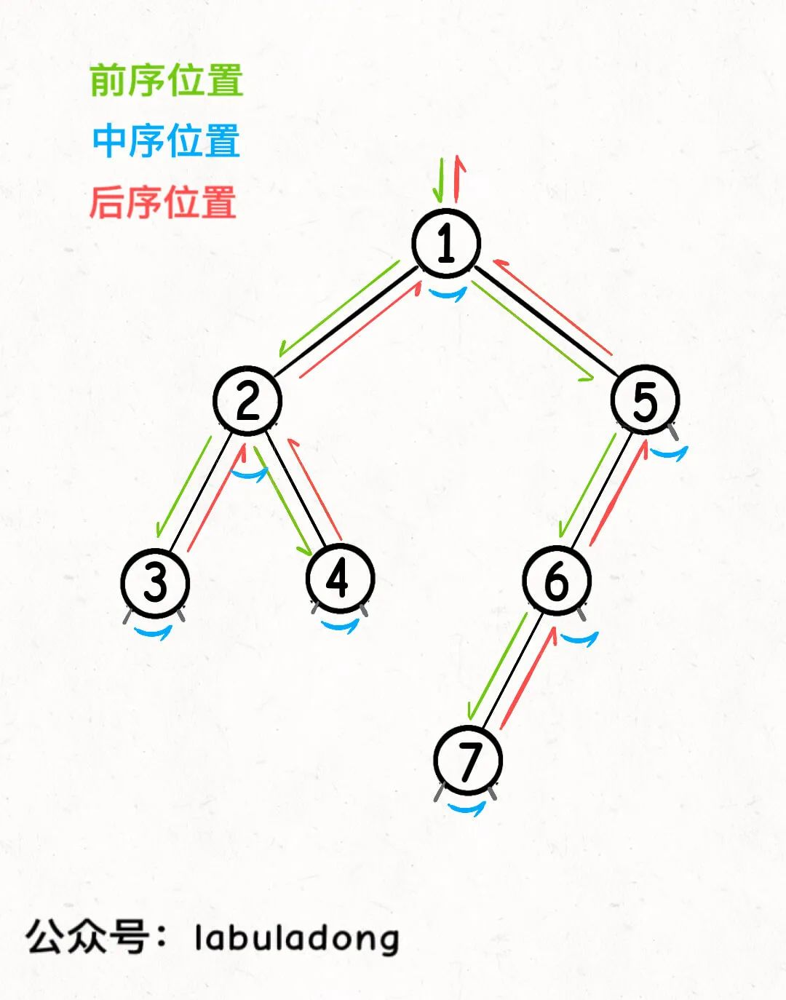
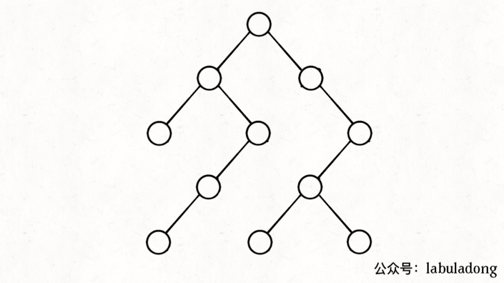

#  栈和递归

>注意：
>
>* 如果想要记录递归内的数据变化，只能使用外部变量；  递归的内部变量都会被初始化；
>* 前序遍历和中序遍历只能接收递归的参数数据，但是后序遍历，可以接收子树的数据；多加注意；
>* <font color=red>**多加注意，要学会用全局变量，来接收数据；**</font>
>* 尾序递归那么，肯定会存在递归函数和递归函数之间的关系；

---


## 定义

递归的定义； 比如  链表（head 移动之后它的子链也是一个递归；）  和 树（子树和本身都是一颗树；）

若一个对象部分地包含自己，或用它自己给自己定义，则称这个对象是递归的；

若一个过程直接地或者或者间接的调用自己，这个过程就是递归；

---


##递归问题--- 用分治法请求

分治法： 对于一个较为复杂的问题，能分解成几个相对简单的且解法相同的子问题来解决； 比如求树的高度，只需要请求max(左子树和左子树的高度)+ 1就可以了；

递归必备的条件：当然有下面三个条件，那么就会想到了用递归；

* 大问题转换成小问题的解决方案是相同的；
* 转换成小问题之后更加简单了；
* 结束条件；递归的边界；结束条件必须要有，不然会 死循环；

---


##案例

1. 递归定义的函数
   * 阶乘
   * 斐波那契数列
2. 具有递归特性的数据结构；
   *  树和链表
3. 迷宫问题；每走一步都当成一个新的迷宫；

---

## 递归代码方面的思想就是，寻找n和n-1直接的关系，和终止条件就可以了；找到最后一步和上一步的关系就可以了；

---

## 多个函数的递归调用

因为是遵循的是后调用的先返回；所以这里用栈来进行函数的调用；




## 递归的过程

两个过程，参数传递，回归求值；




工作记录保存的数据，实际传参，局部变量,返回地址（这个很重要；返回地址；）； 形参和局部变量都会被销毁；

程序运行期间程序是在栈内的；




##  栈的优缺点；

优点：

* 递归清晰，逻辑清晰，程序易读；
* 每次调用都要生成工作记录，保存状态信息，入栈，返回时候出栈，恢复状态信息，时间开销大；时间效率比较差；


## 递归---->非递归   （）

>递归一般分为： 前序递归和后序递归；
>
>前序递归，一般是用来做数据处理的；
>
>后序递归，一般是前面的函数要用到后面的数据，就会放在后面；
>
>

方法1：尾递归（后序递归），单向递归 -> 循环结构；

方法2：自用栈模拟系统运行时栈；用栈来模拟递归运行；

### 循环结构

* 尾递归（后序递归）：

	``````php
	//f(n) = n!;
	//f(n) = n!;
	
	function jiecheng($n) {
	    if ($n == 0) return 1;
	    return $n * jiecheng($n - 1);
	}
	
	echo jiecheng(4);// 4 * 3 * 2 * 1 = 24;
	echo "\n";
	// 递归的过程；
	function jiechengfei($n) {
	    $t = 1;  // 初始化；
	    //
	    for($i = 1; $i <= $n; $i++) {
	        $t = $t * $i;
	    }
	    return $t;
	}
	echo jiechengfei(4);
	echo "\n";
	``````
	
* 单向递归  ---  起始也是一个后序递归；后序递归，递归和递归之间会有关系，我们可以通过他们之间的关系来形成循环；




`````php
//斐波那契数列

function fib($n) {
    if ($n == 1 || $n == 2) return 1;
    return fib($n - 1) + fib($n - 2);
}

echo fib(3);
echo "\n";
// 数学归纳法；
// f3 = f 1 + f2;
// f4 = f3 + f2; // 4 循环两次
function fibfei($n) {
    if ($n == 1 || $n == 2) return 1;
    $f1 = 1;
    $f2 = 1;
    // 注意这里要从 3 开始  要清楚 当等于4的时候运行了2次，也就是4-2次；
    for ($i = 3; $i <= $n; $i++) {
        $sum = $f1 + $f2;
        $f1 = $f2;
        $f2 = $sum;
    }
    return $sum;
}
echo  fibfei(4); // 3
`````


### 模拟栈




`````php
//模拟栈的实现
//f(n) = n!;
/**
 * 娱乐一下 别当真 就是说明一下自己可以模拟栈来实现；
 *  模拟栈来实现递归到非递归的转换；
 * 模拟栈也是在输出的时候处理结果；
 */
//注意一下 $n = 0 ;fn = 1;
function multiStack($n) {
    $res = 1;
    $stack = [];
    for ($i = $n; $i > 0; $i--) {
        array_push($stack,$i);
    }
    
    while (!empty($stack)) {
        $res = $res * array_pop($stack);
    }
    return $res;
}
//echo multiStack(0);
echo multiStack(4);  // 24 ;
`````


## 二叉树的非递归的前中后序遍历方式

实现方式：--- 递归序；

----


这里其实：

--- 一个结点，必须要遍历完右子树之后结点才能出栈；

前序：入栈前的第一次经历结点；

中序：从左子树遍历完成走向右子树，但是并没有出栈，然后进入到右子树；的过程；

后序： 遍历完右子树，然后出栈的过程；


----


参加过我的二叉树专项训练的读者应该知道，二叉树的递归框架中，前中后序遍历位置就是几个特殊的时间点：

前序遍历位置的代码，会在刚遍历到当前节点`root`，遍历`root`的左右子树之前执行；

中序遍历位置的代码，会在在遍历完当前节点`root`的左子树，即将开始遍历`root`的右子树的时候执行；

后序遍历位置的代码，会在遍历完以当前节点`root`为根的整棵子树之后执行。



如果从递归代码上来看，上述结论是很容易理解的：

```java
void traverse(TreeNode root) {
    if (root == null) return;
    /* 前序遍历代码位置 */
    traverse(root.left);
    /* 中序遍历代码位置 */
    traverse(root.right);
    /* 后序遍历代码位置 */
}
```

**不过，如果我们想将递归算法改为迭代算法，就不能从框架上理解算法的逻辑，而要深入细节，思考计算机是如何进行递归的**。

假设计算机运行函数`A`，就会把`A`放到调用栈里面，如果`A`又调用了函数`B`，则把`B`压在`A`上面，如果`B`又调用了`C`，那就再把`C`压到`B`上面……

当`C`执行结束后，`C`出栈，返回值传给`B`，`B`执行完后出栈，返回值传给`A`，最后等`A`执行完，返回结果并出栈，此时调用栈为空，整个函数调用链结束。

我们递归遍历二叉树的函数也是一样的，当函数被调用时，被压入调用栈，当函数结束时，从调用栈中弹出。


那么我们可以写出下面这段代码模拟递归调用的过程：

```java
// 模拟系统的函数调用栈
//都是针对于一个结点Node来考虑的；
Stack<TreeNode> stk = new Stack<>();

void traverse(TreeNode root) {
    if (root == null) return;
    // 函数开始时压入调用栈-- 该结点入栈；
    stk.push(root);
    
    traverse(root.left);
    //该结点左子树入栈和出栈；
    traverse(root.right);
    //该结点右子树的入栈和出栈
    
    // 函数结束时离开调用栈  --- 该结点出栈；
    stk.pop();  //  这是后序遍历 root 结点 后序遍历完才回出栈；
}
```

如果在前序遍历的位置入栈，后序遍历的位置出栈，`stk`中的节点变化情况就反映了`traverse`函数的递归过程（绿色节点就是被压入栈中的节点，灰色节点就是弹出栈的节点）：



简单说就是这样一个流程：

**1、拿到一个节点，就一路向左遍历（因为`traverse(root.left)`排在前面），把路上的节点都压到栈里**。

**2、往左走到头之后就开始退栈，看看栈顶节点的右指针，非空的话就重复第 1 步**。

写成迭代代码就是这样：

```java
private Stack<TreeNode> stk = new Stack<>();

public List<Integer> traverse(TreeNode root) {
    pushLeftBranch(root);

    while (!stk.isEmpty()) {
        TreeNode p = stk.pop();  // 出栈的化就直接是中序遍历啊了；
        pushLeftBranch(p.right);
    }
}

// 左侧树枝一撸到底，都放入栈中
private void pushLeftBranch(TreeNode p) {
    while (p != null) {
        stk.push(p);
        p = p.left;
    }
}
```

上述代码虽然已经可以模拟出递归函数的运行过程，不过还没有找到递归代码中的前中后序代码位置，所以需要进一步修改。


----


`````php
/**
 * bst树的遍历
 * $tree 树的根结点；
 * 一个结点 会被经过三次，什么时候输出那么可以分为前序遍历中序遍历和后序遍历
 */
class TreeNode
{
    public $val = null;
    public $left = null;
    public $right = null;

    function __construct($value) {
        $this->val = $value;
    }
}

//             13
//        10         16
//    9      11   14

$root = new TreeNode(13);
$b = new TreeNode(10);
$c = new TreeNode(16);
$d = new TreeNode(9);
$e = new TreeNode(11);
$f = new TreeNode(14);
// root == $a;
$root->left = $b;
$b->left = $d;
$b->right = $e;
$root->right = $c;
$c->left = $f;

class diguiquTree
{
    public stack;
}


`````


````java
private Stack<TreeNode> stk = new Stack<>();

public List<Integer> postorderTraversal(TreeNode root) {
    // 记录后序遍历的结果
    List<Integer> postorder = new ArrayList<>();
    
    TreeNode visited = new TreeNode(-1); 

    pushLeftBranch(root);
    while (!stk.isEmpty()) {
        TreeNode p = stk.peek();  // 这里仅仅是peek 看一下；  //所以后序遍历 这里仅仅是看一下；

        if ((p.left == null || p.left == visited)  //
          && p.right != visited) {  // null 也会
            pushLeftBranch(p.right);
        }
		// 遍历完右子树 ，然后经历过该结点
        if (p.right == null || p.right == visited) {
            // 后序遍历代码位置
            postorder.add(p.val);
            // 后序遍历之后才会是真正出栈；
            visited = stk.pop();  // 经历过的结点 后序;
        }
    }

    return postorder;
}

private void pushLeftBranch(TreeNode p) {
    while (p != null) {
        stk.push(p);
        p = p.left;
    }
}
````

