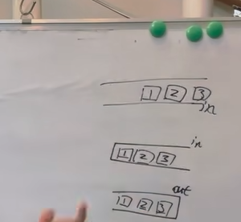

# stack and queue 

案例

---

````php
#用栈来实现队列
#需要用两个栈来实现

/**
 * stack 栈来实现队列
 */
class QueuebyStack
{
    public $inStack = [];
    public $outStack = [];

    public function push($value) {
        // 入栈；
        array_push($this->inStack,$value);
    }

    public function shift() {
        // 必须是null的
        if (empty($this->outStack)) {
            if (!empty($this->inStack)) {
                while (!empty($this->inStack)) {
                    array_push($this->outStack,array_pop($this->inStack));
                }
            } else {
                // 队列里面没有数据 -1
                return -1;
            }
        }
        //不为null直接取；为null就需要先去instack拿数据
        return array_pop($this->outStack);
    }
}

$queueStack = new QueuebyStack();
$queueStack->push(1);
$queueStack->push(2);
$queueStack->push(3);
$queueStack->push(4);
// 1  2
echo $queueStack->shift();
echo $queueStack->shift();

$queueStack->push(5);
$queueStack->push(6);
echo $queueStack->shift();
echo $queueStack->shift();
echo $queueStack->shift();
echo $queueStack->shift();
echo $queueStack->shift();
````





```php
#code stack

/**
 * Class normalStack
 * 最小栈；
 * 实现一个栈，在基本功能的基础上，在实现栈中最小元素的功能；
 * pop push getMin();操作的时间复杂度都是O(1);
 */

class NormalStack
{
    public $stack = [];
    public $minStack = [];
    public $dataTop = 0;
    
    public $minTop = 0;

    public function push($data) {
        array_push($this->stack, $data);
        if (empty($this->minStack)) {
            array_push($this->minStack, $data);// min
        } else {//
            if ($data <= ($this->getMin())) {
                array_push($this->minStack, $data);
            } else {
                //
                array_push($this->minStack, $this->getMin());
            }

        }
        //都要插入数据；push 也是都要++；
        $this->minTop++;
        $this->dataTop++;
    }

    public function pop() {
        //都要pop();
        array_pop($this->stack);
        array_pop($this->minStack);
        $this->dataTop--;
        $this->minTop--;
    }

    public function getMin() {
        //minstack  保存最小值 $top 表示的是将要push的；这里一定要减1；很重要；
        //栈顶就是最下数据；
        return empty($this->minStack) ? null : $this->minStack[$this->minTop - 1];
    }
}

$stackObj = new NormalStack();
```


## 数组来实现一个队列和栈？


### 数组实现一个栈 （）  push()   pop()

````php
class Stack
{
    public $stack = [];
}
````


`````php
#循环数组实现一个队列；
#循环数组的概念；

`````


### 用数组来实现一个队列；


## 链表来实现一个栈和队列？


