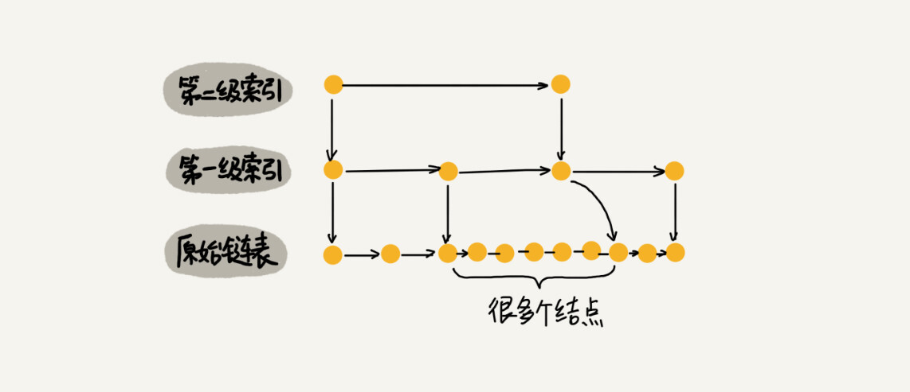
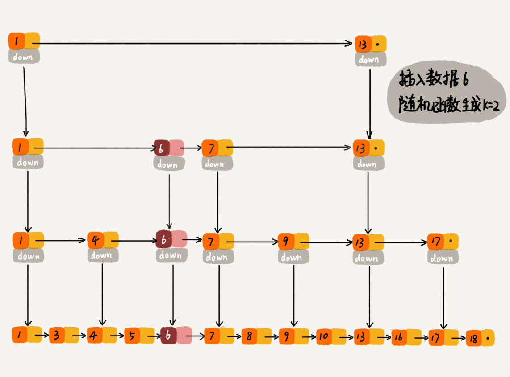

# 跳表 

>时间复杂度是logn
>
>空间复杂度是o(n)
>
>加入链表长度是2\^k = N个数据，那么第一层index的索引树是2\^(k-1) N/2,依次类推  那么 2层就是N/4 ,3层就是N/8；所以空间复杂度是O(n)

**二分查找，底层依赖的是数组的随机访问特性，所以只能用数组来实现；**

但是如果是链表就真的没有办法用二分查找了吗？

但是我们可以对链表加以改造，就可以支持二分查找算法，我们把改造之后的数据结构叫做跳表；skip list；

时间复杂度是logn  查找，插入，删除的时间复杂度是logn；

**如果是一个有序的链表如果我们要查找某个数据，我们只能从头到尾遍历链表；**     ？？？？？/

为什么链表不能使用二分法？？？因为不支持随机访问，所以他只能从光头开始遍历；  

所以我们只能去创建索引来加快访问；

## 前面讲的这种链表加多级索引的结构，就是跳表。

多层索引；

第 k 级索引的结点个数是第 k-1 级索引的结点个数的 1/2，那第 k级索引结点的个数就是 n/(2k)。

### 查询

**假设索引有 h 级，最高级的索引有 2 个结点。通过上面的公式，我们可以得到 n/(2h)=2，从而求得 h=log2n-1。如果包含原始链表这一层，整个跳表的高度就是 log2n**

### 插入

**在单链表中，一旦定位好要插入的位置，插入结点的时间复杂度是很低的，就是 O(1)。但是，这里为了保证原始链表中数据的有序性，我们需要先找到要插入的位置，这个查找操作就会比较耗时。**

### 删除

所以也是logn的时间复杂度； 单链表需要去查询，拿到前继节点；

如果这个结点在索引中也有出现，我们除了要删除原始链表中的结点，还要删除索引中的。因为单链表中的删除操作需要拿到要删除结点的前驱结点，然后通过指针操作完成删除。所以在查找要删除的结点的时候，一定要获取前驱结点。当然，如果我们用的是双向链表，就不需要考虑这个问题了。

## 跳表索引动态更新

跳表索引动态更新当我们不停地往跳表中插入数据时，如果我们不更新索引，就有可能出现某 2 个索引结点之间数据非常多的情况。极端情况下，跳表还会退化成单链表。

作为一种动态数据结构，我们需要某种手段来维护索引与原始链表大小之间的平衡，也就是说，如果链表中结点多了，索引结点就相应地增加一些，避免复杂度退化，以及查找、插入、删除操作性能下降。

**如果你了解红黑树、AVL 树这样平衡二叉树，你就知道它们是通过左右旋的方式保持左右子树的大小平衡（如果不了解也没关系，我们后面会讲），而跳表是通过随机函数来维护前面提到的“平衡性”。**

**随机函数的选择很有讲究，从概率上来讲，能够保证跳表的索引大小和数据大小平衡性，不至于性能过度退化。**

我们通过一个随机函数，来决定将这个结点插入到哪几级索引中，比如随机函数生成了值 K，那我们就将这个结点添加到第一级到第 K 级这 K 级索引中。

