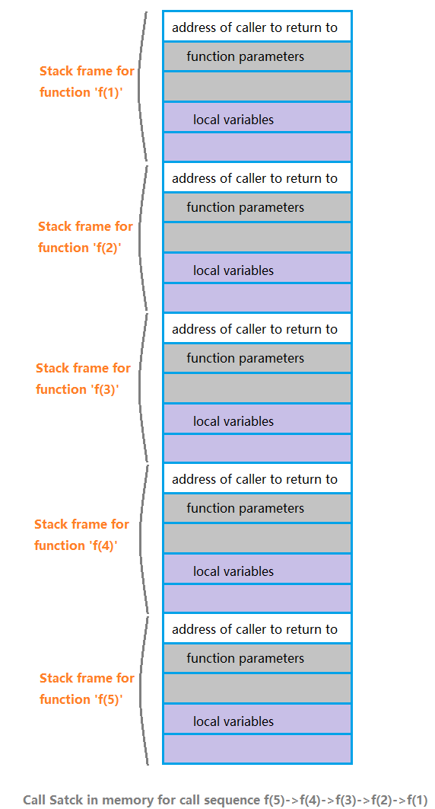
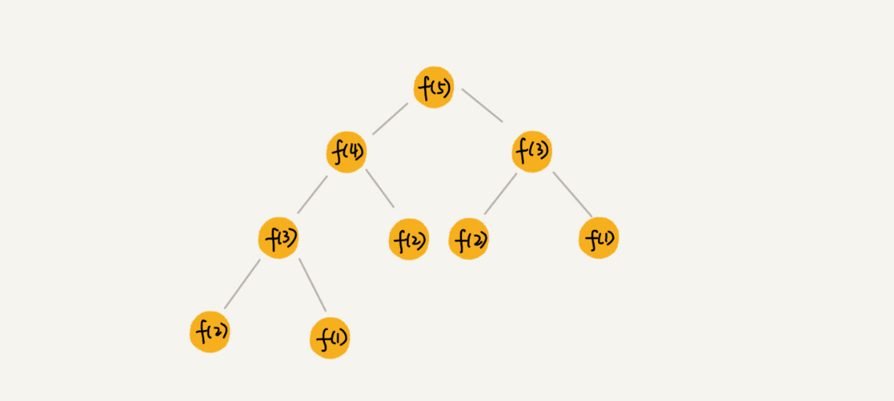
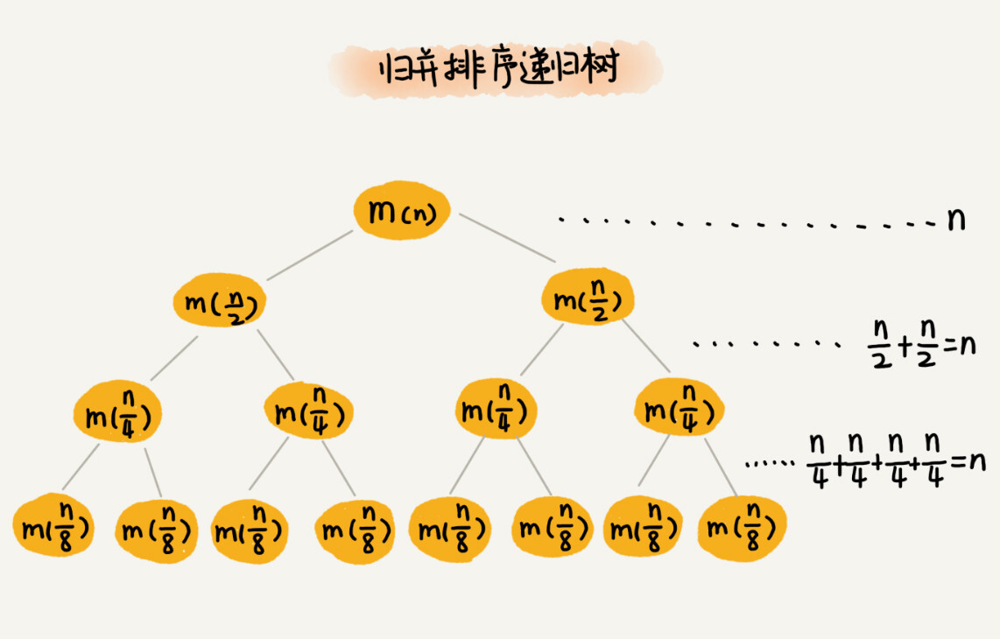
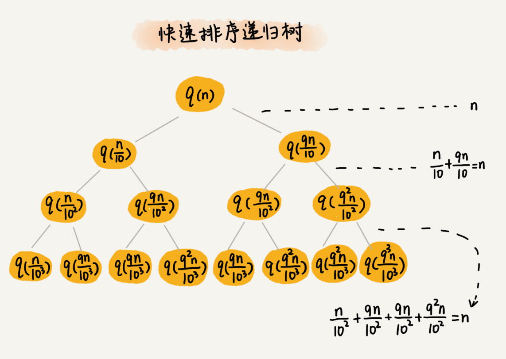
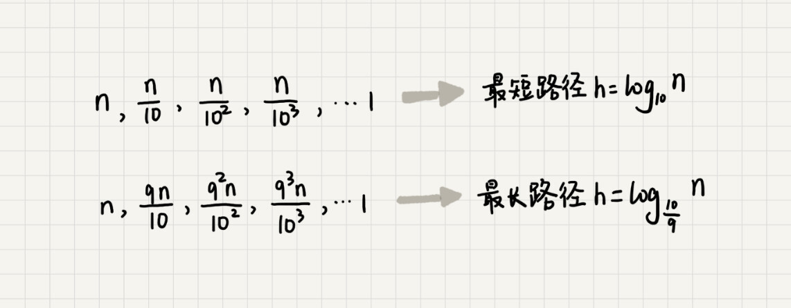
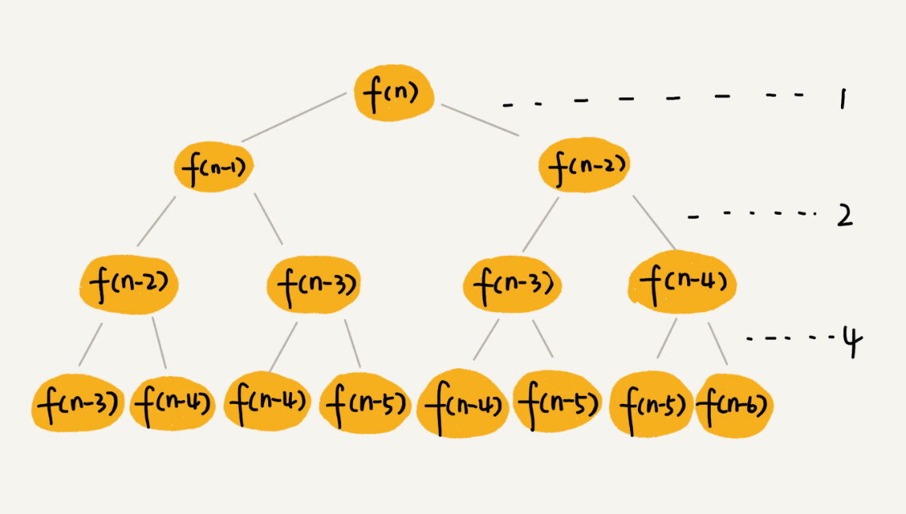
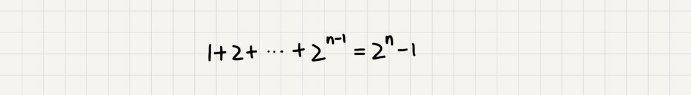
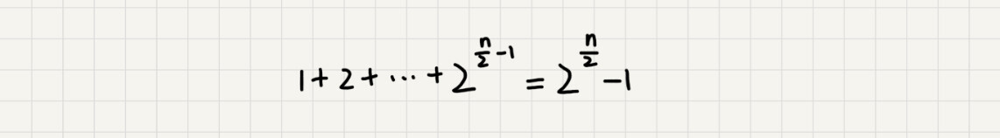

# 递归求解时间复杂度


## 递归树

**注意：每次递归都有会有两个过程：**

<font color=red>**递和归；两个过程；**</font>


我们以上篇求兔子数量的问题（Fibonacci数列 ）为例，来详细讨论递归算法的时空复杂度。

代码摆出来，


```c++
    public int f(int n) {      
       if(n==0||n==1)          
       return n;       
       return f(n-1)+f(n-2);  
    }
```

##**递归算法的时间复杂度**  **  （最好和最坏时间复杂度其实就是树的高度不同；每个节点的时间的复杂度其实都是一样的，比如斐波那契的O（1） 或者是归并或者快排的，O(n)）


**时间复杂度概念：**时间复杂度就是随着问题规模n的增大，算法执行时间增长的情况。

<font color=red>**递归的时间复杂度=每次递归进行的操作的时间复杂度\*递归的次数**</font>

那么，求递归的时间复杂度就是，看它  <font color=red>**每次递归进行了什么操作**和**递归了多少次。**</font>

看图分析




- ***\*每次递归进行了什么操作\****

以上代码中每次递归都只进行相加的操作，即 f(n-1)+f(n-2)，而上面的递归树中每一个结点都是一次递归。

所以，上图中每一个结点都进行的操作是相加。

那么，每次递归进行的操作时间复杂度就是常数级别，为O(1)

- **递归了多少次**

在这棵递归树中每一个结点都是一次递归，要求递归调用的总次数就需要求出这棵树中有多少个结点。

**时间复杂度计算的是最坏的情况，所以我们这里直接考虑每一层结点数都满的情况。**

这里就变成了计算所有层数的结点数相加的数学题了。

## 例子

**当n=5时，总结点数**

````php
**Sn=2^0+2^1+2^2+2^3+2^4，是一个等比数列求和算式。**
````


等比数列求和公式如下：


这里，a1 为首项，q 为公比，n 为项数。

所以，Sn= 2^n = 2^4

当算法的规模为n时，递归的时间复杂度= O(1) * 2^n

**这个算法的时间复杂度为：O(2^n)**


##递归算法的空间复杂度


**空间复杂度的****概念：**空间复杂度是一个算法在运行过程中临时占用存储空间的大小，这里强调的是辅助空间的大小。

注意这里的递归 占用的空间主要是递归栈；


<font color=red>**递归算法的空间复杂度 = 每次递归的空间复杂度 \* 递归深度**</font>


- ***\*每次递归的空间复杂度\****

在这个递归算法中，没有消费额外的空间，

所以，**每次递归的空间复杂度为O(1)**


- **递归的深度**

这里的**递归的深度**指的是，递归**最深的那一次压栈所耗费的栈帧数**，**因为递归最深的那一次所耗费的空间足以容纳它所有的递归调用过程所耗费的空间。**


敲黑板！！！


**这里再次强调下是最深的一次压栈所耗费的栈帧数，而不是整个过程压栈所耗费的栈帧数总和。**

画图分析：


这个算法中递归的深度是二叉树最左侧的这条路线。

我们来讨论下，**最左边这条路线是如何在内存中生成栈帧****以进行递归调用，以及每一次生成的栈帧在内存中保留了多长时间**。

在左侧路线中，调用的顺序是f(5)->f(4) ->f(3) ->f(2)->f(1)，方法f(1)可以直接返回。

**方法 "f(5)" 调用方法 "f(4)" 时，将创建与该方法 " f(4)"相对应的栈帧，并压入虚拟机栈。该栈帧将保留在内存中，直到函数 "f(4)" 执行完毕，栈帧出栈并被销毁。该栈帧负责保存函数“f(4)”的参数，函数 " f(4)" 中的局部变量，以及调用方函数（函数 " f(5)"）的返回地址。**

当函数 " f(4)" 调用另一个函数 " f(3)" 时，也会生成与 " f(3)"相对应的栈帧，，并压入虚拟机栈，将其保留在内存中，直到" f(3)" 执行完毕。

f(3)调用f(2)，f(2)调用f(1)同理，不再赘述。

其中调用栈过程如下图所示，


**当调用f(1)时，由于f(1)是递归终止条件，直接返回，对应的栈帧出栈并被销毁。**

**如下图所示，**


同样，当f(2)，f(3)，f(4)，f(5)调用结束后，也会销毁相应的栈帧。

以上的递归树中任何一条路线在虚拟机栈中生成的栈帧数都不会大于最左侧路线的栈帧数。


### 空间复杂度就是树的深度；

<font color=red>所以，**运行该算法时，在任何时间点，内存中存在的最大栈帧数等于递归树最左侧的路线的栈帧数，即递归树的最大深度。**</font>


**当n=5时，空间复杂度=O(1)*5**

**算法规模为n时，该递归算法的空间复杂度为O(n)。**


**递归算法的优化**

这么一个简单的递归运算所耗费的时间复杂度是 O(2^n)，并且随着n的增大，耗时是指数级上升的。

**为什么会有这么大的时间复杂度？**

从递归树可以看出，这个算法中产生了大量冗余的计算。

比如，要计算f(5)，f(5)= f(4)+ f(3)，需要计算出 f(4)和f(3)

计算f(4)，f(4)= f(3)+f(2)，需要计算出 f(3)和f(2)

计算f(3)， f(3)= f(2)+f(1)，需要计算出 f(2)和f(1)

………


如何**减少重复的运算**是我们优化代码的关键。

那么，如何处理呢？记录。

在前面我们已经总结过，除了第一项和第二项，

**每一项的结果只和它的前面两项值有关**，所以我们每次计算的时候只需要记录下前面两项的值即可。

代码如下，


```c++
// 非递归 
public int f(int n) {  
 //这种效率更加高些       
 sif(n==0||n==1){         
 return n;   
 }    
 int a=0;       
 int b=1;       
 int c=a+b;       
 for (int i = 2; i <=n ; i++) {  
     //从小的数往大的数计算，每一次计算完的结果都保存，作为下一个数计算的项    
     c=a+b;     
     a=b;        
     b=c;    
 }        
 return c; 
 }
```


**优化后的代码时间复杂度为：**O(n)

**空间复杂度为：**O(1)  == 空间的原地操作；


**优化后代码的时空复杂度大大的降低了，通过上面的例子，以后优化递归代码的时候我们可以从以下两个思路考虑：**

- **考虑重复计算**  可以使用缓存的凡是；
- **考虑自底向上**


##  这里是极客时间的递归树

**递归树与时间复杂度分析**

​	递归树与时间复杂度分析我们前面讲过，递归的思想就是，将大问题分解为小问题来求解，然后再将小问题分解为小小问题。这样一层一层地分解，直到问题的数据规模被分解得足够小，不用继续递归分解为止。

​	如果我们把这个一层一层的分解过程画成图，它其实就是一棵树。我们给这棵树起一个名字，叫作递归树。我这里画了一棵斐波那契数列的递归树，你可以看看。节点里的数字表示数据的规模，一个节点的求解可以分解为左右子节点两个问题的求解。



通过这个例子，你对递归树的样子应该有个感性的认识了，看起来并不复杂。现在，我们就来看，如何用递归树来求解时间复杂度。

归并排序算法你还记得吧？它的递归实现代码非常简洁。现在我们就借助归并排序来看看，如何用递归树，来分析递归代码的时间复杂度。

归并排序的原理我就不详细介绍了，如果你忘记了，可以回看一下第 12 节的内容。归并排序每次会将数据规模一分为二。我们把归并排序画成递归树，就是下面这个样子：



因为每次分解都是一分为二，所以代价很低，我们把时间上的消耗记作常量 1。归并算法中比较耗时的是归并操作，也就是把两个子数组合并为大数组。从图中我们可以看出，每一层归并操作消耗的时间总和是一样的，跟要排序的数据规模有关。我们把每一层归并操作消耗的时间记作 n。

现在，我们只需要知道这棵树的高度 h，用高度 h 乘以每一层的时间消耗 n，就可以得到总的时间复杂度 O(n∗h)。

从归并排序的原理和递归树，可以看出来，归并排序递归树是一棵满二叉树。我们前两节中讲到，满二叉树的高度大约是 log2n，所以，归并排序递归实现的时间复杂度就是 O(nlogn)。我这里的时间复杂度都是估算的，对树的高度的计算也没有那么精确，但是这并不影响复杂度的计算结果。

利用递归树的时间复杂度分析方法并不难理解，关键还是在实战，所以，接下来我会通过三个实际的递归算法，带你实战一下递归的复杂度分析。学完这节课之后，你应该能真正掌握递归代码的复杂度分析。


实战一：分析快速排序的时间复杂度在用递归树推导之前，我们先来回忆一下用递推公式的分析方法。你可以回想一下，当时，我们为什么说用递推公式来求解平均时间复杂度非常复杂？

快速排序在最好情况下，每次分区都能一分为二，这个时候用递推公式 T(n)=2T(2n)+n，很容易就能推导出时间复杂度是 O(nlogn)。但是，我们并不可能每次分区都这么幸运，正好一分为二。

我们假设平均情况下，每次分区之后，两个分区的大小比例为 1:k。当 k=9 时，如果用递推公式的方法来求解时间复杂度的话，递推公式就写成 T(n)=T(10n)+T(109n)+n。

这个公式可以推导出时间复杂度，但是推导过程非常复杂。那我们来看看，用递归树来分析快速排序的平均情况时间复杂度，是不是比较简单呢？

我们还是取 k 等于 9，也就是说，每次分区都很不平均，一个分区是另一个分区的 9 倍。如果我们把递归分解的过程画成递归树，就是下面这个样子：



快速排序的过程中，每次分区都要遍历待分区区间的所有数据，所以，每一层分区操作所遍历的数据的个数之和就是 n。我们现在只要求出递归树的高度 h，这个快排过程遍历的数据个数就是 h∗n ，也就是说，时间复杂度就是 O(h∗n)。

因为每次分区并不是均匀地一分为二，所以递归树并不是满二叉树。这样一个递归树的高度是多少呢？

我们知道，快速排序结束的条件就是待排序的小区间，大小为 1，也就是说叶子节点里的数据规模是 1。从根节点 n 到叶子节点 1，递归树中最短的一个路径每次都乘以 101，最长的一个路径每次都乘以 109。通过计算，我们可以得到，从根节点到叶子节点的最短路径是 log10n，最长的路径是 log910n。



所以，遍历数据的个数总和就介于 nlog10n 和 nlog910n 之间。根据复杂度的大 O 表示法，对数复杂度的底数不管是多少，我们统一写成 logn，所以，当分区大小比例是 1:9 时，快速排序的时间复杂度仍然是 O(nlogn)。

刚刚我们假设 k=9，那如果 k=99，也就是说，每次分区极其不平均，两个区间大小是 1:99，这个时候的时间复杂度是多少呢？

我们可以类比上面 k=9 的分析过程。当 k=99 的时候，树的最短路径就是 log100n，最长路径是 log99100n，所以总遍历数据个数介于 nlog100n 和 nlog99100n 之间。尽管底数变了，但是时间复杂度也仍然是 O(nlogn)。

也就是说，对于 k 等于 9，99，甚至是 999，9999……，只要 k 的值不随 n 变化，是一个事先确定的常量，那快排的时间复杂度就是 O(nlogn)。所以，从概率论的角度来说，快排的平均时间复杂度就是 O(nlogn)。

`````php
// 怎么计算 树的最高深度；

    
    
`````


实战二：**分析斐波那契数列的时间复杂度**

在递归那一节中，我们举了一个跨台阶的例子，你还记得吗？那个例子实际上就是一个斐波那契数列。为了方便你回忆，我把它的代码实现贴在这里。

````c

int f(int n) {
  if (n == 1) return 1;
  if (n == 2) return 2;
  return f(n-1) + f(n-2);
}
````

这样一段代码的时间复杂度是多少呢？你可以先试着分析一下，然后再来看，我是怎么利用递归树来分析的。

我们先把上面的递归代码画成递归树，就是下面这个样子：



这棵递归树的高度是多少呢？

f(n) 分解为 f(n−1) 和 f(n−2)，每次数据规模都是 −1 或者 −2，叶子节点的数据规模是 1 或者 2。所以，从根节点走到叶子节点，每条路径是长短不一的。如果每次都是 −1，那最长路径大约就是 n；如果每次都是 −2，那最短路径大约就是 n/2。

每次分解之后的合并操作只需要一次加法运算，我们把这次加法运算的时间消耗记作 1。所以，从上往下，第一层的总时间消耗是 1，第二层的总时间消耗是 2，第三层的总时间消耗就是 22。依次类推，第 k 层的时间消耗就是 2k−1，那整个算法的总的时间消耗就是每一层时间消耗之和。如果路径长度都为 n，那这个总和就是 2n−1。

如果路径长度都为 n，那这个总和就是 2n−1。



如果路径长度都是 2n ，那整个算法的总的时间消耗就是 22n−1。



所以，这个算法的时间复杂度就介于 O(2^n) 和 O(2^(n/2) 之间。虽然这样得到的结果还不够精确，只是一个范围，但是我们也基本上知道了上面算法的时间复杂度是指数级的，非常高。

```php
//斐波那契额数列的时间复杂度是O(2^n) ;;指数级别的时间复杂度；
```


----

## 递归的空间复杂度分析

>  **对于一些递归函数一般和递归树的深度有关，递归树多深，一般空间复杂度就是多少，普通递归就是这样的；**
>
> **所以递归需要占用额外的内存空间；**

````php
递归的空间复杂度取决于递归调用的深度和每次调用所需的额外空间。在递归调用过程中，每次函数调用都会在内存中创建一个新的函数栈帧，用于存储函数的局部变量、参数和返回地址。因此，递归的空间复杂度通常与递归调用的深度成正比。

//对于简单的递归函数，空间复杂度通常是O(n)，其中n是递归调用的深度。这是因为在递归调用过程中，会有n个函数栈帧同时存在于内存中，每个函数栈帧都需要一定的空间。

然而，对于尾递归优化的递归函数，一些编译器和解释器可以对其进行优化，使得递归调用不会导致额外的函数栈帧被创建，从而将空间复杂度降低到O(1)。尾递归优化可以有效地减少递归调用所需的额外空间，使得递归函数在空间上更加高效。

//总的来说，递归的空间复杂度通常与递归调用的深度成正比，但在一些特殊情况下（如尾递归优化），空间复杂度可以得到优化。在使用递归时，需要注意递归调用可能带来的空间开销，并根据实际情况选择合适的解决方法。
````


----


## 公式法


